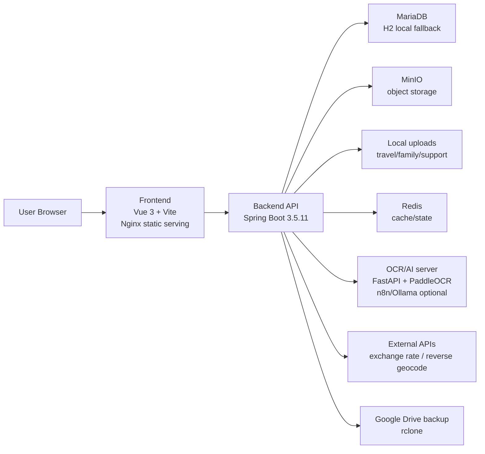
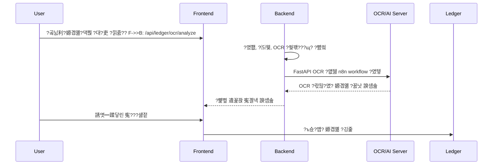
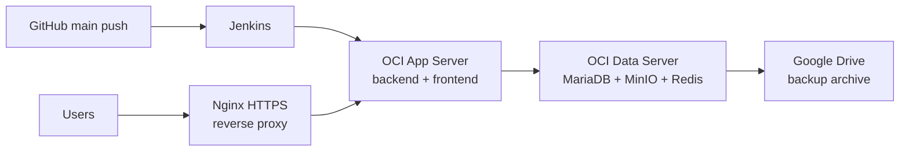
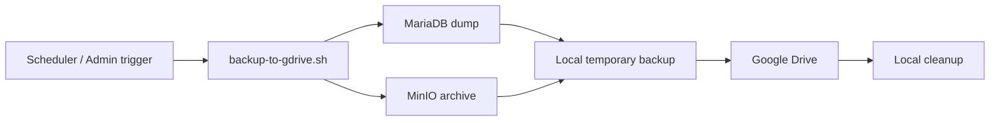

# TravelLedger (Calen)

TravelLedger??媛€怨꾨?, ?ы뻾 湲곕줉, ?ы뻾 ?ъ쭊 吏€?? ?뚯씪 ?쒕씪?대툕, 媛€議??⑤쾾?????쒕퉬???덉뿉??愿€由ы븯??媛쒖씤 ?앺솢 湲곕줉 ?뚮옯?쇱엯?덈떎.

臾몄꽌 媛깆떊?? 2026-06-29

## ?쒕늿??蹂닿린

| 援щ텇 | ?댁슜 |
| --- | --- |
| ?쒗뭹 ?깃꺽 | 媛쒖씤/媛€議??앺솢 湲곕줉 ?뚮옯??|
| 二쇱슂 ?꾨찓??| 媛€怨꾨?, ?ы뻾, ?ъ쭊 吏€?? ?뚯씪 ?쒕씪?대툕, 媛€議??⑤쾾, 愿€由ъ옄 ?댁쁺 |
| Frontend | Vue 3, Vite, Pinia, GridStack, Leaflet, exifr |
| Backend | Java 17, Spring Boot 3.5.11, Spring Security, JPA, Actuator |
| Data/Storage | MariaDB, H2(local default), Redis, MinIO, local upload storage |
| OCR/AI | FastAPI, PaddleOCR, n8n/Ollama ?곕룞 媛€??|
| Infra | Docker Compose, OCI ???곗씠???쒕쾭 遺꾨━, Nginx HTTPS, Jenkins, rclone Google Drive backup |

## 湲곕뒫 吏€??
```mermaid
flowchart TB
  app["TravelLedger / Calen"]

  app --> dashboard["硫붿씤 ?€?쒕낫??br/>?붾젅?? KPI, ?꾩젽 諛곗튂"]
  app --> ledger["媛€怨꾨?<br/>?낅젰, 寃€?? ?듦퀎, ?묒?, 蹂€寃??대젰"]
  app --> ocr["媛€怨꾨? OCR/AI<br/>?곸닔利?嫄곕옒?댁뿭 ?대?吏€ 遺꾩꽍"]
  app --> travel["?ы뻾<br/>怨꾪쉷, ?덉궛, 吏€異? 湲곗뼲, 寃쎈줈"]
  app --> map["?ы뻾 ?ъ쭊 吏€??br/>GPS, ?대윭?ㅽ꽣, 怨듦컻 吏€??]
  app --> drive["CalenDrive<br/>?뚯씪/?대뜑, 怨듭쑀, ?댁??? ?몃꽕??]
  app --> family["媛€議??⑤쾾<br/>?⑤쾾, 移댄뀒怨좊━, 媛€議?怨듭쑀 誘몃뵒??]
  app --> household["媛€援?吏묎퀎<br/>媛€援щ퀎 ?듦퀎?€ ?ы뻾 媛€怨꾨?"]
  app --> account["怨꾩젙/愿€由ъ옄<br/>珥덈?, 沅뚰븳, PIN, 臾몄쓽, 諛깆뾽"]
```

## ?쒖뒪??援ъ“



## 湲곕뒫蹂??ㅻ챸

### 1. 硫붿씤 ?€?쒕낫??
媛€怨꾨?, ?ы뻾, ?쒕씪?대툕 ?뺣낫瑜????붾㈃?먯꽌 ?붿빟?⑸땲?? `GridStack` 湲곕컲 ?붾젅?몃줈 移대뱶?€ ?꾩젽??諛곗튂?섍퀬, ?ъ슜?먮퀎 ?쒖떆 ??ぉ怨??덉씠?꾩썐???€?ν빀?덈떎. ?ㅽ겕/?쇱씠??紐⑤뱶瑜?吏€?먰빀?덈떎.

愿€??Frontend: `MainDashboardWorkspace.vue`, `FeatureLauncher.vue`, `features/palette/*`

### 2. 媛€怨꾨?

| 湲곕뒫 | ?ㅻ챸 |
| --- | --- |
| 嫄곕옒 ?낅젰 | ???щ젰 湲곕컲 ?낅젰怨?鍮좊Ⅸ 嫄곕옒 ?낅젰???쒓났?⑸땲?? |
| 寃€???꾪꽣 | 嫄곕옒 紐⑸줉 寃€?? 遺꾨쪟/寃곗젣?섎떒 湲곗? 議고쉶瑜??쒓났?⑸땲?? |
| ?듦퀎/鍮꾧탳 | 移댄뀒怨좊━, 寃곗젣?섎떒, 湲곌컙 鍮꾧탳, 李⑦듃 遺꾩꽍???쒓났?⑸땲?? |
| 遺꾨쪟 愿€由?| ?€遺꾨쪟/?곸꽭遺꾨쪟?€ 寃곗젣?섎떒??愿€由ы빀?덈떎. |
| ?묒? 媛€?몄삤湲?| ?묒? ?뚯씪 誘몃━蹂닿린 ???좏깮???됱쓣 嫄곕옒濡?諛섏쁺?⑸땲?? |
| CSV/?묒? ?대낫?닿린 | 議곌굔??留욌뒗 嫄곕옒 ?곗씠?곕? ?몃? ?뚯씪濡??대낫?낅땲?? |
| 蹂€寃??대젰 | 寃€???섏젙/?쇨큵 蹂€寃??대젰??湲곕줉?섍퀬 蹂듦뎄?????덉뒿?덈떎. |

愿€??Backend: `ledger/web`, `ledger/service`, `ledger/domain`, `ledger/repository`

### 3. 媛€怨꾨? OCR/AI

?곸닔利??먮뒗 移대뱶 嫄곕옒?댁뿭 罹≪쿂 ?대?吏€瑜??낅줈?쒗븯硫?OCR/AI 遺꾩꽍 寃곌낵瑜??뺤씤?섍퀬 嫄곕옒 ?낅젰 ?쇱뿉 ?곸슜?????덉뒿?덈떎. ?먮룞 ?€?μ? ?섏? ?딆쑝硫? ?ъ슜?먭? 寃€?좏븳 ??理쒖쥌 ?깅줉?⑸땲??



| ?좏삎 | ?ㅻ챸 |
| --- | --- |
| `RECEIPT` | ?곸닔利????μ뿉????嫄곕옒 ?쒖븞 |
| `PAYMENT_CAPTURE` | 移대뱶/怨꾩쥖 嫄곕옒?댁뿭 罹≪쿂 ???μ뿉???щ윭 嫄곕옒 ?꾨낫 ?쒖븞 |
| `AUTO` | ?쒕쾭媛€ 媛€?ν븳 踰붿쐞?먯꽌 臾몄꽌 ?좏삎 ?먮룞 ?먮떒 |

OCR ?쒕쾭媛€ 爰쇱졇 ?덉뼱???쇰컲 媛€怨꾨? ?낅젰, ?섏젙, ??젣, 寃€?? ?듦퀎, ?묒? 湲곕뒫?€ 怨꾩냽 ?ъ슜?????덉뼱???⑸땲??

### 4. ?ы뻾

?ы뻾 湲곕뒫?€ 怨꾪쉷, ?덉궛, 吏€異? 湲곗뼲, 寃쎈줈, 誘몃뵒?대? ???⑥쐞濡?臾띠뼱 愿€由ы빀?덈떎.

| 湲곕뒫 | ?ㅻ챸 |
| --- | --- |
| ?ы뻾 怨꾪쉷 | ?ы뻾蹂??쇱젙, ?곹깭, ?붿빟 ?뺣낫瑜?愿€由ы빀?덈떎. |
| ?덉궛/吏€異?| ?ы뻾 ?덉궛 ??ぉ怨??ㅼ젣 吏€異쒖쓣 湲곕줉?⑸땲?? |
| ?ы뻾 湲곗뼲 | ?ы뻾 以??④릿 硫붾え?€ 湲곕줉??愿€由ы빀?덈떎. |
| 寃쎈줈 | ?대룞 援ш컙, 援먰넻?섎떒, 寃쎈줈 ?ㅽ??쇱쓣 ?€?ν빀?덈떎. |
| ?ы뻾 而ㅻ??덊떚 | 怨듦컻 ?쇰뱶/怨듭쑀 ?붾㈃???듯빐 ?ы뻾 ?뺣낫瑜??몄텧?⑸땲?? |
| ?섏쑉 | ?몃? ?섏쑉 API瑜??ъ슜?섍퀬 罹먯떆 TTL???〓땲?? |
| ????ㅼ퐫??| ?ъ쭊 ?꾩튂??醫뚰몴 湲곕컲 ?꾩튂紐낆쓣 議고쉶?섍퀬 罹먯떆?⑸땲?? |

愿€??Backend: `travel/web`, `travel/service`, `travel/domain`, `travel/repository`

### 5. ?ы뻾 ?ъ쭊 吏€?꾩? 怨듭쑀

?낅줈?쒗븳 ?ы뻾 ?ъ쭊??GPS 硫뷀??곗씠?곕? 湲곕컲?쇰줈 吏€???꾩뿉 ?쒖떆?⑸땲?? ?ъ쭊??留롮쓣 ?뚮뒗 ?대윭?ㅽ꽣?€ 酉고룷??湲곕컲 ?뚮뜑留곸쑝濡??붾㈃ 遺€?댁쓣 以꾩엯?덈떎.

| 湲곕뒫 | ?ㅻ챸 |
| --- | --- |
| ???ъ쭊 | ?ы뻾 ?ъ쭊???몃꽕???⑤쾾?쇰줈 蹂닿퀬 ?곸꽭 紐⑤떖?먯꽌 ?먮낯 鍮꾩쑉怨??꾩튂瑜??뺤씤?⑸땲?? |
| ?ъ쭊 吏€??| GPS ?ъ쭊??吏€???€/?대윭?ㅽ꽣濡??쒖떆?⑸땲?? |
| ?대윭?ㅽ꽣 ?€???대?吏€ | 吏€???대윭?ㅽ꽣???€???ъ쭊??吏€?뺥븷 ???덉뒿?덈떎. |
| 怨듦컻 ?ы뻾 吏€??| 怨듦컻 媛€?ν븳 ?ы뻾 吏€???ъ쭊 ?뺣낫瑜?蹂꾨룄 ?붾㈃?쇰줈 ?쒓났?⑸땲?? |
| 洹몃９ 怨듭쑀 | ?쒗븳???ъ슜??洹몃９???ы뻾 ?뺣낫瑜?怨듭쑀?⑸땲?? |
| ?몃꽕??諛깊븘 | ?꾨씫???ы뻾 誘몃뵒???몃꽕?쇱쓣 諛곗튂 ?묒뾽?쇰줈 蹂닿컯?⑸땲?? |

愿€??Frontend: `TravelMyMapWorkspace.vue`, `TravelMyPhotosWorkspace.vue`, `TravelPublicTripsWorkspace.vue`, `TravelSharedExhibitWorkspace.vue`

### 6. CalenDrive

CalenDrive??媛쒖씤 ?뚯씪 ?쒕씪?대툕 湲곕뒫?낅땲?? ?뚯씪/?대뜑 ?먯깋, ?낅줈?? ?ㅼ슫濡쒕뱶, 怨듭쑀, 諛쏆? ?뚯씪 ?€?? ?댁??? ?몃꽕?? ?꾨줈???대?吏€瑜?愿€由ы빀?덈떎.

| 湲곕뒫 | ?ㅻ챸 |
| --- | --- |
| ?뚯씪/?대뜑 | ?쒕씪?대툕 ?꾩씠?쒖쓣 ?대뜑 援ъ“濡?愿€由ы빀?덈떎. |
| ?낅줈???ㅼ슫濡쒕뱶 | ?뚯씪 ?낅줈?쒖? ?ㅼ슫濡쒕뱶 留곹겕瑜??쒓났?⑸땲?? |
| 怨듭쑀 | ?ъ슜??媛??뚯씪 怨듭쑀?€ 諛쏆? ?뚯씪 ?€?μ쓣 吏€?먰빀?덈떎. |
| ?댁???| ??젣???뚯씪???댁????먮쫫?쇰줈 愿€由ы빀?덈떎. |
| ?몃꽕??| ?대?吏€ 誘몃━蹂닿린?€ ?쒕씪?대툕 ?꾨줈???대?吏€瑜?吏€?먰빀?덈떎. |
| 愿€由ъ옄 ?ㅼ젙 | ?쒕씪?대툕 ?댁쁺 ?ㅼ젙??愿€由ъ옄 API濡?遺꾨━?⑸땲?? |

愿€??Backend: `drive/web`, `drive/service`, `drive/domain`, `drive/repository`

### 7. 媛€議??⑤쾾

媛€議??⑤쾾?€ 媛€議??⑥쐞 誘몃뵒?대? ?⑤쾾怨?移댄뀒怨좊━濡?臾띠뼱 愿€由ы븯???곸뿭?낅땲??

| 湲곕뒫 | ?ㅻ챸 |
| --- | --- |
| ?⑤쾾 | 媛€議??⑤쾾 ?앹꽦怨??⑤쾾蹂?誘몃뵒??援ъ꽦??愿€由ы빀?덈떎. |
| 移댄뀒怨좊━ | 媛€議?移댄뀒怨좊━?€ 援ъ꽦?먯쓣 愿€由ы빀?덈떎. |
| 誘몃뵒??| 媛€議??ъ쭊/誘몃뵒???뚯씪???€?ν븯怨?紐⑸줉?쇰줈 ?쒓났?⑸땲?? |
| ?ъ슜??寃€??| 媛€議??⑤쾾 援ъ꽦??異붽?瑜??꾪븳 ?ъ슜??寃€???듭뀡???쒓났?⑸땲?? |

愿€??Backend: `familyalbum/web`, `familyalbum/service`, `familyalbum/domain`, `familyalbum/repository`

### 8. 媛€援?吏묎퀎

媛€援??⑥쐞 ?붾㈃?€ ?ъ슜?먮퀎 媛€怨꾨? ?곗씠?곕? ?⑹궛??媛€議??먮뒗 媛€援?愿€?먯쓽 吏€異??먮쫫???뺤씤?섎뒗 ?곸뿭?낅땲?? ?ы뻾 媛€怨꾨? ?붾㈃怨??곌퀎?섏뼱 媛€援??⑥쐞 ?ы뻾 吏€異쒖쓣 ?곕줈 蹂????덉뒿?덈떎.

愿€??Frontend: `HouseholdWorkspace.vue`, `HouseholdTravelLedgerWorkspace.vue`

### 9. 怨꾩젙, 沅뚰븳, 愿€由ъ옄

| 湲곕뒫 | ?ㅻ챸 |
| --- | --- |
| ?몄쬆 | 濡쒓렇?? ?뚯썝媛€?? remember-me/JWT 湲곕컲 ?몄쬆???쒓났?⑸땲?? |
| 珥덈? | 愿€由ъ옄 珥덈? 留곹겕 ?앹꽦怨?珥덈? ?섎씫 ?먮쫫???쒓났?⑸땲?? |
| 蹂댁“ PIN | ?꾨줈??愿€由ъ옄 ?묎렐 蹂댄샇瑜??꾪븳 2李?PIN ?먮쫫??吏€?먰빀?덈떎. |
| ?ъ슜???덉씠?꾩썐 | ?ъ슜?먮퀎 ?€?쒕낫???붾㈃ ?ㅼ젙???€?ν빀?덈떎. |
| 怨좉컼 臾몄쓽 | 臾몄쓽 ?깅줉, 泥⑤??뚯씪 ?€?? 愿€由ъ옄 ?듬?/蹂닿????쒓났?⑸땲?? |
| 愿€由ъ옄 ?€?쒕낫??| ?ъ슜?? 濡쒓렇??媛먯궗, 珥덈?, ?곗씠???꾪솴??愿€由ы빀?덈떎. |
| 諛깆뾽/蹂듦뎄 | DB/MinIO 諛깆뾽怨?蹂듦뎄 吏꾩엯?먯쓣 ?쒓났?⑸땲?? |
| Redis ?곹깭 | Redis ?μ븷媛€ ?꾩껜 湲곕뒫 ?μ븷濡?踰덉?吏€ ?딅룄濡?媛€?ν븳 踰붿쐞?먯꽌 ?꾪솕?⑸땲?? |

愿€??Backend: `account/web`, `account/service`, `account/security`, `common/cache`

## 湲곗닠 ?ㅽ깮

### Frontend

| 湲곗닠 | ?⑸룄 |
| --- | --- |
| Vue 3.5 | SPA UI |
| Vite 7 | 媛쒕컻 ?쒕쾭?€ 鍮뚮뱶 |
| Pinia 3 | ?대씪?댁뼵???곹깭 愿€由?|
| GridStack 12 | ?€?쒕낫???붾젅???쒕옒洹?諛곗튂 |
| Leaflet 1.9 | 吏€??UI |
| exifr | ?ъ쭊 EXIF/GPS 硫뷀??곗씠??泥섎━ |
| JavaScript SFC | TypeScript???ъ슜?섏? ?딆쓬 |

?좉퇋 Vue SFC??`<script setup>` JavaScript 湲곗??쇰줈 ?묒꽦?⑸땲??

### Backend

| 湲곗닠 | ?⑸룄 |
| --- | --- |
| Java 17 | 諛깆뿏???고???|
| Spring Boot 3.5.11 | API ?쒕쾭 |
| Spring Web/Security/JPA/Validation | REST API, ?몄쬆, ORM, ?붿껌 寃€利?|
| Spring Actuator | health/info/prometheus ?댁쁺 ?붾뱶?ъ씤??|
| MariaDB | ?댁쁺 ?곗씠?곕쿋?댁뒪 |
| Flyway | 踰꾩쟾 湲곕컲 DB 留덉씠洹몃젅?댁뀡 |
| H2 | 濡쒖뺄 湲곕낯 ?몃찓紐⑤━ ?곗씠?곕쿋?댁뒪 |
| Redis/Lettuce | 罹먯떆/?곹깭 ?€??|
| MinIO | ?ㅻ툕?앺듃 ?ㅽ넗由ъ? |
| Apache POI | ?묒? 媛€?몄삤湲??대낫?닿린 |
| zip4j | ?뺤텞 ?뚯씪 泥섎━ |
| metadata-extractor | ?대?吏€ 硫뷀??곗씠??泥섎━ |
| Micrometer Prometheus | 紐⑤땲?곕쭅 硫뷀듃由?|
| Lombok | Java 蹂댁씪?ы뵆?덉씠??異뺤냼 |

### OCR / AI

| 湲곗닠 | ?⑸룄 |
| --- | --- |
| FastAPI | OCR 遺꾩꽍 ?쒕쾭 |
| PaddleOCR | ?대?吏€ OCR |
| Ollama Gemma 怨꾩뿴 紐⑤뜽 | OCR 寃곌낵 蹂댁젙/?뺥삎???좏깮吏€ |
| n8n workflow | AI 遺꾩꽍 ?뚯씠?꾨씪???좏깮吏€ |
| Windows 1060 PC | 蹂꾨룄 OCR/AI 遺꾩꽍 ?쒕쾭 ?댁쁺 ?섍꼍 |

### Infra

| 湲곗닠 | ?⑸룄 |
| --- | --- |
| Docker Compose | 濡쒖뺄/?댁쁺 而⑦뀒?대꼫 援ъ꽦 |
| Nginx | HTTPS reverse proxy?€ frontend ?뺤쟻 ?뚯씪 ?쒕튃 |
| OCI | ???쒕쾭?€ ?곗씠???쒕쾭 遺꾨━ ?댁쁺 |
| Jenkins | GitHub main push 湲곕컲 諛고룷 |
| rclone | Google Drive 諛깆뾽 |
| Prometheus/Grafana | ?댁쁺 紐⑤땲?곕쭅 援ъ꽦 |

## ?꾨줈?앺듃 援ъ“

```text
.
|-- backend/
|   |-- src/main/java/com/playdata/calen/
|   |   |-- account/        ?몄쬆, 珥덈?, 愿€由ъ옄, 臾몄쓽, ?ъ슜???ㅼ젙
|   |   |-- common/         怨듯넻 ?ㅼ젙, ?덉쇅, 罹먯떆, 誘몃뵒??泥섎━
|   |   |-- drive/          CalenDrive ?뚯씪/怨듭쑀/?꾨줈??|   |   |-- familyalbum/    媛€議??⑤쾾怨?媛€議?誘몃뵒??|   |   |-- ledger/         媛€怨꾨?, ?듦퀎, ?묒?, OCR, AI 遺꾩꽍
|   |   `-- travel/         ?ы뻾, 吏€?? 誘몃뵒?? 怨듭쑀, ?섏쑉
|   |-- src/main/resources/application.yml
|   |-- src/test/java/
|   |-- sql/ledger-dummy/
|   |-- build.gradle
|   `-- Dockerfile
|-- frontend/
|   |-- src/components/     二쇱슂 ?붾㈃ ?⑥쐞 Vue 而댄룷?뚰듃
|   |-- src/features/       ?붾젅????湲곕뒫 紐⑤뱢
|   |-- src/lib/            API, ?щ㎎, 誘몃뵒???ы뻾 ?좏떥
|   |-- public/
|   |-- package.json
|   `-- Dockerfile
|-- PaddleOCR/
|   |-- ocr_service.py
|   |-- requirements.txt
|   `-- install_windows_ocr.ps1
|-- deploy/
|   |-- n8n/                OCR/AI workflow?€ n8n compose
|   `-- oci/
|       |-- nginx/
|       |-- redis/
|       |-- monitoring/
|       `-- scripts/
|-- docs/
|-- docker-compose.yml
|-- docker-compose.oci.app.yml
|-- docker-compose.oci.data.yml
|-- docker-compose.oci.monitoring.yml
`-- README.md
```

猷⑦듃?먯꽌 ?뺤씤?섎뒗 蹂댁“/?묒뾽 ??ぉ:

| ??ぉ | ?깃꺽 |
| --- | --- |
| `.env`, `.env.*.example` | 濡쒖뺄/?댁쁺 ?섍꼍蹂€???덉떆?€ ?ㅼ젣 ?섍꼍媛?|
| `.wiki-temp`, `worklog.md` | 臾몄꽌/?묒뾽 濡쒓렇 蹂댁“ ?먮즺 |
| `ea`, `miniossl`, `?좎쭨` | 濡쒖뺄 ?먮뒗 ?댁쁺 蹂댁“ ?먮즺濡?蹂댁씠硫??듭떖 ?좏뵆由ъ??댁뀡 ?뚯뒪???꾨떂 |
| `backend/build`, `backend/.gradle`, `frontend/node_modules`, `frontend/dist`, `*.log` | 鍮뚮뱶/罹먯떆/濡쒓렇 ?곗텧臾?|

## 濡쒖뺄 媛쒕컻

### ?붽뎄 ?ы빆

| ?꾧뎄 | 沅뚯옣 |
| --- | --- |
| JDK | 17 |
| Node.js/npm | ?꾩옱 Vite/Vue 鍮뚮뱶媛€ 媛€?ν븳 LTS 踰꾩쟾 |
| Docker Desktop ?먮뒗 Docker Engine | Compose 湲곕컲 ?ㅽ뻾 ???꾩슂 |
| MariaDB/MinIO/Redis | Docker Compose瑜??곕㈃ 蹂꾨룄 ?ㅼ튂 遺덊븘??|
| OCR ?쒕쾭 | OCR 湲곕뒫 ?뚯뒪????蹂꾨룄 Windows OCR PC ?먮뒗 ?명솚 ?쒕쾭 ?꾩슂 |

### Frontend

```bash
cd frontend
npm install
npm run dev
npm run build
```

?꾨줎?몄뿏??媛쒕컻 ?쒕쾭??Vite媛€ 湲곕낯 ?ы듃瑜??ъ슜?⑸땲?? ?댁쁺 而⑦뀒?대꼫?먯꽌??Nginx媛€ ?뺤쟻 ?뚯씪???쒕튃?섍퀬 `/api` ?붿껌??backend濡??꾨줉?쒗빀?덈떎.

### Backend

```bash
cd backend
./gradlew test
./gradlew bootWar
```

Windows PowerShell:

```powershell
cd backend
.\gradlew.bat test
.\gradlew.bat bootWar
```

?섍꼍蹂€?섍? ?놁쑝硫?`application.yml` 湲곕낯媛믪뿉 ?곕씪 H2 ?몃찓紐⑤━ DB瑜??ъ슜?⑸땲?? MariaDB, MinIO, Redis ?곕룞?€ `.env` ?먮뒗 ?쒕쾭 ?섍꼍蹂€?섎줈 ?ㅼ젙?⑸땲??

### Docker Compose

```bash
cp .env.example .env
docker compose up -d --build
```

湲곕낯 Compose ?쒕퉬??

| ?쒕퉬??| ?ㅻ챸 | 湲곕낯 ?묎렐 |
| --- | --- | --- |
| `frontend` | Vue ?뺤쟻 ??+ Nginx | `http://localhost:8080` |
| `backend` | Spring Boot API | compose ?대? `backend:8080` |
| `mariadb` | MariaDB 11.4 | compose ?대? |
| `minio` | ?뚯씪/object storage | API `9000`, Console `9001` |
| `minio-init` | 湲곕낯 bucket ?앹꽦 | 1?뚯꽦 ?묒뾽 |

湲곕낯 bucket ?대쫫?€ `MINIO_CLOUD_BUCKET` 媛믪씠硫? 湲곕낯媛믪? `budgetjourneybucket`?낅땲??

## 二쇱슂 ?섍꼍蹂€??
### 怨듯넻/Backend

| 蹂€??| ?ㅻ챸 | 湲곕낯媛?|
| --- | --- | --- |
| `DB_URL` | JDBC ?곌껐 臾몄옄??| H2 ?몃찓紐⑤━ |
| `DB_DRIVER` | JDBC driver | `org.h2.Driver` |
| `DB_ID`, `DB_PASS` | DB 怨꾩젙 | `sa` / empty |
| `JWT_KEY` | JWT/remember-me key | 濡쒖뺄 湲곕낯媛??덉쓬 |
| `JWT_EXPIRE` | JWT 留뚮즺 ?쒓컙 | `300000000` |
| `APP_SEED_ENABLED` | 珥덇린 ?곗씠??seed ?щ? | `false` |
| `H2_CONSOLE_ENABLED` | H2 console ?쒖꽦??| `false` |
| `DB_MIGRATION_ENABLED` | Flyway 留덉씠洹몃젅?댁뀡 ?쒖꽦??| `false` |
| `DB_MIGRATION_BASELINE_ON_MIGRATE` | 湲곗〈 DB baseline ?덉슜 | `true` |
| `DB_MIGRATION_VALIDATE_ON_MIGRATE` | 留덉씠洹몃젅?댁뀡 寃€利??쒖꽦??| `true` |

### Storage

| 蹂€??| ?ㅻ챸 | 湲곕낯媛?|
| --- | --- | --- |
| `MINIO_API` | ?대? MinIO endpoint | empty |
| `MINIO_PUBLIC_API` | ?몃? 怨듦컻 endpoint | empty |
| `MINIO_NAME`, `MINIO_SECRET` | MinIO access key/secret | empty |
| `MINIO_CLOUD_BUCKET` | 湲곕낯 bucket | `budgetjourneybucket` |
| `MINIO_PRESIGNED_URL_EXPIRY_SECONDS` | presigned URL 留뚮즺 | `6000` |
| `TRAVEL_MEDIA_STORAGE_PATH` | ?ы뻾 誘몃뵒??濡쒖뺄 ?€??寃쎈줈 | `${user.dir}/uploads/travel-media` |
| `FAMILY_MEDIA_STORAGE_PATH` | 媛€議??⑤쾾 誘몃뵒??濡쒖뺄 ?€??寃쎈줈 | `${user.dir}/uploads/family-media` |
| `SUPPORT_ATTACHMENT_STORAGE_PATH` | 臾몄쓽 泥⑤? ?€??寃쎈줈 | `${user.dir}/uploads/support-inquiries` |

### Travel

| 蹂€??| ?ㅻ챸 | 湲곕낯媛?|
| --- | --- | --- |
| `TRAVEL_EXCHANGE_RATE_BASE_URL` | ?섏쑉 API base URL | `https://api.frankfurter.dev/v1` |
| `TRAVEL_EXCHANGE_RATE_CACHE_MINUTES` | ?섏쑉 罹먯떆 ?쒓컙 | `30` |
| `TRAVEL_REVERSE_GEOCODE_BASE_URL` | ????ㅼ퐫??API | Nominatim reverse |
| `TRAVEL_REVERSE_GEOCODE_USER_AGENT` | ????ㅼ퐫??User-Agent | `TravelLedger/1.0 ...` |
| `TRAVEL_SUMMARY_CACHE_TTL_SECONDS` | ?ы뻾 ?붿빟 罹먯떆 TTL | `60` |
| `TRAVEL_MEDIA_DOWNLOAD_CACHE_TTL_SECONDS` | 誘몃뵒???ㅼ슫濡쒕뱶 罹먯떆 TTL | `300` |
| `TRAVEL_THUMBNAIL_BACKFILL_ENABLED` | ?몃꽕??諛깊븘 ?쒖꽦??| `true` |
| `TRAVEL_PRESIGNED_UPLOAD_ENABLED` | ?ы뻾 presigned upload ?쒖꽦??| `false` |

### OCR / AI

| 蹂€??| ?ㅻ챸 | 湲곕낯媛?|
| --- | --- | --- |
| `LEDGER_OCR_ENABLED` | 媛€怨꾨? OCR ?쒖꽦??| `false` |
| `LEDGER_OCR_BASE_URL` | FastAPI OCR ?쒕쾭 URL | empty |
| `LEDGER_OCR_WORKFLOW_URL` | n8n workflow webhook URL | empty |
| `LEDGER_OCR_API_KEY` | OCR API key | empty |
| `LEDGER_OCR_CONNECT_TIMEOUT` | ?곌껐 timeout | `3s` |
| `LEDGER_OCR_READ_TIMEOUT` | ?쎄린 timeout | `90s` |
| `LEDGER_OCR_MAX_FILE_SIZE` | OCR ?낅줈??理쒕? ?ш린 | `10MB` |

媛€怨꾨? AI 遺꾩꽍?€ `APP_LEDGER_AI_PROVIDER=lmstudio`????LM Studio瑜?吏곸젒 ?몄텧?섍퀬, `n8n`????湲곗〈 workflow webhook???몄텧?⑸땲?? Provider濡?蹂대궡??嫄곕옒 紐⑸줉?€ 媛쒖씤?뺣낫/?좏겙 蹂댄샇瑜??꾪빐 ?쒕ぉ/硫붾え媛€ 異뺤빟?섍퀬 ?꾩넚 嫄댁닔媛€ ?쒗븳?⑸땲?? ?숈씪 ?ъ슜??湲곌컙/provider/model??鍮좊Ⅸ ?ъ떆?꾨뒗 理쒓렐 ?꾨즺 寃곌낵瑜??ъ궗?⑺빀?덈떎. ?댁쁺?먯꽌??AI provider URL allowlist瑜?耳쒖꽌 LM Studio/n8n ?몄텧 ?€?곸쓣 紐낆떆?곸쑝濡??쒗븳?????덉뒿?덈떎.

| 蹂€??| ?ㅻ챸 | 湲곕낯媛?|
| --- | --- | --- |
| `APP_LEDGER_AI_ENABLED` | 媛€怨꾨? AI 遺꾩꽍 ?쒖꽦??| `false` |
| `APP_LEDGER_AI_PROVIDER` | AI 怨듦툒?? `lmstudio` ?먮뒗 `n8n` | `lmstudio` |
| `APP_LEDGER_AI_MODEL` | 사용할 모델 이름. `auto`이면 LM Studio `/api/v1/models`의 첫 모델을 사용 | `auto` |
| `APP_LEDGER_AI_LMSTUDIO_BASE_URL` | LM Studio ?쒕쾭 二쇱냼 | `http://172.18.240.1:1234` |
| `APP_LEDGER_AI_LMSTUDIO_CHAT_PATH` | LM Studio chat endpoint | `/api/v1/chat` |
| `APP_LEDGER_AI_LMSTUDIO_API_KEY` | LM Studio API key媛€ ?꾩슂??寃쎌슦 ?ъ슜 | empty |
| `APP_LEDGER_AI_TEMPERATURE` | 紐⑤뜽 ?묐떟 ?⑤룄 | `0.2` |
| `APP_LEDGER_AI_MAX_TOKENS` | 理쒕? ?묐떟 ?좏겙 | `2048` |
| `APP_LEDGER_AI_WORKFLOW_URL` | n8n provider??webhook URL | empty |
| `APP_LEDGER_AI_API_KEY` | n8n provider??API key | empty |
| `APP_LEDGER_AI_API_KEY_HEADER` | n8n API key header | `X-TravelLedger-AI-Key` |
| `APP_LEDGER_AI_ENFORCE_PROVIDER_URL_ALLOWLIST` | LM Studio/n8n URL host allowlist 媛뺤젣 ?щ? | `false` |
| `APP_LEDGER_AI_ALLOWED_PROVIDER_HOSTS` | ?덉슜??AI provider host CSV | `localhost,127.0.0.1,::1,172.18.240.1` |

### Redis

| 蹂€??| ?ㅻ챸 |
| --- | --- |
| `REDIS_CACHE_HOST`, `REDIS_CACHE_PORT`, `REDIS_CACHE_PASSWORD`, `REDIS_CACHE_DATABASE`, `REDIS_CACHE_SSL` | 罹먯떆 Redis |
| `REDIS_STATE_HOST`, `REDIS_STATE_PORT`, `REDIS_STATE_PASSWORD`, `REDIS_STATE_DATABASE`, `REDIS_STATE_SSL` | ?곹깭 Redis |

### 諛깆뾽/?댁쁺

| 蹂€??| ?ㅻ챸 |
| --- | --- |
| `DATA_OPS_BACKUP_WORKDIR` | 諛깆뾽 ?묒뾽 ?붾젆?곕━ |
| `DATA_OPS_BACKUP_REMOTE_NAME` | rclone remote ?대쫫 |
| `DATA_OPS_BACKUP_REMOTE_DIR` | DB 諛깆뾽 ?먭꺽 ?붾젆?곕━ |
| `DATA_OPS_MINIO_BACKUP_REMOTE_DIR` | MinIO 諛깆뾽 ?먭꺽 ?붾젆?곕━ |
| `DATA_OPS_RCLONE_CONFIG_PATH` | rclone config 寃쎈줈 |
| `DATA_OPS_DB_BACKUP_ENABLED`, `DATA_OPS_DB_BACKUP_CRON` | DB 諛깆뾽 ?ㅼ?以?|
| `DATA_OPS_MINIO_BACKUP_ENABLED`, `DATA_OPS_MINIO_BACKUP_CRON` | MinIO 諛깆뾽 ?ㅼ?以?|

## ?댁쁺 援ъ“

?댁쁺?€ ???쒕쾭?€ ?곗씠???쒕쾭瑜?遺꾨━?섎뒗 援ъ꽦??湲곗??쇰줈 ?⑸땲??



?댁쁺 Compose ?뚯씪:

| ?뚯씪 | ?⑸룄 |
| --- | --- |
| `docker-compose.oci.app.yml` | ???쒕쾭??backend/frontend 援ъ꽦 |
| `docker-compose.oci.data.yml` | ?곗씠???쒕쾭??MariaDB/MinIO ???곹깭 ?€??援ъ꽦 |
| `docker-compose.oci.monitoring.yml` | Prometheus/Grafana 紐⑤땲?곕쭅 援ъ꽦 |
| `docker-compose.oci.yml` | OCI ?듯빀/蹂댁“ 援ъ꽦 |

Jenkins 諛고룷 ?먮쫫:

```text
GitHub main push
  -> Jenkins checkout
  -> SSH to app server
  -> git fetch/reset
  -> docker compose config
  -> docker compose up -d --build backend frontend
```

## 諛깆뾽

`deploy/oci/scripts/backup-to-gdrive.sh`??DB/MinIO 諛깆뾽???앹꽦?섍퀬 Google Drive濡??낅줈?쒗븳 ??濡쒖뺄 ?꾩떆 ?곗텧臾쇱쓣 ?뺣━?섎뒗 諛⑺뼢?쇰줈 ?댁쁺?⑸땲??



?쒕쾭 ?붿뒪?ш? 諛깆뾽 ?뚯씪 ?꾩쟻?쇰줈 媛€??李⑥? ?딅룄濡?諛깆뾽 ??濡쒖뺄 ?곗텧臾??뺣━瑜??뺤씤?댁빞 ?⑸땲??

## 蹂댁븞 二쇱쓽

?ㅼ쓬 ?뚯씪怨?媛믪? 而ㅻ컠?섏? ?딆뒿?덈떎.

| ?€??| ?덉떆 |
| --- | --- |
| ?섍꼍 ?뚯씪 | `.env`, ?ㅼ젣 ?댁쁺 `.env.*` |
| ?몄쬆 ?뺣낫 | SSH private key, JWT key, OCR API key |
| ?곗씠???묒냽 ?뺣낫 | DB/Redis/MinIO 怨꾩젙怨?鍮꾨?踰덊샇 |
| 媛쒖씤 ?곗씠??| ?ㅼ젣 ?곸닔利? 移대뱶 ?댁뿭, 媛쒖씤 ?ъ쭊 ?먮낯 ?뚯뒪???뚯씪 |
| AI/OCR ?곗텧臾?| OCR 媛€?곹솚寃? 紐⑤뜽 罹먯떆, ?뚯뒪???대?吏€ |
| ?댁쁺 ?곗텧臾?| ?댁쁺 濡쒓렇, 諛깆뾽 ?뚯씪, ?꾩떆 蹂듦뎄 ?뚯씪 |

愿€???쒖쇅 ?€?곸? `.gitignore`, 媛??쒕퉬?ㅻ퀎 `.dockerignore`, ?댁쁺 臾몄꽌瑜??④퍡 ?뺤씤?⑸땲??

## ?뚯뒪?몄? ?덉쭏 ?뺤씤

### Backend

```bash
cd backend
./gradlew test
```

Windows PowerShell:

```powershell
cd backend
.\gradlew.bat test
```

### Frontend

```bash
cd frontend
npm run build
```

?꾩옱 `package.json`?먮뒗 `dev`, `build`, `preview` ?ㅽ겕由쏀듃媛€ ?뺤쓽?섏뼱 ?덉뒿?덈떎.

## 李멸퀬 臾몄꽌

| 臾몄꽌 | ?댁슜 |
| --- | --- |
| [Architecture](docs/architecture.md) | ?꾩껜 ?꾪궎?띿쿂 |
| [Security Baseline Checklist](docs/security_baseline_checklist.md) | ?몄쬆, CSRF, 愿€由ъ옄, 怨듭쑀 留곹겕, ?낅줈??蹂댁븞 湲곗???|
| [Ledger AI Safety Hardening Plan](docs/ledger_ai_safety_hardening.md) | LM Studio/n8n 湲곕컲 媛€怨꾨? AI 遺꾩꽍 ?덉쟾?μ튂 |
| [Project Improvement Roadmap](docs/project_improvement_roadmap.md) | 媛쒖꽑/蹂댁셿 諛?異붽? 湲곕뒫 ?곗꽑?쒖쐞 濡쒕뱶留?|
| [Observability Alerts](docs/observability_alerts.md) | Prometheus ?뚮┝ 洹쒖튃怨?AI/OCR/諛깆뾽 怨꾩륫 怨꾩빟 |
| [Windows 1060 OCR Tailscale Setup Guide](docs/Windows_1060_OCR_Tailscale_Setup_Guide.md) | OCR PC/Tailscale ?ㅼ젙 |
| [DB Restore From Google Drive](docs/db_restore_from_gdrive.md) | Google Drive 諛깆뾽?먯꽌 DB 蹂듦뎄 |
| [DB To Google Drive Backup](docs/dbtogdrive.md) | DB 諛깆뾽 ?댁쁺 |
| [OCI Project Tenant Provisioning Guide](docs/OCI_Project_Tenant_Provisioning_Guide.md) | OCI ?꾨줈?앺듃/?뚮꼳???꾨줈鍮꾩???|
| [OCI DB/MinIO 遺꾨━ 諛고룷 媛€?대뱶](docs/OCI_DB_MinIO_遺꾨━_諛고룷媛€?대뱶.md) | ?곗씠???쒕쾭 遺꾨━ 諛고룷 |
| [OCI Redis 2Server ?ㅼ젙 媛€?대뱶](docs/OCI_Redis_2Server_?ㅼ젙媛€?대뱶.md) | Redis 遺꾨━ ?댁쁺 |
| [OCI Docker Nginx HTTPS ?ㅼ젙 媛€?대뱶](docs/OCI_?꾩빱_Nginx_HTTPS_?ㅼ젙媛€?대뱶.md) | Nginx/HTTPS ?댁쁺 |
| [OCI MinIO presigned URL ?ㅼ젙 媛€?대뱶](docs/OCI_MinIO_presignedURL_?ㅼ젙媛€?대뱶.md) | MinIO presigned URL |
| [Household Development History](docs/household_development_history.md) | 媛€援?媛€怨꾨? 媛쒕컻 ?대젰 |
| [Travel Map Development History](docs/travel_my_map_development_history.md) | ?ы뻾 吏€??媛쒕컻 ?대젰 |
| [Security Patch History](docs/security_patch_history.md) | 蹂댁븞 ?⑥튂 ?대젰 |

