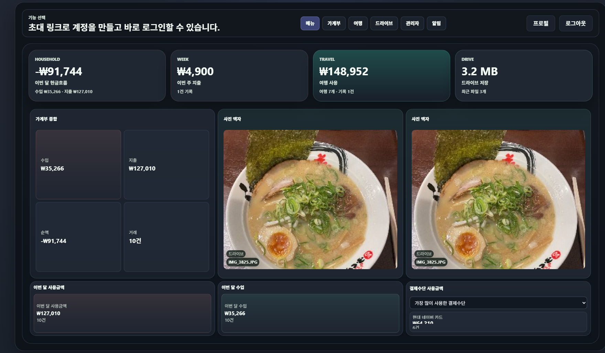
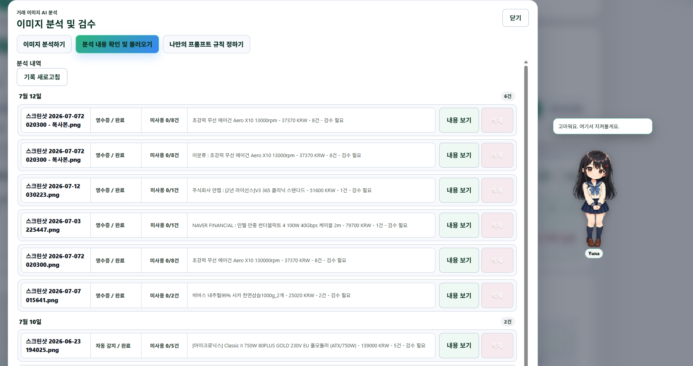
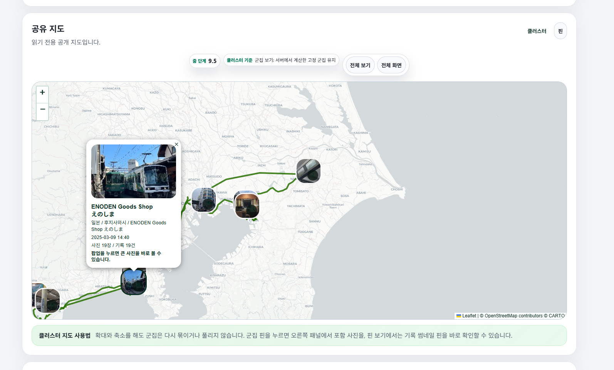
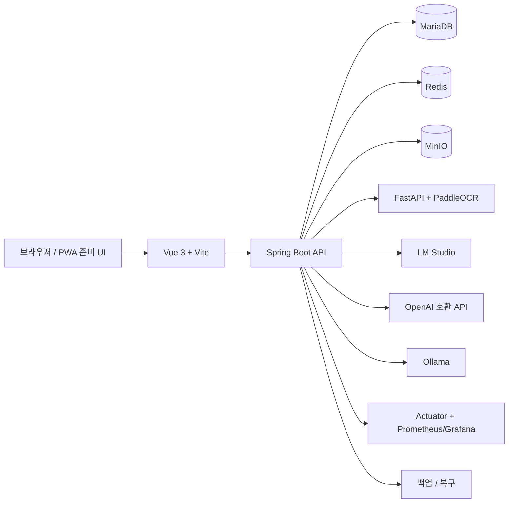
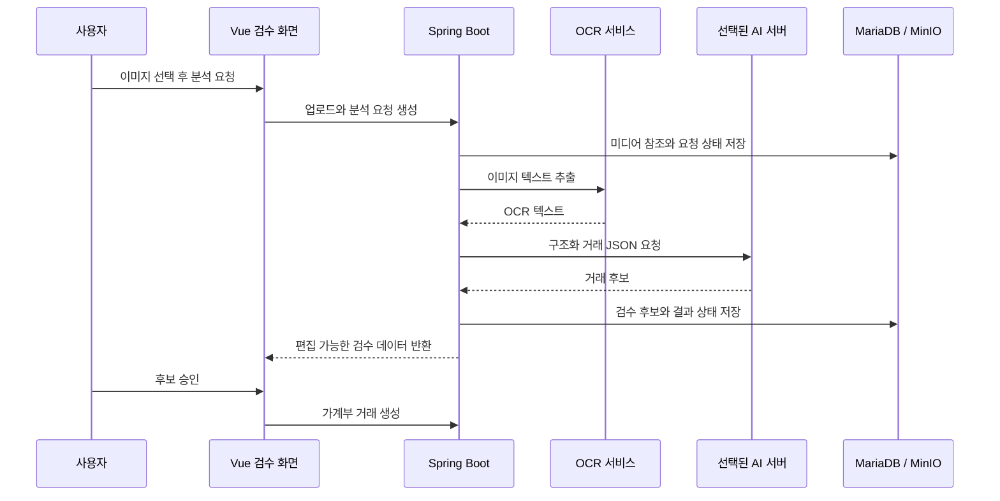

# Calen

> **Calendar, ledger, travel memory, and AI review in one personal workspace.**

Calen은 일상 지출, 여행 기록, 사진, 파일, AI 검수를 하나의 개인 워크스페이스에 연결한 풀스택 서비스입니다. AI는 데이터를 정리하고 제안하지만, 실제 데이터 반영은 사용자의 검수와 승인을 거쳐야만 이루어집니다.


## 프로젝트 한눈에 보기

| 영역 | 구현 내용 |
| --- | --- |
| **가계부** | 달력 기반 수입/지출 입력, 분류·결제수단 관리, 엑셀 가져오기/내보내기, 조합 검색, 사용자 대시보드 |
| **AI 검수** | 영수증·결제 캡처에서 편집 가능한 거래 후보를 생성하고, 사용자 승인 후에만 가계부에 기록 |
| **여행** | 여행 일정, 장소 핀, GPX 경로, EXIF 사진 지도, 타임라인, 읽기 전용 공개 지도 공유 |
| **드라이브** | 파일·폴더 관리, 다운로드, 공유 링크, 여행 미디어 참조 연결로 중복 저장 방지 |
| **운영·보안** | 역할 기반 관리자, AI 서버 라우팅, 암호화된 비밀키, 상태 확인, 스토리지 제어, 백업/복구 |

## 주요 화면

<p align="center">
  
</p>

<p align="center">
  
  
</p>

<p align="center"><sub>사용자 대시보드 · AI 거래 검수 · 읽기 전용 여행 지도 공유</sub></p>

## 핵심 경험

### 1. 달력 가계부와 사용자 대시보드

- 월간 달력, 빠른 거래 입력, 수정/삭제 가능한 거래 시트
- 합계, 예산, 결제수단, 누적 그래프 등을 포함한 최대 6개 사용자 설정 집계
- 데이터 자체를 바꾸지 않고도 가능한 대시보드 레이아웃·위젯 설정
- `네이버 + 컴퓨터`, `네이버 -취소`처럼 포함·제외·그룹을 조합하는 거래 검색식

### 2. AI 이미지 분석과 검수

- 영수증, 결제 완료 화면, 자동 감지 모드 지원
- 다건 결제 캡처를 개별 거래 후보로 분리
- 날짜, 시간, 금액, 제목, 분류, 메모, 결제수단을 입력 전에 직접 수정
- **이미지 업로드 → OCR 텍스트 추출 → 구조화 AI 분석 → 사용자 검수 → 승인 후 가계부 기록** 순서
- 완료/실패 분석 이력과 원본 미디어 참조를 보존해 재검수 가능

### 3. 지도 중심의 여행 기록

- 여행 일정, 방문 장소, GPX 경로, 경비, 사진을 하나의 여행에 연결
- EXIF/GPS를 읽고 썸네일을 생성해 인접 사진을 클러스터로 표시
- GPX 우선 보기와 장소 핀 우선 보기를 전환하고 보조 요소를 ON/OFF
- 장소, 사진, 경로를 선택적으로 제외할 수 있는 읽기 전용 공개 지도 URL
- 모바일 전체 화면 지도와 사진 상세 모달의 터치 충돌·깜박임을 별도 점검

### 4. 실수 없는 AI 서버 전환

- 가계부 AI 분석과 이미지/OCR 분석에 **LM Studio**, **OpenAI 호환 API**, **Ollama**를 각각 연결 가능
- 자주 쓰는 서버를 최대 3개 후보 서버로 등록하고, 기능과 후보 서버를 시각적으로 연결
- 후보 서버 등록만으로 실제 AI 서버는 변경되지 않으며, **기능별 연결 저장** 후에만 반영
- API 키 암호화 저장, 허용 호스트, 연결/응답 제한 시간 설정 지원

## 아키텍처



### AI 이미지 분석 흐름



## 설계와 구현에서 집중한 점

- **명시적인 상태 전이**: 분석, 승인, 재요청, 취소, 거래 기록을 별도 단계로 모델링
- **데이터 무결성**: AI 결과는 제안이며 승인 전에는 원본 가계부 데이터를 변경하지 않음
- **스토리지 효율**: 여행 미디어를 드라이브에서 참조해 동일 바이너리의 중복 저장 방지
- **보안 중심 연동**: 역할 검사, 2차 PIN, 공유 토큰 제어, 공급자 비밀키 암호화, URL allowlist
- **운영 안정성**: 상태 확인, 재시도 가능한 AI/OCR 처리, 제한 시간 설정, MinIO/MariaDB 분리, 백업/복구 문서화
- **반응형 UI**: 데스크톱·모바일별 모달/지도/제스처 처리, 공통 디자인 토큰 기반 다크·라이트 테마

## 기술 스택

| 구분 | 기술 |
| --- | --- |
| Frontend | Vue 3, Vite, Pinia, GridStack, Leaflet, exifr, Playwright |
| Backend | Java 17, Spring Boot 3.5, Spring Security, Spring Data JPA, Validation, Actuator, Flyway |
| Data | MariaDB, H2(로컬), Redis, MinIO |
| AI/OCR | PaddleOCR/FastAPI, LM Studio, OpenAI 호환 API, Ollama, n8n 연동 |
| Infrastructure | Docker Compose, Nginx, OCI 배포 구성, Jenkins, Prometheus/Grafana, rclone, Tailscale |

## 로컬 실행

### 준비물

- JDK 17
- Node.js LTS, npm
- Docker Desktop 또는 Docker Engine
- 선택 사항: OCR 서비스와 지원 AI 공급자

```bash
# Frontend
cd frontend
npm install
npm run dev

# Backend
cd ../backend
./gradlew test
./gradlew bootWar
```

전체 로컬 스택은 Docker Compose로 실행합니다.

```bash
cp .env.example .env
docker compose up -d --build
```

Docker Compose 기준 기본 애플리케이션 주소는 `http://localhost:8080`입니다. 실제 비밀값은 `.env`에만 두고 Git에 커밋하지 않습니다.

## 검증 명령

```bash
# Frontend production build
cd frontend && npm run build

# Backend tests
cd backend && ./gradlew test

# Playwright smoke tests
cd frontend && npm run test:e2e:smoke
```

## 저장소 구조

```text
backend/       Spring Boot API, 도메인 모듈, DB migration, 테스트
frontend/      Vue 화면, 공통 UI, API 클라이언트, Playwright 테스트
PaddleOCR/     선택적 로컬 OCR 서비스
deploy/        OCI, Nginx, Redis, 모니터링, 운영 스크립트
docs/          아키텍처, 보안, 배포, 데이터 이식성 문서
docs/portfolio/ README 화면 캡처
```

## 상세 문서

- [아키텍처](docs/architecture.md)
- [AI 공급자 안전 계약](docs/ai_provider_safety_contract.md)
- [보안 기준 체크리스트](docs/security_baseline_checklist.md)
- [공개 공유 권한 설계](docs/public_share_authorization_contract.md)
- [파일 업로드 보안](docs/file_upload_security_contract.md)
- [접근성·모바일 체크리스트](docs/accessibility_mobile_checklist.md)
- [OCI DB·MinIO 분리 배포 가이드](docs/OCI_DB_MinIO_분리_배포가이드.md)

---

개인 데이터 워크플로우, AI 보조 검수, 지도·미디어 상호작용, 운영 관점을 함께 다루는 포트폴리오 프로젝트입니다.
