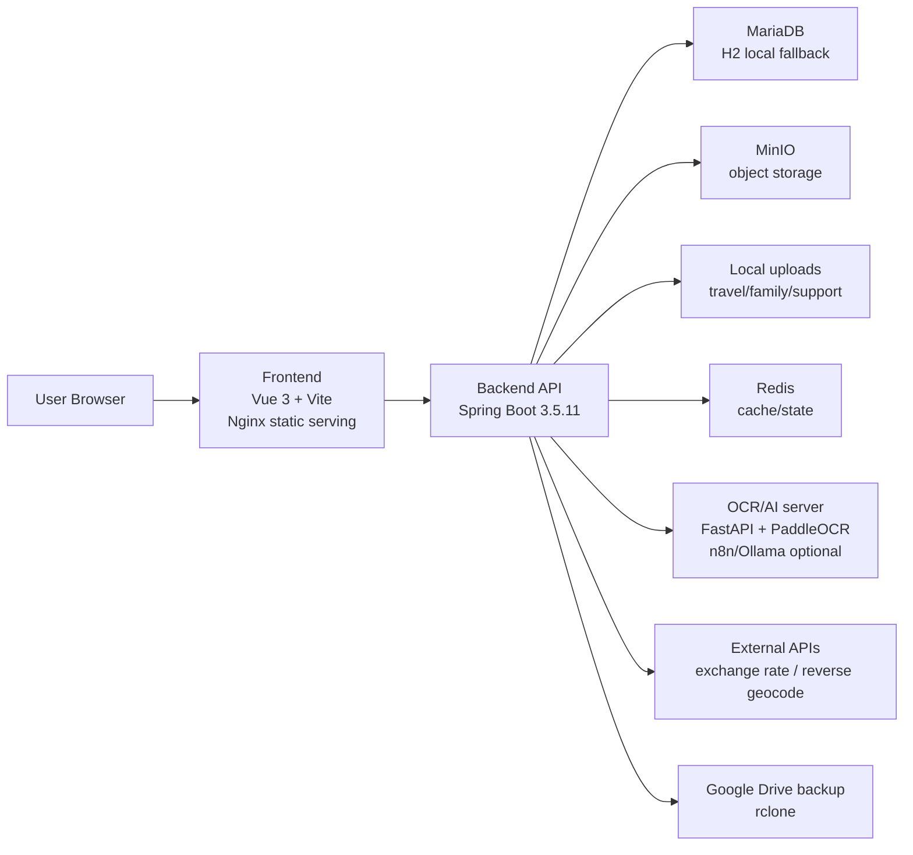
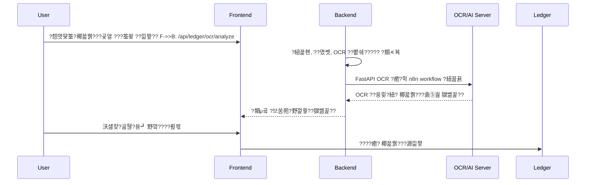
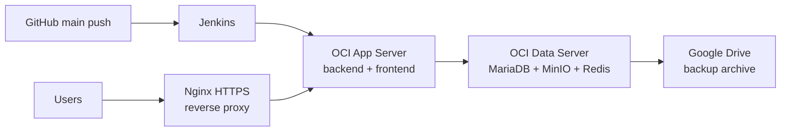
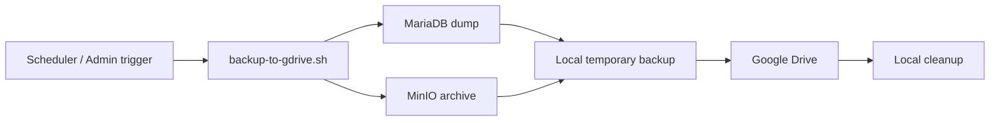

# TravelLedger (Calen)

TravelLedger??揶쎛€?④쑬?, ??六?疫꿸퀡以? ??六???彛?筌왖€?? ???뵬 ??뺤뵬??€?? 揶쎛€鈺???ㅼ씨??????뺥돩????됰퓠???온€?귐뗫릭??揶쏆뮇????븐넞 疫꿸퀡以????삸??깆뿯??덈뼄.

?얜챷苑?揶쏄퉮??? 2026-06-29

## ??뺣듌??癰귣떯由?

| ?닌됲뀋 | ??곸뒠 |
| --- | --- |
| ??쀫? ?源껉봄 | 揶쏆뮇??揶쎛€鈺???븐넞 疫꿸퀡以????삸??|
| 雅뚯눘???袁⑥컭??| 揶쎛€?④쑬?, ??六? ??彛?筌왖€?? ???뵬 ??뺤뵬??€?? 揶쎛€鈺???ㅼ씨, ?온€?귐딆쁽 ??곸겫 |
| Frontend | Vue 3, Vite, Pinia, GridStack, Leaflet, exifr |
| Backend | Java 17, Spring Boot 3.5.11, Spring Security, JPA, Actuator |
| Data/Storage | MariaDB, H2(local default), Redis, MinIO, local upload storage |
| OCR/AI | FastAPI, PaddleOCR, n8n/Ollama ?怨뺣짗 揶쎛€??|
| Infra | Docker Compose, OCI ???怨쀬뵠????뺤쒔 ?브쑬?? Nginx HTTPS, Jenkins, rclone Google Drive backup |

## 疫꿸퀡??筌왖€??
```mermaid
flowchart TB
  app["TravelLedger / Calen"]

  app --> dashboard["筌롫뗄??????뺣궖??br/>?遺얠쟿?? KPI, ?袁⑹졐 獄쏄퀣??]
  app --> ledger["揶쎛€?④쑬?<br/>??낆젾, 野꺜€?? ???€? ?臾?, 癰궰€野???€??]
  app --> ocr["揶쎛€?④쑬? OCR/AI<br/>?怨몃땾筌?椰꾧퀡???곷열 ??€?筌왖€ ?브쑴苑?]
  app --> travel["??六?br/>?④쑵?? ??됯텦, 筌왖€?? 疫꿸퀣堉? 野껋럥以?]
  app --> map["??六???彛?筌왖€??br/>GPS, ??€???쎄숲, ?⑤벀而?筌왖€??]
  app --> drive["CalenDrive<br/>???뵬/??€?? ?⑤벊?€, ????? ?紐껉퐬??]
  app --> family["揶쎛€鈺???ㅼ씨<br/>??ㅼ씨, 燁삳똾?믤€⑥쥓?? 揶쎛€鈺??⑤벊?€ 沃섎챶逾??]
  app --> household["揶쎛€??筌욌쵌??br/>揶쎛€?닌됲€????€?? ??六?揶쎛€?④쑬?"]
  app --> account["?④쑴???온€?귐딆쁽<br/>?λ뜄?, 亦낅슦釉? PIN, ?얜챷?? 獄쏄퉮毓?]
```

## ??뽯뮞???닌듼€?



## 疫꿸퀡?ヨ퉪???살구

### 1. 筌롫뗄??????뺣궖??
揶쎛€?④쑬?, ??六? ??뺤뵬??€???類ｋ궖?????遺얇늺?癒?퐣 ?遺용튋??몃빍?? `GridStack` 疫꿸퀡而??遺얠쟿?紐껋쨮 燁삳?諭?? ?袁⑹졐??獄쏄퀣???랁€? ????癒?€???뽯뻻 ???됪€???됱뵠?袁⑹뜍?????館鍮€??덈뼄. ??쎄쾿/??깆뵠??筌뤴뫀諭띄몴?筌왖€?癒곕???덈뼄.

?온€??Frontend: `MainDashboardWorkspace.vue`, `FeatureLauncher.vue`, `features/palette/*`

### 2. 揶쎛€?④쑬?

| 疫꿸퀡??| ??살구 |
| --- | --- |
| 椰꾧퀡????낆젾 | ??????疫꿸퀡而???낆젾????쥓??椰꾧퀡????낆젾????볥궗??몃빍?? |
| 野꺜€???袁り숲 | 椰꾧퀡??筌뤴뫖以?野꺜€?? ?브쑬履?野껉퀣???롫뼊 疫꿸퀣? 鈺곌퀬?띄몴???볥궗??몃빍?? |
| ???€???쑨??| 燁삳똾?믤€⑥쥓?? 野껉퀣???롫뼊, 疫꿸퀗而???쑨?? 筌△뫂???브쑴苑????볥궗??몃빍?? |
| ?브쑬履??온€??| ???브쑬履??怨멸쉭?브쑬履?? 野껉퀣???롫뼊???온€?귐뗫???덈뼄. |
| ?臾? 揶쎛€?紐꾩궎疫?| ?臾? ???뵬 沃섎챶?곮퉪?용┛ ???醫뤾문????깆뱽 椰꾧퀡?믤에?獄쏆꼷???몃빍?? |
| CSV/?臾? ??€???용┛ | 鈺곌퀗援??筌띿쉶??椰꾧퀡???怨쀬뵠?怨? ?紐? ???뵬嚥???€???낅빍?? |
| 癰궰€野???€??| 野꺜€????륁젟/??⑦겣 癰궰€野???€???疫꿸퀡以??랁€?癰귣벀???????됰뮸??덈뼄. |

?온€??Backend: `ledger/web`, `ledger/service`, `ledger/domain`, `ledger/repository`

### 3. 揶쎛€?④쑬? OCR/AI

?怨몃땾筌??癒?뮉 燁삳?諭?椰꾧퀡???곷열 筌╈돦荑???€?筌왖€????낆쨮??쀫릭筌?OCR/AI ?브쑴苑?野껉퀗?든몴??類ㅼ뵥??랁€?椰꾧퀡????낆젾 ??깅퓠 ?怨몄뒠??????됰뮸??덈뼄. ?癒?짗 ???關? ??? ??놁몵筌? ????癒? 野꺜€?醫뤿립 ??筌ㅼ뮇伊??源낆쨯??몃빍??



| ?醫륁굨 | ??살구 |
| --- | --- |
| `RECEIPT` | ?怨몃땾筌????關肉????椰꾧퀡????뽯툧 |
| `PAYMENT_CAPTURE` | 燁삳?諭??④쑴伊?椰꾧퀡???곷열 筌╈돦荑????關肉??????椰꾧퀡???袁⑤궖 ??뽯툧 |
| `AUTO` | ??뺤쒔揶쎛€ 揶쎛€?館釉?甕곕뗄??癒?퐣 ?얜챷苑??醫륁굨 ?癒?짗 ?癒?뼊 |

OCR ??뺤쒔揶쎛€ ?곗눘議???됰선????곗뺘 揶쎛€?④쑬? ??낆젾, ??륁젟, ???? 野꺜€?? ???€? ?臾? 疫꿸퀡??? ?④쑴???????????됰선????몃빍??

### 4. ??六?

??六?疫꿸퀡??? ?④쑵?? ??됯텦, 筌왖€?? 疫꿸퀣堉? 野껋럥以? 沃섎챶逾??€? ????μ맄嚥??얜씈堉??온€?귐뗫???덈뼄.

| 疫꿸퀡??| ??살구 |
| --- | --- |
| ??六??④쑵??| ??六얕퉪???깆젟, ?怨밴묶, ?遺용튋 ?類ｋ궖???온€?귐뗫???덈뼄. |
| ??됯텦/筌왖€??| ??六???됯텦 ???됪€???쇱젫 筌왖€?곗뮇??疫꿸퀡以??몃빍?? |
| ??六?疫꿸퀣堉?| ??六?餓???ｋ┸ 筌롫뗀??? 疫꿸퀡以???온€?귐뗫???덈뼄. |
| 野껋럥以?| ??€猷??닌덉퍢, ?대????롫뼊, 野껋럥以??????깆뱽 ???館鍮€??덈뼄. |
| ??六??뚣끇???딅뼒 | ?⑤벀而???곕굡/?⑤벊?€ ?遺얇늺?????퉸 ??六??類ｋ궖???紐꾪뀱??몃빍?? |
| ??륁몛 | ?紐? ??륁몛 API???????랁€?筌?Ŋ??TTL????볥빍?? |
| ?????쇳맜??| ??彛??袁⑺뒄???ル슦紐?疫꿸퀡而??袁⑺뒄筌뤿굞??鈺곌퀬???랁€?筌?Ŋ???몃빍?? |

?온€??Backend: `travel/web`, `travel/service`, `travel/domain`, `travel/repository`

### 5. ??六???彛?筌왖€?袁? ?⑤벊?€

??낆쨮??쀫립 ??六???彛??GPS 筌롫???怨쀬뵠?怨? 疫꿸퀡而??곗쨮 筌왖€???袁⑸퓠 ??뽯뻻??몃빍?? ??彛??筌띾‘?????뮉 ??€???쎄숲?? ?됯퀬猷??疫꿸퀡而????쐭筌띻낯?앮에??遺얇늺 ?봔€??곸뱽 餓κ쑴???덈뼄.

| 疫꿸퀡??| ??살구 |
| --- | --- |
| ????彛?| ??六???彛???紐껉퐬????ㅼ씨??곗쨮 癰귣떯???怨멸쉭 筌뤴뫀??癒?퐣 ?癒?궚 ??쑴?됪€??袁⑺뒄???類ㅼ뵥??몃빍?? |
| ??彛?筌왖€??| GPS ??彛??筌왖€????/??€???쎄숲嚥???뽯뻻??몃빍?? |
| ??€???쎄숲 ??????€?筌왖€ | 筌왖€????€???쎄숲????????彛??筌왖€?類λ막 ????됰뮸??덈뼄. |
| ?⑤벀而???六?筌왖€??| ?⑤벀而?揶쎛€?館釉???六?筌왖€????彛??類ｋ궖??癰귢쑬猷??遺얇늺??곗쨮 ??볥궗??몃빍?? |
| 域밸챶竊??⑤벊?€ | ??쀫립???????域밸챶竊????六??類ｋ궖???⑤벊?€??몃빍?? |
| ?紐껉퐬??獄쏄퉲釉?| ?袁⑥뵭????六?沃섎챶逾???紐껉퐬??깆뱽 獄쏄퀣???臾믩씜??곗쨮 癰귣떯而??몃빍?? |

?온€??Frontend: `TravelMyMapWorkspace.vue`, `TravelMyPhotosWorkspace.vue`, `TravelPublicTripsWorkspace.vue`, `TravelSharedExhibitWorkspace.vue`

### 6. CalenDrive

CalenDrive??揶쏆뮇?????뵬 ??뺤뵬??€??疫꿸퀡???낅빍?? ???뵬/??€???癒?퉳, ??낆쨮?? ??쇱뒲嚥≪뮆諭? ?⑤벊?€, 獄쏆룇? ???뵬 ???? ????? ?紐껉퐬?? ?袁⑥쨮????€?筌왖€???온€?귐뗫???덈뼄.

| 疫꿸퀡??| ??살구 |
| --- | --- |
| ???뵬/??€??| ??뺤뵬??€???袁⑹뵠??뽰뱽 ??€???닌듼€쒏에??온€?귐뗫???덈뼄. |
| ??낆쨮????쇱뒲嚥≪뮆諭?| ???뵬 ??낆쨮??? ??쇱뒲嚥≪뮆諭?筌띻낱寃뺟몴???볥궗??몃빍?? |
| ?⑤벊?€ | ?????揶????뵬 ?⑤벊?€?? 獄쏆룇? ???뵬 ???關??筌왖€?癒곕???덈뼄. |
| ?????| ????????뵬????????癒?カ??곗쨮 ?온€?귐뗫???덈뼄. |
| ?紐껉퐬??| ??€?筌왖€ 沃섎챶?곮퉪?용┛?? ??뺤뵬??€???袁⑥쨮????€?筌왖€??筌왖€?癒곕???덈뼄. |
| ?온€?귐딆쁽 ??쇱젟 | ??뺤뵬??€????곸겫 ??쇱젟???온€?귐딆쁽 API嚥??브쑬???몃빍?? |

?온€??Backend: `drive/web`, `drive/service`, `drive/domain`, `drive/repository`

### 7. 揶쎛€鈺???ㅼ씨

揶쎛€鈺???ㅼ씨?? 揶쎛€鈺???μ맄 沃섎챶逾??€? ??ㅼ씨??燁삳똾?믤€⑥쥓?곫에??얜씈堉??온€?귐뗫릭???怨몃열??낅빍??

| 疫꿸퀡??| ??살구 |
| --- | --- |
| ??ㅼ씨 | 揶쎛€鈺???ㅼ씨 ??밴쉐????ㅼ씨癰?沃섎챶逾???닌딄쉐???온€?귐뗫???덈뼄. |
| 燁삳똾?믤€⑥쥓??| 揶쎛€鈺?燁삳똾?믤€⑥쥓??? ?닌딄쉐?癒?뱽 ?온€?귐뗫???덈뼄. |
| 沃섎챶逾??| 揶쎛€鈺???彛?沃섎챶逾?????뵬?????館釉?€?筌뤴뫖以??곗쨮 ??볥궗??몃빍?? |
| ?????野꺜€??| 揶쎛€鈺???ㅼ씨 ?닌딄쉐???곕떽????袁る립 ?????野꺜€?????€????볥궗??몃빍?? |

?온€??Backend: `familyalbum/web`, `familyalbum/service`, `familyalbum/domain`, `familyalbum/repository`

### 8. 揶쎛€??筌욌쵌??

揶쎛€????μ맄 ?遺얇늺?? ????癒?€?揶쎛€?④쑬? ?怨쀬뵠?怨? ??밴텦??揶쎛€鈺??癒?뮉 揶쎛€???온€?癒?벥 筌왖€???癒?カ???類ㅼ뵥??롫뮉 ?怨몃열??낅빍?? ??六?揶쎛€?④쑬? ?遺얇늺???怨뚰€??뤿선 揶쎛€????μ맄 ??六?筌왖€?곗뮇???怨뺤쨮 癰?????됰뮸??덈뼄.

?온€??Frontend: `HouseholdWorkspace.vue`, `HouseholdTravelLedgerWorkspace.vue`

### 9. ?④쑴?? 亦낅슦釉? ?온€?귐딆쁽

| 疫꿸퀡??| ??살구 |
| --- | --- |
| ?紐꾩쵄 | 嚥≪뮄??? ???뜚揶쎛€?? remember-me/JWT 疫꿸퀡而??紐꾩쵄????볥궗??몃빍?? |
| ?λ뜄? | ?온€?귐딆쁽 ?λ뜄? 筌띻낱寃???밴쉐???λ뜄? ??롮뵭 ?癒?カ????볥궗??몃빍?? |
| 癰귣똻??PIN | ?袁⑥쨮???온€?귐딆쁽 ?臾롫젏 癰귣똾?뉒몴??袁る립 2筌?PIN ?癒?カ??筌왖€?癒곕???덈뼄. |
| ???????됱뵠?袁⑹뜍 | ????癒?€?????뺣궖???遺얇늺 ??쇱젟?????館鍮€??덈뼄. |
| ?⑥쥒而??얜챷??| ?얜챷???源낆쨯, 筌ｂ뫀????뵬 ???? ?온€?귐딆쁽 ???/癰귣떯?????볥궗??몃빍?? |
| ?온€?귐딆쁽 ????뺣궖??| ????? 嚥≪뮄???揶쏅Ŋ沅? ?λ뜄?, ?怨쀬뵠???袁れ넺???온€?귐뗫???덈뼄. |
| 獄쏄퉮毓?癰귣벀??| DB/MinIO 獄쏄퉮毓썸€?癰귣벀??筌욊쑴??癒?뱽 ??볥궗??몃빍?? |
| Redis ?怨밴묶 | Redis ?關釉룟첎? ?袁⑷퍥 疫꿸퀡???關釉룡에?甕곕뜆?筌왖€ ??낅즲嚥?揶쎛€?館釉?甕곕뗄??癒?퐣 ?袁れ넅??몃빍?? |

?온€??Backend: `account/web`, `account/service`, `account/security`, `common/cache`

## 疫꿸퀣????쎄문

### Frontend

| 疫꿸퀣??| ??몃즲 |
| --- | --- |
| Vue 3.5 | SPA UI |
| Vite 7 | 揶쏆뮆而???뺤쒔?? ??슢諭?|
| Pinia 3 | ??€???곷섧???怨밴묶 ?온€??|
| GridStack 12 | ????뺣궖???遺얠쟿????뺤삋域?獄쏄퀣??|
| Leaflet 1.9 | 筌왖€??UI |
| exifr | ??彛?EXIF/GPS 筌롫???怨쀬뵠??筌ｌ꼶??|
| JavaScript SFC | TypeScript???????? ??놁벉 |

?醫됲뇣 Vue SFC??`<script setup>` JavaScript 疫꿸퀣???곗쨮 ?臾믨쉐??몃빍??

### Backend

| 疫꿸퀣??| ??몃즲 |
| --- | --- |
| Java 17 | 獄쏄퉮肉???怨???|
| Spring Boot 3.5.11 | API ??뺤쒔 |
| Spring Web/Security/JPA/Validation | REST API, ?紐꾩쵄, ORM, ?遺욧퍕 野꺜€筌?|
| Spring Actuator | health/info/prometheus ??곸겫 ?遺얜굡?????|
| MariaDB | ??곸겫 ?怨쀬뵠?怨뺤퓢??곷뮞 |
| Flyway | 甕곌쑴??疫꿸퀡而?DB 筌띾뜆?졿뉩紐껋쟿??곷€?|
| H2 | 嚥≪뮇類?疫꿸퀡???紐껋컭筌뤴뫀???怨쀬뵠?怨뺤퓢??곷뮞 |
| Redis/Lettuce | 筌?Ŋ???怨밴묶 ????|
| MinIO | ??삵닏??븍뱜 ??쎈꽅?귐? |
| Apache POI | ?臾? 揶쎛€?紐꾩궎疫???€???용┛ |
| zip4j | ?類ㅽ뀧 ???뵬 筌ｌ꼶??|
| metadata-extractor | ??€?筌왖€ 筌롫???怨쀬뵠??筌ｌ꼶??|
| Micrometer Prometheus | 筌뤴뫀??怨뺤춦 筌롫??껆뵳?|
| Lombok | Java 癰귣똻???逾??됱뵠???곕벡??|

### OCR / AI

| 疫꿸퀣??| ??몃즲 |
| --- | --- |
| FastAPI | OCR ?브쑴苑???뺤쒔 |
| PaddleOCR | ??€?筌왖€ OCR |
| Ollama Gemma ?④쑴肉?筌뤴뫀??| OCR 野껉퀗??癰귣똻???類μ굨???醫뤾문筌왖€ |
| n8n workflow | AI ?브쑴苑????뵠?袁⑥뵬???醫뤾문筌왖€ |
| Windows 1060 PC | 癰귢쑬猷?OCR/AI ?브쑴苑???뺤쒔 ??곸겫 ??띻펾 |

### Infra

| 疫꿸퀣??| ??몃즲 |
| --- | --- |
| Docker Compose | 嚥≪뮇類???곸겫 ?뚢뫂???€瑗??닌딄쉐 |
| Nginx | HTTPS reverse proxy?? frontend ?類ㅼ읅 ???뵬 ??뺥뒅 |
| OCI | ????뺤쒔?? ?怨쀬뵠????뺤쒔 ?브쑬????곸겫 |
| Jenkins | GitHub main push 疫꿸퀡而?獄쏄퀬猷?|
| rclone | Google Drive 獄쏄퉮毓?|
| Prometheus/Grafana | ??곸겫 筌뤴뫀??怨뺤춦 ?닌딄쉐 |

## ?袁⑥쨮??븍뱜 ?닌듼€?

```text
.
|-- backend/
|   |-- src/main/java/com/playdata/calen/
|   |   |-- account/        ?紐꾩쵄, ?λ뜄?, ?온€?귐딆쁽, ?얜챷?? ???????쇱젟
|   |   |-- common/         ?⑤벏????쇱젟, ??됱뇚, 筌?Ŋ?? 沃섎챶逾??筌ｌ꼶??
|   |   |-- drive/          CalenDrive ???뵬/?⑤벊?€/?袁⑥쨮??|   |   |-- familyalbum/    揶쎛€鈺???ㅼ씨??揶쎛€鈺?沃섎챶逾??|   |   |-- ledger/         揶쎛€?④쑬?, ???€? ?臾?, OCR, AI ?브쑴苑?
|   |   `-- travel/         ??六? 筌왖€?? 沃섎챶逾?? ?⑤벊?€, ??륁몛
|   |-- src/main/resources/application.yml
|   |-- src/test/java/
|   |-- sql/ledger-dummy/
|   |-- build.gradle
|   `-- Dockerfile
|-- frontend/
|   |-- src/components/     雅뚯눘???遺얇늺 ??μ맄 Vue ?뚮똾猷??곕뱜
|   |-- src/features/       ?遺얠쟿????疫꿸퀡??筌뤴뫀諭?
|   |-- src/lib/            API, ???? 沃섎챶逾????六??醫뤿뼢
|   |-- public/
|   |-- package.json
|   `-- Dockerfile
|-- PaddleOCR/
|   |-- ocr_service.py
|   |-- requirements.txt
|   `-- install_windows_ocr.ps1
|-- deploy/
|   |-- n8n/                OCR/AI workflow?? n8n compose
|   `-- oci/
|       |-- nginx/
|       |-- redis/
|       |-- monitoring/
|       `-- scripts/
|-- docs/
|-- docker-compose.yml
|-- docker-compose.oci.app.yml
|-- docker-compose.oci.data.yml
|-- docker-compose.oci.monitoring.yml
`-- README.md
```

?룐뫂??癒?퐣 ?類ㅼ뵥??롫뮉 癰귣똻???臾믩씜 ????

| ????| ?源껉봄 |
| --- | --- |
| `.env`, `.env.*.example` | 嚥≪뮇類???곸겫 ??띻펾癰궰€????됰뻻?? ??쇱젫 ??띻펾揶?|
| `.wiki-temp`, `worklog.md` | ?얜챷苑??臾믩씜 嚥≪뮄??癰귣똻???癒?┷ |
| `ea`, `miniossl`, `?醫롮?` | 嚥≪뮇類??癒?뮉 ??곸겫 癰귣똻???癒?┷嚥?癰귣똻?좑쭖????뼎 ?醫뤿탣?귐???곷€????뮞???袁⑤뻷 |
| `backend/build`, `backend/.gradle`, `frontend/node_modules`, `frontend/dist`, `*.log` | ??슢諭?筌?Ŋ??嚥≪뮄???怨쀭뀱??|

## 嚥≪뮇類?揶쏆뮆而?

### ?遺쎈럡 ??鍮?

| ?袁㏓럡 | 亦낅슣??|
| --- | --- |
| JDK | 17 |
| Node.js/npm | ?袁⑹삺 Vite/Vue ??슢諭뜹첎? 揶쎛€?館釉?LTS 甕곌쑴??|
| Docker Desktop ?癒?뮉 Docker Engine | Compose 疫꿸퀡而???쎈뻬 ???袁⑹뒄 |
| MariaDB/MinIO/Redis | Docker Compose???怨뺛늺 癰귢쑬猷???쇳뒄 ?븍뜇釉??|
| OCR ??뺤쒔 | OCR 疫꿸퀡?????뮞????癰귢쑬猷?Windows OCR PC ?癒?뮉 ?紐낆넎 ??뺤쒔 ?袁⑹뒄 |

### Frontend

```bash
cd frontend
npm install
npm run dev
npm run build
```

?袁⑥쨴?紐꾨퓦??揶쏆뮆而???뺤쒔??Vite揶쎛€ 疫꿸퀡?????껆몴??????몃빍?? ??곸겫 ?뚢뫂???€瑗?癒?퐣??Nginx揶쎛€ ?類ㅼ읅 ???뵬????뺥뒅??랁€?`/api` ?遺욧퍕??backend嚥??袁⑥쨯??쀫???덈뼄.

### Backend

```bash
cd backend
./gradlew test
./gradlew bootWar
```

Windows PowerShell:

```powershell
cd backend
.\gradlew.bat test
.\gradlew.bat bootWar
```

??띻펾癰궰€??? ??곸몵筌?`application.yml` 疫꿸퀡??첎誘る퓠 ?怨뺤뵬 H2 ?紐껋컭筌뤴뫀??DB???????몃빍?? MariaDB, MinIO, Redis ?怨뺣짗?? `.env` ?癒?뮉 ??뺤쒔 ??띻펾癰궰€??롮쨮 ??쇱젟??몃빍??

### Docker Compose

```bash
cp .env.example .env
docker compose up -d --build
```

疫꿸퀡??Compose ??뺥돩??

| ??뺥돩??| ??살구 | 疫꿸퀡???臾롫젏 |
| --- | --- | --- |
| `frontend` | Vue ?類ㅼ읅 ??+ Nginx | `http://localhost:8080` |
| `backend` | Spring Boot API | compose ??€? `backend:8080` |
| `mariadb` | MariaDB 11.4 | compose ??€? |
| `minio` | ???뵬/object storage | API `9000`, Console `9001` |
| `minio-init` | 疫꿸퀡??bucket ??밴쉐 | 1???쉐 ?臾믩씜 |

疫꿸퀡??bucket ??€已?? `MINIO_CLOUD_BUCKET` 揶쏅??좑쭖? 疫꿸퀡??첎誘? `budgetjourneybucket`??낅빍??

## 雅뚯눘????띻펾癰궰€??
### ?⑤벏??Backend

| 癰궰€??| ??살구 | 疫꿸퀡??첎?|
| --- | --- | --- |
| `DB_URL` | JDBC ?怨뚭퍙 ?얜챷???| H2 ?紐껋컭筌뤴뫀??|
| `DB_DRIVER` | JDBC driver | `org.h2.Driver` |
| `DB_ID`, `DB_PASS` | DB ?④쑴??| `sa` / empty |
| `JWT_KEY` | JWT/remember-me key | 嚥≪뮇類?疫꿸퀡??첎???됱벉 |
| `JWT_EXPIRE` | JWT 筌띾슢利???볦퍢 | `300000000` |
| `APP_SEED_ENABLED` | ?λ뜃由??怨쀬뵠??seed ??? | `false` |
| `H2_CONSOLE_ENABLED` | H2 console ??뽮쉐??| `false` |
| `DB_MIGRATION_ENABLED` | Flyway 筌띾뜆?졿뉩紐껋쟿??곷€???뽮쉐??| `false` |
| `DB_MIGRATION_BASELINE_ON_MIGRATE` | 疫꿸퀣??DB baseline ??됱뒠 | `true` |
| `DB_MIGRATION_VALIDATE_ON_MIGRATE` | 筌띾뜆?졿뉩紐껋쟿??곷€?野꺜€筌???뽮쉐??| `true` |

### Storage

| 癰궰€??| ??살구 | 疫꿸퀡??첎?|
| --- | --- | --- |
| `MINIO_API` | ??€? MinIO endpoint | empty |
| `MINIO_PUBLIC_API` | ?紐? ?⑤벀而?endpoint | empty |
| `MINIO_NAME`, `MINIO_SECRET` | MinIO access key/secret | empty |
| `MINIO_CLOUD_BUCKET` | 疫꿸퀡??bucket | `budgetjourneybucket` |
| `MINIO_PRESIGNED_URL_EXPIRY_SECONDS` | presigned URL 筌띾슢利?| `6000` |
| `TRAVEL_MEDIA_STORAGE_PATH` | ??六?沃섎챶逾??嚥≪뮇類?????野껋럥以?| `${user.dir}/uploads/travel-media` |
| `FAMILY_MEDIA_STORAGE_PATH` | 揶쎛€鈺???ㅼ씨 沃섎챶逾??嚥≪뮇類?????野껋럥以?| `${user.dir}/uploads/family-media` |
| `SUPPORT_ATTACHMENT_STORAGE_PATH` | ?얜챷??筌ｂ뫀? ????野껋럥以?| `${user.dir}/uploads/support-inquiries` |

### Travel

| 癰궰€??| ??살구 | 疫꿸퀡??첎?|
| --- | --- | --- |
| `TRAVEL_EXCHANGE_RATE_BASE_URL` | ??륁몛 API base URL | `https://api.frankfurter.dev/v1` |
| `TRAVEL_EXCHANGE_RATE_CACHE_MINUTES` | ??륁몛 筌?Ŋ????볦퍢 | `30` |
| `TRAVEL_REVERSE_GEOCODE_BASE_URL` | ?????쇳맜??API | Nominatim reverse |
| `TRAVEL_REVERSE_GEOCODE_USER_AGENT` | ?????쇳맜??User-Agent | `TravelLedger/1.0 ...` |
| `TRAVEL_SUMMARY_CACHE_TTL_SECONDS` | ??六??遺용튋 筌?Ŋ??TTL | `60` |
| `TRAVEL_MEDIA_DOWNLOAD_CACHE_TTL_SECONDS` | 沃섎챶逾????쇱뒲嚥≪뮆諭?筌?Ŋ??TTL | `300` |
| `TRAVEL_THUMBNAIL_BACKFILL_ENABLED` | ?紐껉퐬??獄쏄퉲釉???뽮쉐??| `true` |
| `TRAVEL_PRESIGNED_UPLOAD_ENABLED` | ??六?presigned upload ??뽮쉐??| `false` |

### OCR / AI

| 癰궰€??| ??살구 | 疫꿸퀡??첎?|
| --- | --- | --- |
| `LEDGER_OCR_ENABLED` | 揶쎛€?④쑬? OCR ??뽮쉐??| `false` |
| `LEDGER_OCR_BASE_URL` | FastAPI OCR ??뺤쒔 URL | empty |
| `LEDGER_OCR_WORKFLOW_URL` | n8n workflow webhook URL | empty |
| `LEDGER_OCR_API_KEY` | OCR API key | empty |
| `LEDGER_OCR_CONNECT_TIMEOUT` | ?怨뚭퍙 timeout | `3s` |
| `LEDGER_OCR_READ_TIMEOUT` | ??꾨┛ timeout | `90s` |
| `LEDGER_OCR_MAX_FILE_SIZE` | OCR ??낆쨮??筌ㅼ뮆? ??由?| `10MB` |

揶쎛€?④쑬? AI ?브쑴苑?? `APP_LEDGER_AI_PROVIDER=lmstudio`????LM Studio??筌욊낯???紐꾪뀱??랁€? `n8n`????疫꿸퀣??workflow webhook???紐꾪뀱??몃빍?? Provider嚥?癰귣?沅??椰꾧퀡??筌뤴뫖以?? 揶쏆뮇??類ｋ궖/?醫뤾쿃 癰귣똾?뉒몴??袁る퉸 ??뺛걠/筌롫뗀?덂첎? ?곕벡鍮??랁€??袁⑸꽊 椰꾨똻?붷첎? ??쀫립??몃빍?? ??덉뵬 ?????疫꿸퀗而?provider/model????쥓??????袁⑤뮉 筌ㅼ뮄???袁⑥┷ 野껉퀗?든몴???沅??븍???덈뼄. ??곸겫?癒?퐣??AI provider URL allowlist???녹뮇苑?LM Studio/n8n ?紐꾪뀱 ???怨몄뱽 筌뤿굞??怨몄몵嚥???쀫립??????됰뮸??덈뼄.

| 癰궰€??| ??살구 | 疫꿸퀡??첎?|
| --- | --- | --- |
| `APP_LEDGER_AI_ENABLED` | 揶쎛€?④쑬? AI ?브쑴苑???뽮쉐??| `true` |
| `APP_LEDGER_AI_PROVIDER` | AI ?⑤벀??? `lmstudio` ?癒?뮉 `n8n` | `lmstudio` |
| `APP_LEDGER_AI_MODEL` | ?ъ슜??紐⑤뜽 ?대쫫. `auto`?대㈃ LM Studio `/api/v1/models`??泥?紐⑤뜽???ъ슜 | `auto` |
| `APP_LEDGER_AI_LMSTUDIO_BASE_URL` | LM Studio ??뺤쒔 雅뚯눘??| `http://172.18.240.1:1234` |
| `APP_LEDGER_AI_LMSTUDIO_CHAT_PATH` | LM Studio chat endpoint | `/api/v1/chat` |
| `APP_LEDGER_AI_LMSTUDIO_MODELS_PATH` | LM Studio model discovery endpoint used when `APP_LEDGER_AI_MODEL=auto` | `/api/v1/models` |
| `APP_LEDGER_AI_LMSTUDIO_API_KEY` | LM Studio API key揶쎛€ ?袁⑹뒄??野껋럩??????| empty |
| `APP_LEDGER_AI_TEMPERATURE` | 筌뤴뫀???臾먮뼗 ??ㅻ즲 | `0.2` |
| `APP_LEDGER_AI_MAX_TOKENS` | 筌ㅼ뮆? ?臾먮뼗 ?醫뤾쿃 | `2048` |
| `APP_LEDGER_AI_WORKFLOW_URL` | n8n provider??webhook URL | empty |
| `APP_LEDGER_AI_API_KEY` | n8n provider??API key | empty |
| `APP_LEDGER_AI_API_KEY_HEADER` | n8n API key header | `X-TravelLedger-AI-Key` |
| `APP_LEDGER_AI_ENFORCE_PROVIDER_URL_ALLOWLIST` | LM Studio/n8n URL host allowlist 揶쏅벡????? | `false` |
| `APP_LEDGER_AI_ALLOWED_PROVIDER_HOSTS` | ??됱뒠??AI provider host CSV | `localhost,127.0.0.1,::1,172.18.240.1` |

### Redis

| 癰궰€??| ??살구 |
| --- | --- |
| `REDIS_CACHE_HOST`, `REDIS_CACHE_PORT`, `REDIS_CACHE_PASSWORD`, `REDIS_CACHE_DATABASE`, `REDIS_CACHE_SSL` | 筌?Ŋ??Redis |
| `REDIS_STATE_HOST`, `REDIS_STATE_PORT`, `REDIS_STATE_PASSWORD`, `REDIS_STATE_DATABASE`, `REDIS_STATE_SSL` | ?怨밴묶 Redis |

### 獄쏄퉮毓???곸겫

| 癰궰€??| ??살구 |
| --- | --- |
| `DATA_OPS_BACKUP_WORKDIR` | 獄쏄퉮毓??臾믩씜 ?遺얠젂?怨뺚봺 |
| `DATA_OPS_BACKUP_REMOTE_NAME` | rclone remote ??€已?|
| `DATA_OPS_BACKUP_REMOTE_DIR` | DB 獄쏄퉮毓??癒?봄 ?遺얠젂?怨뺚봺 |
| `DATA_OPS_MINIO_BACKUP_REMOTE_DIR` | MinIO 獄쏄퉮毓??癒?봄 ?遺얠젂?怨뺚봺 |
| `DATA_OPS_RCLONE_CONFIG_PATH` | rclone config 野껋럥以?|
| `DATA_OPS_DB_BACKUP_ENABLED`, `DATA_OPS_DB_BACKUP_CRON` | DB 獄쏄퉮毓????餓?|
| `DATA_OPS_MINIO_BACKUP_ENABLED`, `DATA_OPS_MINIO_BACKUP_CRON` | MinIO 獄쏄퉮毓????餓?|

## ??곸겫 ?닌듼€?

??곸겫?? ????뺤쒔?? ?怨쀬뵠????뺤쒔???브쑬???롫뮉 ?닌딄쉐??疫꿸퀣???곗쨮 ??몃빍??



??곸겫 Compose ???뵬:

| ???뵬 | ??몃즲 |
| --- | --- |
| `docker-compose.oci.app.yml` | ????뺤쒔??backend/frontend ?닌딄쉐 |
| `docker-compose.oci.data.yml` | ?怨쀬뵠????뺤쒔??MariaDB/MinIO ???怨밴묶 ?????닌딄쉐 |
| `docker-compose.oci.monitoring.yml` | Prometheus/Grafana 筌뤴뫀??怨뺤춦 ?닌딄쉐 |
| `docker-compose.oci.yml` | OCI ????/癰귣똻???닌딄쉐 |

Jenkins 獄쏄퀬猷??癒?カ:

```text
GitHub main push
  -> Jenkins checkout
  -> SSH to app server
  -> git fetch/reset
  -> docker compose config
  -> docker compose up -d --build backend frontend
```

## 獄쏄퉮毓?

`deploy/oci/scripts/backup-to-gdrive.sh`??DB/MinIO 獄쏄퉮毓????밴쉐??랁€?Google Drive嚥???낆쨮??쀫립 ??嚥≪뮇類??袁⑸뻻 ?怨쀭뀱?얠눘???類ｂ봺??롫뮉 獄쎻뫚堉??곗쨮 ??곸겫??몃빍??



??뺤쒔 ?遺용뮞??? 獄쏄퉮毓????뵬 ?袁⑹읅??곗쨮 揶쎛€??筌△뫁? ??낅즲嚥?獄쏄퉮毓???嚥≪뮇類??怨쀭뀱???類ｂ봺???類ㅼ뵥??곷튊 ??몃빍??

## 癰귣똻釉?雅뚯눘??

??쇱벉 ???뵬??揶쏅?? ?뚣끇而??? ??녿뮸??덈뼄.

| ????| ??됰뻻 |
| --- | --- |
| ??띻펾 ???뵬 | `.env`, ??쇱젫 ??곸겫 `.env.*` |
| ?紐꾩쵄 ?類ｋ궖 | SSH private key, JWT key, OCR API key |
| ?怨쀬뵠???臾믩꺗 ?類ｋ궖 | DB/Redis/MinIO ?④쑴?숁€???쑬?甕곕뜇??|
| 揶쏆뮇???怨쀬뵠??| ??쇱젫 ?怨몃땾筌? 燁삳?諭???곷열, 揶쏆뮇????彛??癒?궚 ???뮞?????뵬 |
| AI/OCR ?怨쀭뀱??| OCR 揶쎛€?怨뱀넎野? 筌뤴뫀??筌?Ŋ?? ???뮞????€?筌왖€ |
| ??곸겫 ?怨쀭뀱??| ??곸겫 嚥≪뮄?? 獄쏄퉮毓????뵬, ?袁⑸뻻 癰귣벀?????뵬 |

?온€????뽰뇚 ???怨? `.gitignore`, 揶???뺥돩??삵€?`.dockerignore`, ??곸겫 ?얜챷苑뚨몴???ｍ뜞 ?類ㅼ뵥??몃빍??

## ???뮞?紐? ??됱춳 ?類ㅼ뵥

### Backend

```bash
cd backend
./gradlew test
```

Windows PowerShell:

```powershell
cd backend
.\gradlew.bat test
```

### Frontend

```bash
cd frontend
npm run build
```

?袁⑹삺 `package.json`?癒?뮉 `dev`, `build`, `preview` ??쎄쾿?깆??껃첎? ?類ㅼ벥??뤿선 ??됰뮸??덈뼄.

## 筌〓㈇???얜챷苑?

| ?얜챷苑?| ??곸뒠 |
| --- | --- |
| [Architecture](docs/architecture.md) | ?袁⑷퍥 ?袁り텕??우퓗 |
| [Security Baseline Checklist](docs/security_baseline_checklist.md) | ?紐꾩쵄, CSRF, ?온€?귐딆쁽, ?⑤벊?€ 筌띻낱寃? ??낆쨮??癰귣똻釉?疫꿸퀣???|
| [Ledger AI Safety Hardening Plan](docs/ledger_ai_safety_hardening.md) | LM Studio/n8n 疫꿸퀡而?揶쎛€?④쑬? AI ?브쑴苑???됱읈?關??|
| [Project Improvement Roadmap](docs/project_improvement_roadmap.md) | 揶쏆뮇苑?癰귣똻??獄??곕떽? 疫꿸퀡???怨쀪퐨??뽰맄 嚥≪뮆諭띰쭕?|
| [Observability Alerts](docs/observability_alerts.md) | Prometheus ???뵝 域뱀뮇?껅€?AI/OCR/獄쏄퉮毓??④쑴瑜??④쑴鍮?|
| [Windows 1060 OCR Tailscale Setup Guide](docs/Windows_1060_OCR_Tailscale_Setup_Guide.md) | OCR PC/Tailscale ??쇱젟 |
| [DB Restore From Google Drive](docs/db_restore_from_gdrive.md) | Google Drive 獄쏄퉮毓?癒?퐣 DB 癰귣벀??|
| [DB To Google Drive Backup](docs/dbtogdrive.md) | DB 獄쏄퉮毓???곸겫 |
| [OCI Project Tenant Provisioning Guide](docs/OCI_Project_Tenant_Provisioning_Guide.md) | OCI ?袁⑥쨮??븍뱜/???설???袁⑥쨮??쑴???|
| [OCI DB/MinIO ?브쑬??獄쏄퀬猷?揶쎛€??€諭?(docs/OCI_DB_MinIO_?브쑬??獄쏄퀬猷룟첎???€諭?md) | ?怨쀬뵠????뺤쒔 ?브쑬??獄쏄퀬猷?|
| [OCI Redis 2Server ??쇱젟 揶쎛€??€諭?(docs/OCI_Redis_2Server_??쇱젟揶쎛€??€諭?md) | Redis ?브쑬????곸겫 |
| [OCI Docker Nginx HTTPS ??쇱젟 揶쎛€??€諭?(docs/OCI_?袁⑸묽_Nginx_HTTPS_??쇱젟揶쎛€??€諭?md) | Nginx/HTTPS ??곸겫 |
| [OCI MinIO presigned URL ??쇱젟 揶쎛€??€諭?(docs/OCI_MinIO_presignedURL_??쇱젟揶쎛€??€諭?md) | MinIO presigned URL |
| [Household Development History](docs/household_development_history.md) | 揶쎛€??揶쎛€?④쑬? 揶쏆뮆而???€??|
| [Travel Map Development History](docs/travel_my_map_development_history.md) | ??六?筌왖€??揶쏆뮆而???€??|
| [Security Patch History](docs/security_patch_history.md) | 癰귣똻釉???ν뒄 ??€??|


