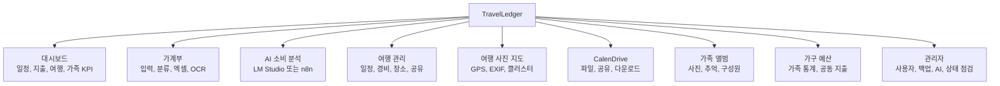
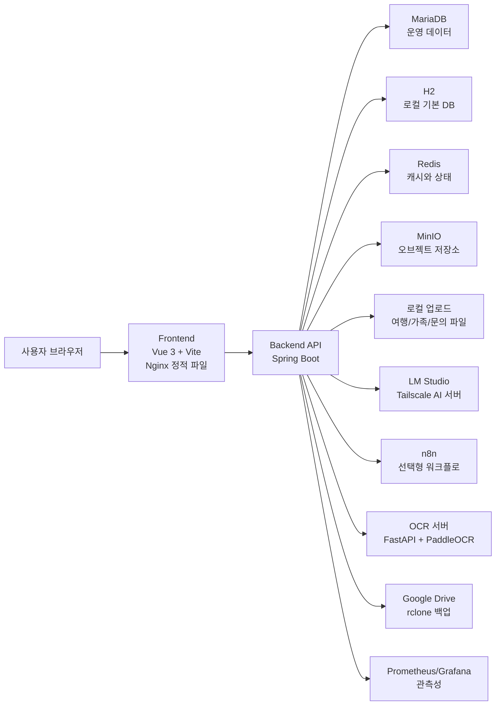
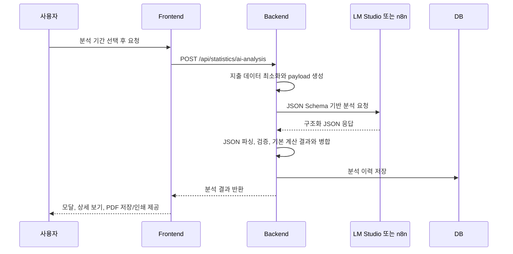
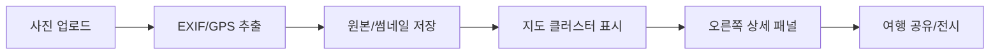
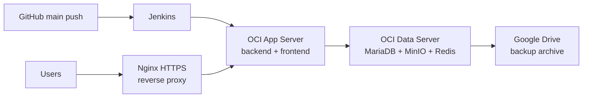
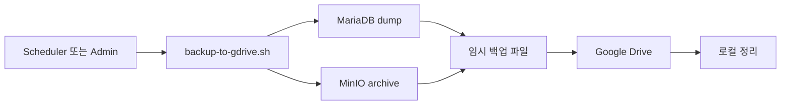

# TravelLedger (Calen)

TravelLedger는 개인과 가족의 일정, 가계부, 여행 기록, 사진 지도, 파일 드라이브, OCR/AI 분석, 백업/운영 관리를 하나의 서비스로 묶은 생활 데이터 플랫폼입니다.

최종 갱신일: 2026-06-30

## 프로젝트 요약

| 구분 | 내용 |
| --- | --- |
| 핵심 목적 | 일정, 지출, 여행, 사진, 파일, 가족 데이터를 한 곳에서 기록하고 분석합니다. |
| 주요 사용자 | 개인 사용자, 가족 구성원, 여행 기록을 관리하는 사용자, 운영 관리자 |
| Frontend | Vue 3, Vite, Pinia, GridStack, Leaflet, exifr |
| Backend | Java 17, Spring Boot 3.5.11, Spring Security, JPA, Actuator, Flyway |
| Data/Storage | MariaDB, H2 로컬 기본값, Redis, MinIO, 로컬 업로드 저장소 |
| OCR/AI | FastAPI, PaddleOCR, LM Studio, n8n 연동 가능 |
| Infra | Docker Compose, OCI, Nginx HTTPS, Jenkins, rclone Google Drive 백업, Prometheus/Grafana |

## 전체 기능 지도



## 시스템 아키텍처



## 주요 기능

### 1. 대시보드

대시보드는 일정, 가계부, 여행, 가족 기능의 핵심 정보를 카드형 위젯으로 보여줍니다. GridStack 기반으로 위젯 배치를 조정할 수 있고, 사용자가 필요한 기능으로 빠르게 이동할 수 있습니다.

| 기능 | 설명 |
| --- | --- |
| 통합 요약 | 일정, 지출, 여행, 가족 관련 주요 지표를 한 화면에 표시합니다. |
| 위젯 배치 | GridStack 기반으로 카드 위치와 크기를 조정합니다. |
| 빠른 실행 | 가계부 입력, 여행 관리, 파일 드라이브 등 주요 기능으로 이동합니다. |
| 모바일 대응 | 좁은 화면에서는 입력과 핵심 정보를 우선 배치합니다. |

### 2. 가계부

가계부는 수입과 지출을 기록하고, 카테고리, 결제수단, 반복 지출, 엑셀 import/export, OCR 분석을 함께 제공합니다.

| 기능 | 설명 |
| --- | --- |
| 수입/지출 입력 | 날짜, 금액, 카테고리, 결제수단, 메모를 기록합니다. |
| 결제수단 관리 | 카드, 현금, 계좌 등 결제수단별 지출을 집계합니다. |
| 카테고리 관리 | 식비, 교통, 여행, 구독 등 사용자 분류를 관리합니다. |
| 엑셀 import/export | 대량 거래 데이터를 가져오거나 내보냅니다. |
| OCR 입력 | 영수증과 결제 화면 이미지를 분석해 거래 후보를 생성합니다. |
| AI 소비 분석 | 선택 기간의 지출 흐름, 이상 소비, 개선점을 분석합니다. |
| 변경 이력 | 거래 생성, 수정, 삭제 이력을 추적합니다. |

### 3. AI 소비 분석

AI 소비 분석은 선택한 가계부 기간 데이터를 LM Studio 또는 n8n provider로 보내고, 분석 결과를 저장한 뒤 화면과 PDF로 제공합니다. AI 결과는 자동 거래 변경이 아니라 참고용 조언으로만 표시됩니다.



| 기능 | 설명 |
| --- | --- |
| 기간 분석 | 선택한 기간의 총 지출, 일 평균, 주요 소비를 분석합니다. |
| 비교 분석 | 기준 기간과 비교 기간의 지출 변화를 비교합니다. |
| JSON Schema 강제 | LM Studio 요청에 `response_format=json_schema`를 사용하고, 미지원 시 `json_object`로 재시도합니다. |
| fallback 처리 | 모델 응답이 깨져도 원본 JSON이나 기술 문구를 사용자 화면에 길게 노출하지 않고 기본 계산 기반 결과로 보완합니다. |
| 결과 모달 | 분석 성공 또는 저장 결과 열기 시 스크롤 가능한 상세 모달을 표시합니다. |
| PDF 저장/인쇄 | 새 의존성 없이 브라우저 인쇄 기능으로 PDF 저장을 지원합니다. |
| 안전 원칙 | AI 권고는 조언이며, 실제 거래 변경은 사용자가 별도로 확인해야 합니다. |

### 4. OCR 분석

OCR 기능은 영수증, 결제 화면, 거래 캡처 이미지를 분석해 가계부 입력 후보를 생성합니다. FastAPI/PaddleOCR 서버 또는 n8n 워크플로와 연동할 수 있습니다.

| 분석 모드 | 설명 |
| --- | --- |
| `RECEIPT` | 영수증 이미지에서 상호, 날짜, 금액, 품목 후보를 추출합니다. |
| `PAYMENT_CAPTURE` | 결제 완료 화면에서 결제금액, 결제수단, 가맹점 후보를 추출합니다. |
| `AUTO` | 입력 이미지 특성에 따라 적절한 OCR 흐름을 선택합니다. |

### 5. 여행 관리

여행 기능은 여행 일정, 장소, 경비, 사진, 공유 링크를 연결합니다. 여행 중 발생한 가계부 지출과 여행 기록을 함께 관리할 수 있습니다.

| 기능 | 설명 |
| --- | --- |
| 여행 일정 | 여행 제목, 기간, 장소, 설명을 관리합니다. |
| 여행 경비 | 여행별 예산과 지출 내역을 정리합니다. |
| 지도 경로 | 장소와 이동 경로를 지도 위에 표시합니다. |
| 환율 | 외화 경비를 환율 API 기반으로 계산합니다. |
| 공유 | 여행 기록을 공개 또는 제한 공유 형태로 노출합니다. |
| 타임라인 | 사진, 장소, 지출, 메모를 시간 흐름으로 정리합니다. |

### 6. 여행 사진 지도

여행 사진 지도는 사진의 EXIF GPS 정보를 읽어 지도에 표시하고, 가까운 사진을 클러스터로 묶어 보여줍니다.



| 기능 | 설명 |
| --- | --- |
| GPS 추출 | 사진 EXIF에서 위도와 경도를 읽습니다. |
| 지도 클러스터 | 가까운 사진들을 묶고 대표 썸네일과 개수를 표시합니다. |
| 썸네일 API | 지도와 패널에서 가벼운 썸네일을 우선 로드합니다. |
| 원본 보기 | 상세 패널에서 원본 또는 큰 이미지를 확인합니다. |
| 실패 격리 | 특정 이미지 처리 실패가 전체 지도 렌더링을 막지 않도록 분리합니다. |

### 7. CalenDrive

CalenDrive는 개인 파일 저장, 폴더 관리, 공유 링크, 다운로드, 관리자 점검을 제공하는 파일 드라이브 기능입니다.

| 기능 | 설명 |
| --- | --- |
| 파일/폴더 | 파일 업로드, 폴더 생성, 이동, 삭제를 지원합니다. |
| 공유 링크 | 파일 또는 폴더를 외부에 공유할 수 있습니다. |
| 만료 관리 | 공유 URL 만료와 폐기 정책을 관리할 수 있습니다. |
| 다운로드 | 개별 파일 또는 묶음 다운로드를 지원합니다. |
| 저장소 점검 | 관리자 화면에서 드라이브 저장소 연결 상태를 확인합니다. |
| 감사 로그 | 관리자 작업과 공유 접근 흐름을 추적하는 방향으로 확장 중입니다. |

### 8. 가족 앨범

가족 앨범은 가족 구성원과 사진, 추억, 위치 정보를 함께 관리합니다.

| 기능 | 설명 |
| --- | --- |
| 구성원 관리 | 가족 구성원 정보를 등록하고 관리합니다. |
| 앨범 | 가족 사진과 설명을 저장합니다. |
| 위치 정보 | 사진 위치와 여행 기록을 함께 연결할 수 있습니다. |
| 권한 | 가족 단위 접근 권한을 기준으로 데이터를 보호합니다. |

### 9. 가구 예산과 공동 통계

가구 기능은 개인 가계부를 넘어 가족 단위 통계와 공동 예산을 관리하기 위한 영역입니다.

| 기능 | 설명 |
| --- | --- |
| 가족 지출 통계 | 가족 구성원과 가계부 데이터를 묶어 분석합니다. |
| 공동 예산 | 가족 예산, 공동 목표, 여행 적립 목표로 확장할 수 있습니다. |
| 여행 가계부 연결 | 여행 경비와 가족 지출을 함께 볼 수 있습니다. |

### 10. 관리자 제어판

관리자 화면은 사용자, 인증, 백업, 저장소, AI 서버, 운영 상태를 확인하고 제어하는 영역입니다.

| 기능 | 설명 |
| --- | --- |
| 사용자 관리 | 계정, 권한, 관리자 작업을 관리합니다. |
| 보안 설정 | 인증, remember-me, CSRF, PIN, 공유 링크 정책을 관리합니다. |
| AI 제어 | AI 기능 on/off, provider, 모델, base URL, timeout, max token을 조정합니다. |
| AI 서버 상태 | LM Studio 모델 목록과 응답 상태를 확인합니다. |
| 데이터 서버 상태 | DB, MinIO, Redis, 스토리지 사용량을 점검합니다. |
| 백업/복구 | DB와 MinIO 백업, Google Drive 업로드, 복구 리허설을 관리합니다. |
| 알림/관측성 | OCR/AI 실패, 백업 실패, 저장소 오류, API 오류율을 알림 대상으로 확장합니다. |

## 기술 스택

### Frontend

| 기술 | 역할 |
| --- | --- |
| Vue 3.5 | SPA UI 구성 |
| Vite 7 | 개발 서버와 빌드 도구 |
| Pinia 3 | 프론트 상태 관리 |
| GridStack 12 | 대시보드 위젯 배치 |
| Leaflet 1.9 | 지도 UI |
| exifr | 사진 EXIF/GPS 추출 |
| JavaScript SFC | Vue Single File Component 작성 |

### Backend

| 기술 | 역할 |
| --- | --- |
| Java 17 | 백엔드 런타임 |
| Spring Boot 3.5.11 | REST API 서버 |
| Spring Security | 인증과 권한 제어 |
| Spring Data JPA | DB ORM |
| Spring Validation | 요청 검증 |
| Spring Actuator | health, info, prometheus endpoint |
| Flyway | 명시적 DB migration 관리 |
| MariaDB | 운영 DB |
| H2 | 로컬 기본 DB |
| Redis | 캐시와 상태 저장 |
| MinIO | 오브젝트 저장소 |
| Apache POI | 엑셀 import/export |
| zip4j | 압축 파일 생성 |
| metadata-extractor | 이미지 메타데이터 처리 |
| Micrometer Prometheus | 메트릭 수집 |
| Lombok | 반복 코드 축소 |

### Infra

| 기술 | 역할 |
| --- | --- |
| Docker Compose | 로컬과 운영 컨테이너 구성 |
| OCI | 운영 서버 인프라 |
| Nginx | HTTPS reverse proxy와 정적 파일 서빙 |
| Jenkins | GitHub push 기반 배포 자동화 |
| rclone | Google Drive 백업 연동 |
| Prometheus/Grafana | 메트릭 수집과 대시보드 |
| Tailscale | 내부망 AI/OCR 서버 연결 |

## 프로젝트 구조

```text
.
|-- backend/
|   |-- src/main/java/com/playdata/calen/
|   |   |-- account/        인증, 사용자, 관리자, 백업, 운영 제어
|   |   |-- common/         공통 예외, 캐시, 설정, 보안 보조 기능
|   |   |-- drive/          CalenDrive 파일, 공유, 다운로드
|   |   |-- familyalbum/    가족 앨범과 가족 사진
|   |   |-- ledger/         가계부, 엑셀, OCR, AI 분석
|   |   `-- travel/         여행, 지도, 사진, 경비, 공유
|   |-- src/main/resources/application.yml
|   |-- src/main/resources/db/migration/
|   |-- src/test/java/
|   |-- build.gradle
|   `-- Dockerfile
|-- frontend/
|   |-- src/components/     주요 화면 컴포넌트
|   |-- src/features/       대시보드 위젯과 기능 모듈
|   |-- src/lib/            API 클라이언트와 공통 유틸
|   |-- public/
|   |-- package.json
|   `-- Dockerfile
|-- PaddleOCR/
|   |-- ocr_service.py
|   |-- requirements.txt
|   `-- install_windows_ocr.ps1
|-- deploy/
|   |-- n8n/
|   `-- oci/
|       |-- nginx/
|       |-- redis/
|       |-- monitoring/
|       `-- scripts/
|-- docs/
|-- docker-compose.yml
|-- docker-compose.oci.app.yml
|-- docker-compose.oci.data.yml
|-- docker-compose.oci.monitoring.yml
`-- README.md
```

## 로컬 실행

### 사전 준비

| 항목 | 권장 값 |
| --- | --- |
| JDK | 17 |
| Node.js/npm | Vite/Vue 호환 LTS |
| Docker | Docker Desktop 또는 Docker Engine |
| DB/Storage | Docker Compose의 MariaDB, Redis, MinIO 사용 권장 |
| OCR/AI | 필요 시 별도 FastAPI OCR 서버 또는 LM Studio 서버 실행 |

### Frontend

```bash
cd frontend
npm install
npm run dev
npm run build
```

### Backend

```bash
cd backend
./gradlew test
./gradlew bootWar
```

Windows PowerShell:

```powershell
cd backend
.\gradlew.bat test
.\gradlew.bat bootWar
```

### Docker Compose

```bash
cp .env.example .env
docker compose up -d --build
```

| 서비스 | 역할 | 기본 접근 |
| --- | --- | --- |
| `frontend` | Vue 정적 파일과 Nginx | `http://localhost:8080` |
| `backend` | Spring Boot API | Compose 내부 `backend:8080` |
| `mariadb` | MariaDB | Compose 내부 |
| `redis` | Redis | Compose 내부 |
| `minio` | 오브젝트 저장소 | API `9000`, Console `9001` |
| `minio-init` | 기본 bucket 생성 | 1회성 작업 |

## 주요 환경변수

### Backend 공통

| 변수 | 설명 | 기본값 |
| --- | --- | --- |
| `DB_URL` | JDBC 연결 URL | H2 로컬 DB |
| `DB_DRIVER` | JDBC driver | `org.h2.Driver` |
| `DB_ID`, `DB_PASS` | DB 계정 | `sa` / empty |
| `JWT_KEY` | JWT와 remember-me 서명 키 | 개발 기본값 |
| `JWT_EXPIRE` | JWT 만료 시간 | `300000000` |
| `APP_SEED_ENABLED` | seed 데이터 생성 여부 | `false` |
| `H2_CONSOLE_ENABLED` | H2 console 활성화 | `false` |
| `DB_MIGRATION_ENABLED` | Flyway migration 활성화 | `false` |
| `DB_MIGRATION_BASELINE_ON_MIGRATE` | 기존 DB baseline 처리 | `true` |
| `DB_MIGRATION_VALIDATE_ON_MIGRATE` | migration 검증 | `true` |

### Storage

| 변수 | 설명 | 기본값 |
| --- | --- | --- |
| `MINIO_API` | 내부 MinIO endpoint | empty |
| `MINIO_PUBLIC_API` | 공개 MinIO endpoint | empty |
| `MINIO_NAME`, `MINIO_SECRET` | MinIO access key와 secret | empty |
| `MINIO_CLOUD_BUCKET` | 기본 bucket | `budgetjourneybucket` |
| `MINIO_PRESIGNED_URL_EXPIRY_SECONDS` | presigned URL 만료 시간 | `6000` |
| `TRAVEL_MEDIA_STORAGE_PATH` | 여행 미디어 로컬 저장 경로 | `${user.dir}/uploads/travel-media` |
| `FAMILY_MEDIA_STORAGE_PATH` | 가족 앨범 로컬 저장 경로 | `${user.dir}/uploads/family-media` |
| `SUPPORT_ATTACHMENT_STORAGE_PATH` | 문의 첨부 저장 경로 | `${user.dir}/uploads/support-inquiries` |

### Travel

| 변수 | 설명 | 기본값 |
| --- | --- | --- |
| `TRAVEL_EXCHANGE_RATE_BASE_URL` | 환율 API base URL | `https://api.frankfurter.dev/v1` |
| `TRAVEL_EXCHANGE_RATE_CACHE_MINUTES` | 환율 캐시 시간 | `30` |
| `TRAVEL_REVERSE_GEOCODE_BASE_URL` | reverse geocode API | Nominatim reverse |
| `TRAVEL_REVERSE_GEOCODE_USER_AGENT` | reverse geocode User-Agent | `TravelLedger/1.0` |
| `TRAVEL_SUMMARY_CACHE_TTL_SECONDS` | 여행 요약 캐시 TTL | `60` |
| `TRAVEL_MEDIA_DOWNLOAD_CACHE_TTL_SECONDS` | 미디어 다운로드 캐시 TTL | `300` |
| `TRAVEL_THUMBNAIL_BACKFILL_ENABLED` | 썸네일 backfill 활성화 | `true` |
| `TRAVEL_PRESIGNED_UPLOAD_ENABLED` | 여행 presigned upload 활성화 | `false` |

### OCR

| 변수 | 설명 | 기본값 |
| --- | --- | --- |
| `LEDGER_OCR_ENABLED` | OCR 기능 활성화 | `false` |
| `LEDGER_OCR_BASE_URL` | FastAPI OCR 서버 URL | empty |
| `LEDGER_OCR_WORKFLOW_URL` | n8n OCR webhook URL | empty |
| `LEDGER_OCR_API_KEY` | OCR API key | empty |
| `LEDGER_OCR_CONNECT_TIMEOUT` | 연결 timeout | `3s` |
| `LEDGER_OCR_READ_TIMEOUT` | 읽기 timeout | `90s` |
| `LEDGER_OCR_MAX_FILE_SIZE` | OCR 업로드 최대 크기 | `10MB` |

### AI 소비 분석

LM Studio를 기본 provider로 사용합니다. 현재 내부망 AI 서버는 Tailscale을 통해 `http://your-lm-studio-host:1234` 주소로 접근하는 구성을 기준으로 합니다.

| 변수 | 설명 | 기본값 |
| --- | --- | --- |
| `APP_LEDGER_AI_ENABLED` | AI 분석 활성화 | `true` |
| `APP_LEDGER_AI_PROVIDER` | `lmstudio` 또는 `n8n` | `lmstudio` |
| `APP_LEDGER_AI_MODEL` | 모델명. `auto`이면 models endpoint에서 자동 선택 | `auto` |
| `APP_LEDGER_AI_LMSTUDIO_BASE_URL` | LM Studio base URL | `http://your-lm-studio-host:1234` |
| `APP_LEDGER_AI_LMSTUDIO_CHAT_PATH` | OpenAI-compatible chat endpoint | `/v1/chat/completions` |
| `APP_LEDGER_AI_LMSTUDIO_MODELS_PATH` | 모델 조회 endpoint | `/v1/models` |
| `APP_LEDGER_AI_LMSTUDIO_API_KEY` | LM Studio 인증 토큰 | empty |
| `APP_LEDGER_AI_TEMPERATURE` | 응답 무작위성 | `0.2` |
| `APP_LEDGER_AI_MAX_TOKENS` | 최대 응답 토큰 | `4096` |
| `APP_LEDGER_AI_WORKFLOW_URL` | n8n provider webhook URL | empty |
| `APP_LEDGER_AI_API_KEY` | n8n provider API key | empty |
| `APP_LEDGER_AI_API_KEY_HEADER` | n8n API key header | `X-TravelLedger-AI-Key` |
| `APP_LEDGER_AI_ENFORCE_PROVIDER_URL_ALLOWLIST` | provider URL allowlist 강제 | `false` |
| `APP_LEDGER_AI_ALLOWED_PROVIDER_HOSTS` | 허용 provider host CSV | `localhost,127.0.0.1,::1,your-lm-studio-host` |
| `APP_LEDGER_AI_HISTORY_RETENTION_ENABLED` | AI 이력 보관 정책 활성화 | `false` |
| `APP_LEDGER_AI_HISTORY_RETENTION_DAYS` | AI 이력 보관 일수 | `180` |

AI 요청은 OpenAI-compatible `/v1/chat/completions` 형식을 사용합니다. LM Studio가 지원하면 `response_format=json_schema`로 구조화 JSON을 강제하고, 미지원 시 `json_object`로 재시도합니다.

### Redis

| 변수 | 설명 |
| --- | --- |
| `REDIS_CACHE_HOST`, `REDIS_CACHE_PORT`, `REDIS_CACHE_PASSWORD`, `REDIS_CACHE_DATABASE`, `REDIS_CACHE_SSL` | 캐시 Redis 설정 |
| `REDIS_STATE_HOST`, `REDIS_STATE_PORT`, `REDIS_STATE_PASSWORD`, `REDIS_STATE_DATABASE`, `REDIS_STATE_SSL` | 상태 Redis 설정 |

### 백업과 데이터 운영

| 변수 | 설명 |
| --- | --- |
| `DATA_OPS_BACKUP_WORKDIR` | 백업 작업 디렉터리 |
| `DATA_OPS_BACKUP_REMOTE_NAME` | rclone remote 이름 |
| `DATA_OPS_BACKUP_REMOTE_DIR` | DB 백업 업로드 경로 |
| `DATA_OPS_MINIO_BACKUP_REMOTE_DIR` | MinIO 백업 업로드 경로 |
| `DATA_OPS_RCLONE_CONFIG_PATH` | rclone config 경로 |
| `DATA_OPS_DB_BACKUP_ENABLED`, `DATA_OPS_DB_BACKUP_CRON` | DB 백업 스케줄 |
| `DATA_OPS_MINIO_BACKUP_ENABLED`, `DATA_OPS_MINIO_BACKUP_CRON` | MinIO 백업 스케줄 |

## 운영 배포 흐름



| 파일 | 역할 |
| --- | --- |
| `docker-compose.oci.app.yml` | 운영 app 서버의 backend/frontend 구성 |
| `docker-compose.oci.data.yml` | 운영 data 서버의 MariaDB/MinIO/Redis 구성 |
| `docker-compose.oci.monitoring.yml` | Prometheus/Grafana 구성 |
| `docker-compose.oci.yml` | OCI 통합 구성 |

Jenkins 배포 흐름은 GitHub main push를 기준으로 checkout, 서버 반영, Docker Compose config 확인, backend/frontend 재기동 순서로 동작합니다.

## 백업과 복구

`deploy/oci/scripts/backup-to-gdrive.sh`는 DB dump와 MinIO archive를 생성하고 rclone으로 Google Drive에 업로드하는 운영 백업 흐름을 담당합니다.



운영 데이터가 중요해진 상태이므로 백업 성공 여부, 복구 리허설, 암호화, 백업 파일 보관 정책을 함께 관리해야 합니다.

## 보안 기준

| 영역 | 기준 |
| --- | --- |
| 인증 | Spring Security, remember-me, JWT, PIN 흐름을 분리해 관리합니다. |
| CSRF | 브라우저 기반 요청은 CSRF 정책을 명확히 유지합니다. |
| 관리자 | 관리자 API는 권한 테스트와 감사 로그를 강화합니다. |
| 공유 링크 | 만료, 폐기, 접근 로그를 관리합니다. |
| 파일 업로드 | MIME, 확장자, 크기, 이미지 처리 실패를 검증합니다. |
| AI/OCR | API key, provider allowlist, prompt injection 방어, JSON schema 검증을 적용합니다. |
| 데이터 | 개인정보 다운로드, 공유 회수, AI 이력 삭제, 위치정보 제거 기능을 확장합니다. |

## 관측성과 알림

Actuator, Prometheus, Grafana 구성을 기반으로 다음 항목을 우선 알림 대상으로 봅니다.

| 대상 | 알림 기준 예시 |
| --- | --- |
| API | 오류율 증가, 5xx 증가, 응답 지연 |
| OCR/AI | 분석 실패율, LM Studio 응답 지연, JSON 파싱 실패 |
| 백업 | DB/MinIO 백업 실패, Google Drive 업로드 실패 |
| 저장소 | MinIO 사용량, 로컬 업로드 용량 부족 |
| Redis | 연결 실패, timeout 증가 |
| DB | 커넥션 풀 고갈, migration 실패 |
| Jenkins | 빌드 실패, 배포 실패 |

## 테스트와 빌드

### Backend

```bash
cd backend
./gradlew test
```

Windows PowerShell:

```powershell
cd backend
.\gradlew.bat test
```

### Frontend

```bash
cd frontend
npm run build
```

권장 핵심 테스트 영역은 로그인, 가계부 입력, 엑셀 import, OCR 분석, AI 분석, 여행 사진 업로드, 지도 썸네일, 드라이브 공유, 관리자 백업입니다.

## 향후 개선 방향

| 항목 | 설명 |
| --- | --- |
| AI 가계부 코치 | 위험 지출, 반복 구독, 예산 초과 예상, 다음 달 현금흐름 예측을 제공합니다. |
| 자동 분류 규칙 엔진 | 사용자가 승인한 규칙으로 거래 분류 품질을 높입니다. |
| 거래 이상 탐지 | 큰 지출, 중복 결제, 반복 결제, 여행 기간 외 지출을 감지합니다. |
| 여행 스토리 export | 여행 경로, 사진 지도, 지출, 메모를 PDF 또는 웹 전시 페이지로 내보냅니다. |
| PWA/모바일 업로드 | 모바일 촬영 업로드, 오프라인 임시 저장, PWA 설치를 지원합니다. |
| 드라이브 버전 관리 | 파일 버전, 만료 링크, 다운로드 감사 로그, 공유 권한 단계를 추가합니다. |
| 가족 예산/공동 목표 | 가족 예산, 저축 목표, 여행 적립 목표, 구성원별 지출 비중을 제공합니다. |
| 알림 센터 | 예산 초과, AI 완료, 백업 실패, 공유 수신, 여행 일정 임박, OCR 실패를 모읍니다. |
| 데이터 포터빌리티 | 사용자별 전체 데이터 export, 사진/파일 포함 archive, CSV/Excel 표준 import/export를 강화합니다. |
| 개인정보 관리 | 내 데이터 다운로드, 공유 링크 전체 회수, AI 분석 이력 삭제, 사진 위치정보 제거를 제공합니다. |

## 관련 문서

| 문서 | 설명 |
| --- | --- |
| `docs/architecture.md` | 시스템 구조와 설계 메모 |
| `docs/security_baseline_checklist.md` | 인증, 세션, 접근제어, 파일 업로드, 관리자 보안 기준 |
| `docs/ledger_ai_safety_hardening.md` | AI 분석 안전장치와 provider 연동 기준 |
| `docs/project_improvement_roadmap.md` | 개선 과제와 기능 확장 계획 |
| `docs/observability_alerts.md` | 운영 알림 기준 |
| `docs/env_configuration_contract.md` | 환경변수 동기화 기준 |
| `docs/db_restore_from_gdrive.md` | Google Drive 백업에서 DB 복구 |
| `docs/dbtogdrive.md` | DB 백업 운영 문서 |
| `docs/Windows_1060_OCR_Tailscale_Setup_Guide.md` | OCR/AI 서버와 Tailscale 연결 가이드 |
| `docs/travel_my_map_development_history.md` | 여행 지도 기능 개발 기록 |
| `docs/household_development_history.md` | 가구 기능 개발 기록 |
| `docs/security_patch_history.md` | 보안 패치 이력 |

## 운영 주의사항

| 항목 | 주의사항 |
| --- | --- |
| `.env` | 실제 비밀값은 Git에 올리지 않습니다. |
| JWT/API key | 운영에서는 반드시 강한 값으로 교체합니다. |
| LM Studio | 외부 공개 시 Require Authentication과 방화벽, allowlist를 함께 사용합니다. |
| Tailscale | 내부망 AI/OCR 서버는 Tailscale IP와 ACL을 기준으로 접근을 제한합니다. |
| MinIO | public endpoint와 internal endpoint를 혼동하지 않도록 분리합니다. |
| 백업 | 백업 성공만 보지 말고 복구 리허설을 주기적으로 실행합니다. |
| AI 결과 | AI 분석은 조언이며 거래 데이터 변경은 사용자 확인 후 수행합니다. |