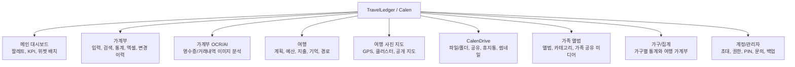
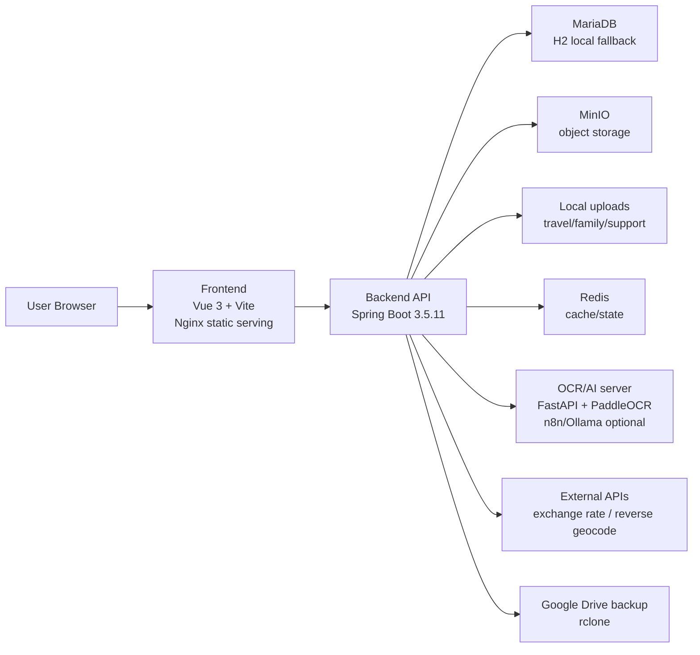
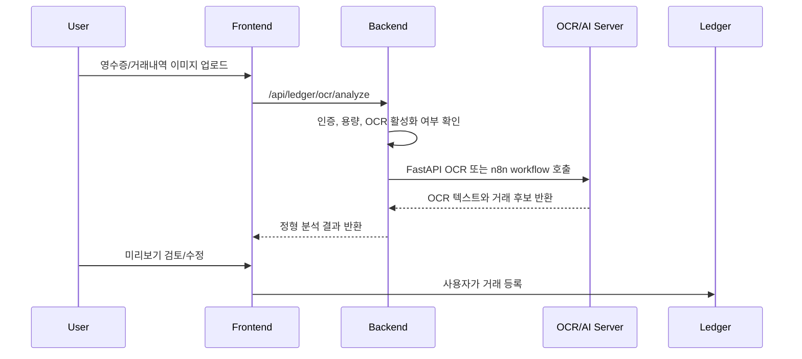
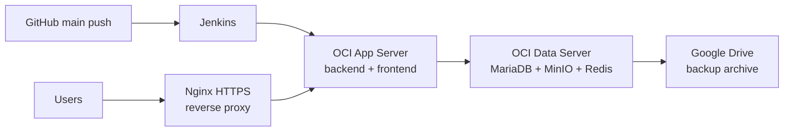
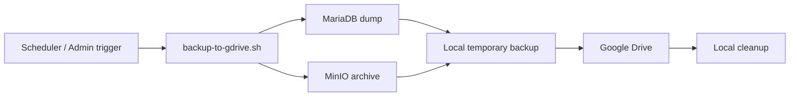

# TravelLedger (Calen)

TravelLedger는 가계부, 여행 기록, 여행 사진 지도, 파일 드라이브, 가족 앨범을 한 서비스 안에서 관리하는 개인 생활 기록 플랫폼입니다.

문서 갱신일: 2026-06-29

## 한눈에 보기

| 구분 | 내용 |
| --- | --- |
| 제품 성격 | 개인/가족 생활 기록 플랫폼 |
| 주요 도메인 | 가계부, 여행, 사진 지도, 파일 드라이브, 가족 앨범, 관리자 운영 |
| Frontend | Vue 3, Vite, Pinia, GridStack, Leaflet, exifr |
| Backend | Java 17, Spring Boot 3.5.11, Spring Security, JPA, Actuator |
| Data/Storage | MariaDB, H2(local default), Redis, MinIO, local upload storage |
| OCR/AI | FastAPI, PaddleOCR, n8n/Ollama 연동 가능 |
| Infra | Docker Compose, OCI 앱/데이터 서버 분리, Nginx HTTPS, Jenkins, rclone Google Drive backup |

## 기능 지도



## 시스템 구조



## 기능별 설명

### 1. 메인 대시보드

가계부, 여행, 드라이브 정보를 한 화면에서 요약합니다. `GridStack` 기반 팔레트로 카드와 위젯을 배치하고, 사용자별 표시 항목과 레이아웃을 저장합니다. 다크/라이트 모드를 지원합니다.

관련 Frontend: `MainDashboardWorkspace.vue`, `FeatureLauncher.vue`, `features/palette/*`

### 2. 가계부

| 기능 | 설명 |
| --- | --- |
| 거래 입력 | 월 달력 기반 입력과 빠른 거래 입력을 제공합니다. |
| 검색/필터 | 거래 목록 검색, 분류/결제수단 기준 조회를 제공합니다. |
| 통계/비교 | 카테고리, 결제수단, 기간 비교, 차트 분석을 제공합니다. |
| 분류 관리 | 대분류/상세분류와 결제수단을 관리합니다. |
| 엑셀 가져오기 | 엑셀 파일 미리보기 후 선택한 행을 거래로 반영합니다. |
| CSV/엑셀 내보내기 | 조건에 맞는 거래 데이터를 외부 파일로 내보냅니다. |
| 변경 이력 | 검색/수정/일괄 변경 이력을 기록하고 복구할 수 있습니다. |

관련 Backend: `ledger/web`, `ledger/service`, `ledger/domain`, `ledger/repository`

### 3. 가계부 OCR/AI

영수증 또는 카드 거래내역 캡처 이미지를 업로드하면 OCR/AI 분석 결과를 확인하고 거래 입력 폼에 적용할 수 있습니다. 자동 저장은 하지 않으며, 사용자가 검토한 뒤 최종 등록합니다.



| 유형 | 설명 |
| --- | --- |
| `RECEIPT` | 영수증 한 장에서 한 거래 제안 |
| `PAYMENT_CAPTURE` | 카드/계좌 거래내역 캡처 한 장에서 여러 거래 후보 제안 |
| `AUTO` | 서버가 가능한 범위에서 문서 유형 자동 판단 |

OCR 서버가 꺼져 있어도 일반 가계부 입력, 수정, 삭제, 검색, 통계, 엑셀 기능은 계속 사용할 수 있어야 합니다.

### 4. 여행

여행 기능은 계획, 예산, 지출, 기억, 경로, 미디어를 한 단위로 묶어 관리합니다.

| 기능 | 설명 |
| --- | --- |
| 여행 계획 | 여행별 일정, 상태, 요약 정보를 관리합니다. |
| 예산/지출 | 여행 예산 항목과 실제 지출을 기록합니다. |
| 여행 기억 | 여행 중 남긴 메모와 기록을 관리합니다. |
| 경로 | 이동 구간, 교통수단, 경로 스타일을 저장합니다. |
| 여행 커뮤니티 | 공개 피드/공유 화면을 통해 여행 정보를 노출합니다. |
| 환율 | 외부 환율 API를 사용하고 캐시 TTL을 둡니다. |
| 역지오코딩 | 사진 위치나 좌표 기반 위치명을 조회하고 캐시합니다. |

관련 Backend: `travel/web`, `travel/service`, `travel/domain`, `travel/repository`

### 5. 여행 사진 지도와 공유

업로드한 여행 사진의 GPS 메타데이터를 기반으로 지도 위에 표시합니다. 사진이 많을 때는 클러스터와 뷰포트 기반 렌더링으로 화면 부담을 줄입니다.

| 기능 | 설명 |
| --- | --- |
| 내 사진 | 여행 사진을 썸네일 앨범으로 보고 상세 모달에서 원본 비율과 위치를 확인합니다. |
| 사진 지도 | GPS 사진을 지도 핀/클러스터로 표시합니다. |
| 클러스터 대표 이미지 | 지도 클러스터의 대표 사진을 지정할 수 있습니다. |
| 공개 여행 지도 | 공개 가능한 여행 지도/사진 정보를 별도 화면으로 제공합니다. |
| 그룹 공유 | 제한된 사용자 그룹에 여행 정보를 공유합니다. |
| 썸네일 백필 | 누락된 여행 미디어 썸네일을 배치 작업으로 보강합니다. |

관련 Frontend: `TravelMyMapWorkspace.vue`, `TravelMyPhotosWorkspace.vue`, `TravelPublicTripsWorkspace.vue`, `TravelSharedExhibitWorkspace.vue`

### 6. CalenDrive

CalenDrive는 개인 파일 드라이브 기능입니다. 파일/폴더 탐색, 업로드, 다운로드, 공유, 받은 파일 저장, 휴지통, 썸네일, 프로필 이미지를 관리합니다.

| 기능 | 설명 |
| --- | --- |
| 파일/폴더 | 드라이브 아이템을 폴더 구조로 관리합니다. |
| 업로드/다운로드 | 파일 업로드와 다운로드 링크를 제공합니다. |
| 공유 | 사용자 간 파일 공유와 받은 파일 저장을 지원합니다. |
| 휴지통 | 삭제한 파일을 휴지통 흐름으로 관리합니다. |
| 썸네일 | 이미지 미리보기와 드라이브 프로필 이미지를 지원합니다. |
| 관리자 설정 | 드라이브 운영 설정을 관리자 API로 분리합니다. |

관련 Backend: `drive/web`, `drive/service`, `drive/domain`, `drive/repository`

### 7. 가족 앨범

가족 앨범은 가족 단위 미디어를 앨범과 카테고리로 묶어 관리하는 영역입니다.

| 기능 | 설명 |
| --- | --- |
| 앨범 | 가족 앨범 생성과 앨범별 미디어 구성을 관리합니다. |
| 카테고리 | 가족 카테고리와 구성원을 관리합니다. |
| 미디어 | 가족 사진/미디어 파일을 저장하고 목록으로 제공합니다. |
| 사용자 검색 | 가족 앨범 구성원 추가를 위한 사용자 검색 옵션을 제공합니다. |

관련 Backend: `familyalbum/web`, `familyalbum/service`, `familyalbum/domain`, `familyalbum/repository`

### 8. 가구/집계

가구 단위 화면은 사용자별 가계부 데이터를 합산해 가족 또는 가구 관점의 지출 흐름을 확인하는 영역입니다. 여행 가계부 화면과 연계되어 가구 단위 여행 지출을 따로 볼 수 있습니다.

관련 Frontend: `HouseholdWorkspace.vue`, `HouseholdTravelLedgerWorkspace.vue`

### 9. 계정, 권한, 관리자

| 기능 | 설명 |
| --- | --- |
| 인증 | 로그인, 회원가입, remember-me/JWT 기반 인증을 제공합니다. |
| 초대 | 관리자 초대 링크 생성과 초대 수락 흐름을 제공합니다. |
| 보조 PIN | 프로필/관리자 접근 보호를 위한 2차 PIN 흐름을 지원합니다. |
| 사용자 레이아웃 | 사용자별 대시보드/화면 설정을 저장합니다. |
| 고객 문의 | 문의 등록, 첨부파일 저장, 관리자 답변/보관을 제공합니다. |
| 관리자 대시보드 | 사용자, 로그인 감사, 초대, 데이터 현황을 관리합니다. |
| 백업/복구 | DB/MinIO 백업과 복구 진입점을 제공합니다. |
| Redis 상태 | Redis 장애가 전체 기능 장애로 번지지 않도록 가능한 범위에서 완화합니다. |

관련 Backend: `account/web`, `account/service`, `account/security`, `common/cache`

## 기술 스택

### Frontend

| 기술 | 용도 |
| --- | --- |
| Vue 3.5 | SPA UI |
| Vite 7 | 개발 서버와 빌드 |
| Pinia 3 | 클라이언트 상태 관리 |
| GridStack 12 | 대시보드 팔레트/드래그 배치 |
| Leaflet 1.9 | 지도 UI |
| exifr | 사진 EXIF/GPS 메타데이터 처리 |
| JavaScript SFC | TypeScript는 사용하지 않음 |

신규 Vue SFC는 `<script setup>` JavaScript 기준으로 작성합니다.

### Backend

| 기술 | 용도 |
| --- | --- |
| Java 17 | 백엔드 런타임 |
| Spring Boot 3.5.11 | API 서버 |
| Spring Web/Security/JPA/Validation | REST API, 인증, ORM, 요청 검증 |
| Spring Actuator | health/info/prometheus 운영 엔드포인트 |
| MariaDB | 운영 데이터베이스 |
| Flyway | 버전 기반 DB 마이그레이션 |
| H2 | 로컬 기본 인메모리 데이터베이스 |
| Redis/Lettuce | 캐시/상태 저장 |
| MinIO | 오브젝트 스토리지 |
| Apache POI | 엑셀 가져오기/내보내기 |
| zip4j | 압축 파일 처리 |
| metadata-extractor | 이미지 메타데이터 처리 |
| Micrometer Prometheus | 모니터링 메트릭 |
| Lombok | Java 보일러플레이트 축소 |

### OCR / AI

| 기술 | 용도 |
| --- | --- |
| FastAPI | OCR 분석 서버 |
| PaddleOCR | 이미지 OCR |
| Ollama Gemma 계열 모델 | OCR 결과 보정/정형화 선택지 |
| n8n workflow | AI 분석 파이프라인 선택지 |
| Windows 1060 PC | 별도 OCR/AI 분석 서버 운영 환경 |

### Infra

| 기술 | 용도 |
| --- | --- |
| Docker Compose | 로컬/운영 컨테이너 구성 |
| Nginx | HTTPS reverse proxy와 frontend 정적 파일 서빙 |
| OCI | 앱 서버와 데이터 서버 분리 운영 |
| Jenkins | GitHub main push 기반 배포 |
| rclone | Google Drive 백업 |
| Prometheus/Grafana | 운영 모니터링 구성 |

## 프로젝트 구조

```text
.
|-- backend/
|   |-- src/main/java/com/playdata/calen/
|   |   |-- account/        인증, 초대, 관리자, 문의, 사용자 설정
|   |   |-- common/         공통 설정, 예외, 캐시, 미디어 처리
|   |   |-- drive/          CalenDrive 파일/공유/프로필
|   |   |-- familyalbum/    가족 앨범과 가족 미디어
|   |   |-- ledger/         가계부, 통계, 엑셀, OCR, AI 분석
|   |   `-- travel/         여행, 지도, 미디어, 공유, 환율
|   |-- src/main/resources/application.yml
|   |-- src/test/java/
|   |-- sql/ledger-dummy/
|   |-- build.gradle
|   `-- Dockerfile
|-- frontend/
|   |-- src/components/     주요 화면 단위 Vue 컴포넌트
|   |-- src/features/       팔레트 등 기능 모듈
|   |-- src/lib/            API, 포맷, 미디어/여행 유틸
|   |-- public/
|   |-- package.json
|   `-- Dockerfile
|-- PaddleOCR/
|   |-- ocr_service.py
|   |-- requirements.txt
|   `-- install_windows_ocr.ps1
|-- deploy/
|   |-- n8n/                OCR/AI workflow와 n8n compose
|   `-- oci/
|       |-- nginx/
|       |-- redis/
|       |-- monitoring/
|       `-- scripts/
|-- docs/
|-- docker-compose.yml
|-- docker-compose.oci.app.yml
|-- docker-compose.oci.data.yml
|-- docker-compose.oci.monitoring.yml
`-- README.md
```

루트에서 확인되는 보조/작업 항목:

| 항목 | 성격 |
| --- | --- |
| `.env`, `.env.*.example` | 로컬/운영 환경변수 예시와 실제 환경값 |
| `.wiki-temp`, `worklog.md` | 문서/작업 로그 보조 자료 |
| `ea`, `miniossl`, `날짜` | 로컬 또는 운영 보조 자료로 보이며 핵심 애플리케이션 소스는 아님 |
| `backend/build`, `backend/.gradle`, `frontend/node_modules`, `frontend/dist`, `*.log` | 빌드/캐시/로그 산출물 |

## 로컬 개발

### 요구 사항

| 도구 | 권장 |
| --- | --- |
| JDK | 17 |
| Node.js/npm | 현재 Vite/Vue 빌드가 가능한 LTS 버전 |
| Docker Desktop 또는 Docker Engine | Compose 기반 실행 시 필요 |
| MariaDB/MinIO/Redis | Docker Compose를 쓰면 별도 설치 불필요 |
| OCR 서버 | OCR 기능 테스트 시 별도 Windows OCR PC 또는 호환 서버 필요 |

### Frontend

```bash
cd frontend
npm install
npm run dev
npm run build
```

프론트엔드 개발 서버는 Vite가 기본 포트를 사용합니다. 운영 컨테이너에서는 Nginx가 정적 파일을 서빙하고 `/api` 요청을 backend로 프록시합니다.

### Backend

```bash
cd backend
./gradlew test
./gradlew bootWar
```

Windows PowerShell:

```powershell
cd backend
.\gradlew.bat test
.\gradlew.bat bootWar
```

환경변수가 없으면 `application.yml` 기본값에 따라 H2 인메모리 DB를 사용합니다. MariaDB, MinIO, Redis 연동은 `.env` 또는 서버 환경변수로 설정합니다.

### Docker Compose

```bash
cp .env.example .env
docker compose up -d --build
```

기본 Compose 서비스:

| 서비스 | 설명 | 기본 접근 |
| --- | --- | --- |
| `frontend` | Vue 정적 앱 + Nginx | `http://localhost:8080` |
| `backend` | Spring Boot API | compose 내부 `backend:8080` |
| `mariadb` | MariaDB 11.4 | compose 내부 |
| `minio` | 파일/object storage | API `9000`, Console `9001` |
| `minio-init` | 기본 bucket 생성 | 1회성 작업 |

기본 bucket 이름은 `MINIO_CLOUD_BUCKET` 값이며, 기본값은 `budgetjourneybucket`입니다.

## 주요 환경변수

### 공통/Backend

| 변수 | 설명 | 기본값 |
| --- | --- | --- |
| `DB_URL` | JDBC 연결 문자열 | H2 인메모리 |
| `DB_DRIVER` | JDBC driver | `org.h2.Driver` |
| `DB_ID`, `DB_PASS` | DB 계정 | `sa` / empty |
| `JWT_KEY` | JWT/remember-me key | 로컬 기본값 있음 |
| `JWT_EXPIRE` | JWT 만료 시간 | `300000000` |
| `APP_SEED_ENABLED` | 초기 데이터 seed 여부 | `false` |
| `H2_CONSOLE_ENABLED` | H2 console 활성화 | `false` |
| `DB_MIGRATION_ENABLED` | Flyway 마이그레이션 활성화 | `false` |
| `DB_MIGRATION_BASELINE_ON_MIGRATE` | 기존 DB baseline 허용 | `true` |
| `DB_MIGRATION_VALIDATE_ON_MIGRATE` | 마이그레이션 검증 활성화 | `true` |

### Storage

| 변수 | 설명 | 기본값 |
| --- | --- | --- |
| `MINIO_API` | 내부 MinIO endpoint | empty |
| `MINIO_PUBLIC_API` | 외부 공개 endpoint | empty |
| `MINIO_NAME`, `MINIO_SECRET` | MinIO access key/secret | empty |
| `MINIO_CLOUD_BUCKET` | 기본 bucket | `budgetjourneybucket` |
| `MINIO_PRESIGNED_URL_EXPIRY_SECONDS` | presigned URL 만료 | `6000` |
| `TRAVEL_MEDIA_STORAGE_PATH` | 여행 미디어 로컬 저장 경로 | `${user.dir}/uploads/travel-media` |
| `FAMILY_MEDIA_STORAGE_PATH` | 가족 앨범 미디어 로컬 저장 경로 | `${user.dir}/uploads/family-media` |
| `SUPPORT_ATTACHMENT_STORAGE_PATH` | 문의 첨부 저장 경로 | `${user.dir}/uploads/support-inquiries` |

### Travel

| 변수 | 설명 | 기본값 |
| --- | --- | --- |
| `TRAVEL_EXCHANGE_RATE_BASE_URL` | 환율 API base URL | `https://api.frankfurter.dev/v1` |
| `TRAVEL_EXCHANGE_RATE_CACHE_MINUTES` | 환율 캐시 시간 | `30` |
| `TRAVEL_REVERSE_GEOCODE_BASE_URL` | 역지오코딩 API | Nominatim reverse |
| `TRAVEL_REVERSE_GEOCODE_USER_AGENT` | 역지오코딩 User-Agent | `TravelLedger/1.0 ...` |
| `TRAVEL_SUMMARY_CACHE_TTL_SECONDS` | 여행 요약 캐시 TTL | `60` |
| `TRAVEL_MEDIA_DOWNLOAD_CACHE_TTL_SECONDS` | 미디어 다운로드 캐시 TTL | `300` |
| `TRAVEL_THUMBNAIL_BACKFILL_ENABLED` | 썸네일 백필 활성화 | `true` |
| `TRAVEL_PRESIGNED_UPLOAD_ENABLED` | 여행 presigned upload 활성화 | `false` |

### OCR / AI

| 변수 | 설명 | 기본값 |
| --- | --- | --- |
| `LEDGER_OCR_ENABLED` | 가계부 OCR 활성화 | `false` |
| `LEDGER_OCR_BASE_URL` | FastAPI OCR 서버 URL | empty |
| `LEDGER_OCR_WORKFLOW_URL` | n8n workflow webhook URL | empty |
| `LEDGER_OCR_API_KEY` | OCR API key | empty |
| `LEDGER_OCR_CONNECT_TIMEOUT` | 연결 timeout | `3s` |
| `LEDGER_OCR_READ_TIMEOUT` | 읽기 timeout | `90s` |
| `LEDGER_OCR_MAX_FILE_SIZE` | OCR 업로드 최대 크기 | `10MB` |

가계부 AI 분석은 `APP_LEDGER_AI_PROVIDER=lmstudio`일 때 LM Studio를 직접 호출하고, `n8n`일 때 기존 workflow webhook을 호출합니다. Provider로 보내는 거래 목록은 개인정보/토큰 보호를 위해 제목/메모가 축약되고 전송 건수가 제한됩니다.

| 변수 | 설명 | 기본값 |
| --- | --- | --- |
| `APP_LEDGER_AI_ENABLED` | 가계부 AI 분석 활성화 | `false` |
| `APP_LEDGER_AI_PROVIDER` | AI 공급자. `lmstudio` 또는 `n8n` | `lmstudio` |
| `APP_LEDGER_AI_MODEL` | 사용할 모델 이름 | `gemma4:e12b` |
| `APP_LEDGER_AI_LMSTUDIO_BASE_URL` | LM Studio 서버 주소 | `http://172.18.240.1:1234` |
| `APP_LEDGER_AI_LMSTUDIO_CHAT_PATH` | LM Studio chat endpoint | `/api/v1/chat` |
| `APP_LEDGER_AI_LMSTUDIO_API_KEY` | LM Studio API key가 필요한 경우 사용 | empty |
| `APP_LEDGER_AI_TEMPERATURE` | 모델 응답 온도 | `0.2` |
| `APP_LEDGER_AI_MAX_TOKENS` | 최대 응답 토큰 | `2048` |
| `APP_LEDGER_AI_WORKFLOW_URL` | n8n provider용 webhook URL | empty |
| `APP_LEDGER_AI_API_KEY` | n8n provider용 API key | empty |
| `APP_LEDGER_AI_API_KEY_HEADER` | n8n API key header | `X-TravelLedger-AI-Key` |

### Redis

| 변수 | 설명 |
| --- | --- |
| `REDIS_CACHE_HOST`, `REDIS_CACHE_PORT`, `REDIS_CACHE_PASSWORD`, `REDIS_CACHE_DATABASE`, `REDIS_CACHE_SSL` | 캐시 Redis |
| `REDIS_STATE_HOST`, `REDIS_STATE_PORT`, `REDIS_STATE_PASSWORD`, `REDIS_STATE_DATABASE`, `REDIS_STATE_SSL` | 상태 Redis |

### 백업/운영

| 변수 | 설명 |
| --- | --- |
| `DATA_OPS_BACKUP_WORKDIR` | 백업 작업 디렉터리 |
| `DATA_OPS_BACKUP_REMOTE_NAME` | rclone remote 이름 |
| `DATA_OPS_BACKUP_REMOTE_DIR` | DB 백업 원격 디렉터리 |
| `DATA_OPS_MINIO_BACKUP_REMOTE_DIR` | MinIO 백업 원격 디렉터리 |
| `DATA_OPS_RCLONE_CONFIG_PATH` | rclone config 경로 |
| `DATA_OPS_DB_BACKUP_ENABLED`, `DATA_OPS_DB_BACKUP_CRON` | DB 백업 스케줄 |
| `DATA_OPS_MINIO_BACKUP_ENABLED`, `DATA_OPS_MINIO_BACKUP_CRON` | MinIO 백업 스케줄 |

## 운영 구조

운영은 앱 서버와 데이터 서버를 분리하는 구성을 기준으로 합니다.



운영 Compose 파일:

| 파일 | 용도 |
| --- | --- |
| `docker-compose.oci.app.yml` | 앱 서버용 backend/frontend 구성 |
| `docker-compose.oci.data.yml` | 데이터 서버용 MariaDB/MinIO 등 상태 저장 구성 |
| `docker-compose.oci.monitoring.yml` | Prometheus/Grafana 모니터링 구성 |
| `docker-compose.oci.yml` | OCI 통합/보조 구성 |

Jenkins 배포 흐름:

```text
GitHub main push
  -> Jenkins checkout
  -> SSH to app server
  -> git fetch/reset
  -> docker compose config
  -> docker compose up -d --build backend frontend
```

## 백업

`deploy/oci/scripts/backup-to-gdrive.sh`는 DB/MinIO 백업을 생성하고 Google Drive로 업로드한 뒤 로컬 임시 산출물을 정리하는 방향으로 운영합니다.



서버 디스크가 백업 파일 누적으로 가득 차지 않도록 백업 후 로컬 산출물 정리를 확인해야 합니다.

## 보안 주의

다음 파일과 값은 커밋하지 않습니다.

| 대상 | 예시 |
| --- | --- |
| 환경 파일 | `.env`, 실제 운영 `.env.*` |
| 인증 정보 | SSH private key, JWT key, OCR API key |
| 데이터 접속 정보 | DB/Redis/MinIO 계정과 비밀번호 |
| 개인 데이터 | 실제 영수증, 카드 내역, 개인 사진 원본 테스트 파일 |
| AI/OCR 산출물 | OCR 가상환경, 모델 캐시, 테스트 이미지 |
| 운영 산출물 | 운영 로그, 백업 파일, 임시 복구 파일 |

관련 제외 대상은 `.gitignore`, 각 서비스별 `.dockerignore`, 운영 문서를 함께 확인합니다.

## 테스트와 품질 확인

### Backend

```bash
cd backend
./gradlew test
```

Windows PowerShell:

```powershell
cd backend
.\gradlew.bat test
```

### Frontend

```bash
cd frontend
npm run build
```

현재 `package.json`에는 `dev`, `build`, `preview` 스크립트가 정의되어 있습니다.

## 참고 문서

| 문서 | 내용 |
| --- | --- |
| [Architecture](docs/architecture.md) | 전체 아키텍처 |
| [Security Baseline Checklist](docs/security_baseline_checklist.md) | 인증, CSRF, 관리자, 공유 링크, 업로드 보안 기준선 |
| [Ledger AI Safety Hardening Plan](docs/ledger_ai_safety_hardening.md) | LM Studio/n8n 기반 가계부 AI 분석 안전장치 |
| [Project Improvement Roadmap](docs/project_improvement_roadmap.md) | 개선/보완 및 추가 기능 우선순위 로드맵 |
| [Observability Alerts](docs/observability_alerts.md) | Prometheus 알림 규칙과 AI/OCR/백업 계측 계약 |
| [Windows 1060 OCR Tailscale Setup Guide](docs/Windows_1060_OCR_Tailscale_Setup_Guide.md) | OCR PC/Tailscale 설정 |
| [DB Restore From Google Drive](docs/db_restore_from_gdrive.md) | Google Drive 백업에서 DB 복구 |
| [DB To Google Drive Backup](docs/dbtogdrive.md) | DB 백업 운영 |
| [OCI Project Tenant Provisioning Guide](docs/OCI_Project_Tenant_Provisioning_Guide.md) | OCI 프로젝트/테넌트 프로비저닝 |
| [OCI DB/MinIO 분리 배포 가이드](docs/OCI_DB_MinIO_분리_배포가이드.md) | 데이터 서버 분리 배포 |
| [OCI Redis 2Server 설정 가이드](docs/OCI_Redis_2Server_설정가이드.md) | Redis 분리 운영 |
| [OCI Docker Nginx HTTPS 설정 가이드](docs/OCI_도커_Nginx_HTTPS_설정가이드.md) | Nginx/HTTPS 운영 |
| [OCI MinIO presigned URL 설정 가이드](docs/OCI_MinIO_presignedURL_설정가이드.md) | MinIO presigned URL |
| [Household Development History](docs/household_development_history.md) | 가구/가계부 개발 이력 |
| [Travel Map Development History](docs/travel_my_map_development_history.md) | 여행 지도 개발 이력 |
| [Security Patch History](docs/security_patch_history.md) | 보안 패치 이력 |
