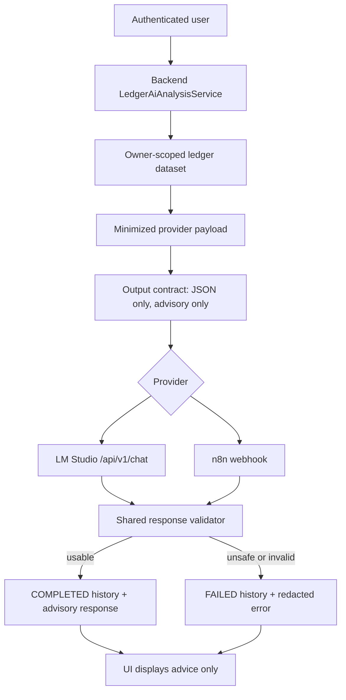

# AI Provider Safety Contract

Updated: 2026-06-30

This contract pins the release criteria for Ledger AI provider calls. Ledger AI can call LM Studio through the OpenAI-like `/api/v1/chat` endpoint and can call an n8n webhook, but both providers are treated as untrusted remote systems. Provider output is advisory only and must never be trusted to mutate ledger data.

## Scope

| Surface | Contract |
| --- | --- |
| LM Studio | Backend-only OpenAI-like chat call through `LedgerAiLmStudioClient`; `APP_LEDGER_AI_MODEL=auto` resolves the first available model from `/api/v1/models`. |
| n8n | Backend-only webhook call through `LedgerAiN8nClient`; optional API key header is used only server-side. |
| Shared response validation | `LedgerAiRemoteResponseValidator.requireUsable(...)` rejects null, failed, empty, secret-like content, authorization-header echoes, secret-bearing URLs/presigned URLs, oversized text fields or lists, prompt-injection echo, and ledger-mutation-claim responses. |
| Analysis service | `LedgerAiAnalysisService` builds owner-scoped, minimized provider payloads, stores completed or failed history, redacts provider failure details, records metrics, accepts a frontend-generated bounded `clientRequestId`, serializes same-JVM in-flight duplicate requests, and reuses recent duplicate completed analysis results. |
| Configuration/status | AI status can expose enabled/configured/provider/model state, but must not expose provider URLs, base URLs, webhook paths, API keys, or API-key header names. |
| Release gate | `scripts/verify-ai-provider-safety-contract.ps1` must run in CI before the release gate succeeds. |

## Provider safety flow

## Non-negotiable invariants

| ID | Invariant | Required evidence |
| --- | --- | --- |
| AI-PROV-01 | Provider calls stay backend-only; frontend receives no provider URL, base URL, webhook path, API key, or API-key header name. | `LedgerAiAnalysisServiceTest.statusDoesNotExposeProviderUrlsOrApiKeys` and AI status DTO coverage. |
| AI-PROV-02 | Provider URLs are allowlisted when enforcement is enabled, including LM Studio and n8n hosts. | `LedgerAiAnalysisPropertiesTest` allowlist coverage. |
| AI-PROV-03 | Provider payloads are owner-scoped, capped, text-limited, and include `payloadMinimization` overflow counts. | `LedgerAiAnalysisService.analyzeLimitsProviderPayloadEntryCountAndText`. |
| AI-PROV-04 | Prompt-injection-like ledger titles or memos remain data and are not treated as system/developer instructions. | `LedgerAiAnalysisServiceTest.analyzeKeepsPromptInjectionLikeLedgerTextAsData`. |
| AI-PROV-05 | Provider output must fail closed when it is null, failed, empty, non-JSON for LM Studio, or lacks usable analysis. | `LedgerAiRemoteResponseValidatorTest` and `LedgerAiLmStudioClient` JSON parsing errors. |
| AI-PROV-06 | Provider output that echoes prompt-injection instructions is rejected. | `LedgerAiRemoteResponseValidatorTest.rejectsPromptInjectionEchoFromProviderOutput`. |
| AI-PROV-07 | Provider output that contains secret-like content, authorization headers, provider webhook URLs, or presigned URLs is rejected. | `LedgerAiRemoteResponseValidatorTest.rejectsSecretLikeProviderOutput`. |
| AI-PROV-08 | Provider output that claims ledger entries were created, updated, deleted, saved, categorized, or reclassified is rejected. | `LedgerAiRemoteResponseValidatorTest.rejectsProviderOutputClaimingLedgerMutation`. |
| AI-PROV-08A | Provider output with oversized text fields or oversized arrays is rejected before history storage or UI exposure. | `LedgerAiRemoteResponseValidatorTest.rejectsOversizedProviderTextValue` and `rejectsOversizedProviderList`. |
| AI-PROV-09 | Failed provider requests still persist failed history, but error messages are redacted before storage. | `LedgerAiAnalysisServiceTest.analyzeStoresFailedHistoryWhenRemoteRequestFails` and `analyzeStoresFailedHistoryWithoutLeakingProviderSecrets`. |
| AI-PROV-10 | Recent duplicate completed analysis requests for the same owner, provider, model, mode, period, comparison range, and optional bounded `clientRequestId` reuse the existing result instead of calling the provider again; same-JVM in-flight duplicates are serialized so a browser double-submit cannot create parallel provider calls. The frontend `analyzeLedgerSpending` request wrapper generates bounded `clientRequestId` values before posting analysis requests. `clientRequestId` is backend-only dedupe metadata and must not be sent to LM Studio or n8n payloads. | `LedgerAiAnalysisServiceTest.analyzeReusesRecentCompletedHistoryWithoutCallingRemoteProvider`, `analyzeSerializesParallelDuplicateRequestsAndReusesFirstResult`, `analyzeUsesClientRequestIdOnlyForBackendDedupe`, `LedgerAiAnalysisRequest.clientRequestId`, `LedgerAiAnalysisService.inFlightAnalysisLocks`, and `LedgerAiAnalysisHistoryRepository.findLatestMatchingCompletedAnalysis`. |
| AI-PROV-11 | Provider latency/failure metrics keep workflow/provider/status tags available for alerting. | `calen.external.workflow.requests`, `calen.external.workflow.request`, `calen.ledger.ai.requests`, and `calen.ledger.ai.request`. |
| AI-PROV-12 | AI output remains advisory only; any feature that applies mutations must require a separate explicit user action and a dedicated authorization/audit contract. | Output contract text and validator mutation-claim rejection. |

## LM Studio connection contract

Use the OpenAI-like LM Studio endpoint shown by LM Studio:

| Setting | Required value or rule |
| --- | --- |
| Base URL | `APP_LEDGER_AI_LMSTUDIO_BASE_URL=http://172.18.240.1:1234` for the local Windows/WSL bridge shown in LM Studio. |
| Chat path | `APP_LEDGER_AI_LMSTUDIO_CHAT_PATH=/api/v1/chat`. |
| Models path | `APP_LEDGER_AI_LMSTUDIO_MODELS_PATH=/api/v1/models`. |
| Model | `APP_LEDGER_AI_MODEL=auto` is allowed only when model discovery succeeds without leaking provider secrets. |
| API key | Optional; if configured, it is sent as `Authorization: Bearer ...` only from the backend and must not appear in status/history/errors. |
| Allowlist | In production-like environments set `APP_LEDGER_AI_ENFORCE_PROVIDER_URL_ALLOWLIST=true` and include only trusted hosts such as `172.18.240.1`, `localhost`, or the approved internal host. |

## n8n connection contract

| Setting | Required value or rule |
| --- | --- |
| Workflow URL | Stored only in backend configuration as `APP_LEDGER_AI_WORKFLOW_URL`. |
| API key header | `APP_LEDGER_AI_API_KEY_HEADER` is optional and must never be returned by status/history/error responses. |
| API key | `APP_LEDGER_AI_API_KEY` is optional and must never be logged, returned, or stored in history. |
| Response body | Must map to the shared `LedgerAiRemoteResponse` contract and pass `LedgerAiRemoteResponseValidator.requireUsable(...)`. |

## Release checklist

Before enabling or changing a provider in production, verify:

1. `APP_LEDGER_AI_ENABLED` is intentional for the environment.
2. Provider host allowlist is enabled for production-like deployments.
3. Status responses hide provider URLs, base URLs, webhook paths, API keys, and API-key header names.
4. Provider payloads stay capped and include `payloadMinimization` counts.
5. Invalid/non-JSON provider responses fail closed.
6. Prompt-injection echoes, secret-like output, authorization-header echoes, secret-bearing URLs/presigned URLs, oversized text fields/lists, and mutation claims are rejected.
7. Failed history is persisted with redacted error messages.
8. Frontend `analyzeLedgerSpending` keeps generating bounded `clientRequestId` values; duplicate suppression remains provider/model/range/clientRequestId aware, `clientRequestId` stays out of provider payloads, and same-JVM in-flight duplicate requests are serialized before provider calls.
9. Provider failure and latency metrics remain alertable.
10. Durable client idempotency keys reuse the bounded `clientRequestId` contract before supporting cross-node or queued parallel retries from multiple browser tabs.

## Next hardening slices

| Priority | Slice | Reason |
| --- | --- | --- |
| P1 | Durable client idempotency keys for `POST /api/ledger/ai/analyze` | Persist the bounded `clientRequestId` with owner/provider/model/range metadata to extend the current same-JVM in-flight guard and 5-minute completed-result reuse window across nodes, restarts, and queued retries. |
| P1 | Provider sample fixtures for LM Studio and n8n | Make provider drift visible without requiring live LM Studio or n8n access in CI. |
| P1 | Metric-level contract tests | Lock `calen.external.workflow.*` and `calen.ledger.ai.*` tags before dashboards depend on them. |
| P2 | Redaction profile catalog | Keep provider-specific secret formats documented as new providers are added. |
| P2 | Frontend confidence copy | Make it clear that AI advice is a suggestion, not verified accounting truth. |

