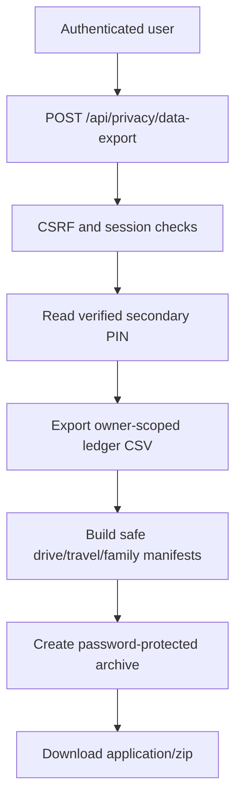

# Data Portability Contract

Updated: 2026-06-30

This document is the release contract for user data portability. The current backend export provides a password-protected archive containing ledger CSV data, export metadata, and safe file/media manifests. The archive is created only for the authenticated user and only after a recently verified secondary PIN session.

## Implemented API

| Endpoint | Method | Purpose | Protection |
| --- | --- | --- | --- |
| `/api/privacy/data-export` | `POST` | Downloads a user data archive for the authenticated user. | Authentication, CSRF, secondary PIN session, and password-protected ZIP. |

Request body is optional:

```json
{
  "from": "2026-01-01",
  "to": "2026-12-31"
}
```

When `from` and `to` are omitted, all non-deleted ledger entries visible to the authenticated owner are exported.

## Export flow



## Archive contents

| Path | Description | Privacy boundary |
| --- | --- | --- |
| `ledger/*.csv` | Ledger CSV generated by the existing ledger export formatter. | Owner-scoped through the ledger export service. |
| `metadata/export-metadata.json` | Export timestamp, owner identity, requested date range, included files, and safe counts. | Contains counts and descriptors, not operational secrets. |
| `manifest/drive-items.json` | Safe CalenDrive item manifest. | Excludes object storage paths, public URLs, presigned URLs, and raw share credentials. |
| `manifest/travel-media.json` | Safe travel media manifest. | Exposes `hasGpsMetadata` and timestamps, not raw latitude/longitude coordinates. |
| `manifest/family-media.json` | Safe family media manifest. | Excludes storage paths and temporary access URLs. |

Binary photos and files are intentionally not included in the current archive. They require an async job with progress, size limits, retry behavior, expiration cleanup, and restore rehearsal evidence before release.

## Non-negotiable safety rules

| Rule | Required behavior |
| --- | --- |
| Owner scope | The request body cannot target another user; the controller uses `@AuthenticationPrincipal` and passes only the current user id. |
| Unsafe method protection | `POST /api/privacy/data-export` remains authenticated and CSRF-protected. |
| Secondary PIN | Export requires a recently verified secondary PIN session, and the password-protected archive uses that verified secondary PIN. |
| Secret exclusion | Archives must not include API keys, access tokens, backup credentials, workflow URLs, prompt payloads, provider responses, model responses, object storage paths, signed URLs, presigned URLs, public link tokens, raw share credentials, or secondary PIN values. |
| Location privacy | Travel media manifests may expose `hasGpsMetadata`; they must not expose raw latitude/longitude or raw EXIF/GPS payloads. |
| Membership privacy | Future household, family, travel, and shared-budget exports must include only data visible to the current user. |
| Binary archive boundary | Binary file/photo export must be async, bounded, encrypted, expiring, and separately rehearsed before it can be part of the release path. |
| Import/export standardization | Future standard CSV/Excel import and export schemas must preserve owner scope, manifest redaction, and validation before database writes. |

## Current implementation anchors

| Area | Anchor |
| --- | --- |
| API controller | `PrivacyController.exportUserDataArchive` maps `POST /api/privacy/data-export`, reads `@AuthenticationPrincipal AppUserPrincipal currentUser`, verifies the secondary PIN session, and returns `application/zip` as an attachment. |
| Export service | `DataPortabilityExportService.exportUserDataArchive` verifies the secondary PIN, exports ledger CSV, fetches owner-scoped drive/travel/family manifest data, and creates the encrypted ZIP. |
| Manifest safety | `buildDriveManifest`, `buildTravelMediaManifest`, `buildFamilyMediaManifest`, and `excludedFields` document the safe manifest boundary. |
| Service tests | `DataPortabilityExportServiceTest.exportUserDataArchiveBuildsEncryptedArchiveWithoutOperationalSecrets` checks encrypted archive contents and secret exclusion. |
| Ordering tests | `DataPortabilityExportServiceTest.exportUserDataArchiveVerifiesSecondaryPinBeforeExportingLedgerData` keeps secondary PIN verification before ledger export. |
| API tests | PrivacyControllerIntegrationTest.dataExportRequiresAuthenticationCsrfAndVerifiedSecondaryPin keeps auth, CSRF, secondary PIN, and ZIP response behavior covered. |
| Frontend privacy action | rontend/src/components/ProfileWorkspace.vue exposes the privacy panel, date range fields, secondary-PIN export dialog, manifest-only archive explanation, live status messages, and stable data-testid anchors such as privacy-data-export-card, privacy-export-open, and privacy-export-secondary-pin. |

## Release gate

The `data-portability-contract` CI job must pass before promoting changes that affect privacy controls, data export, ledger CSV generation, media manifests, storage links, secondary PIN handling, or future import/export jobs.

A release is not ready if any of these are true:

| Failure | Why it blocks release |
| --- | --- |
| Export can be requested for another user. | Breaks owner scope. |
| Export does not require authentication, CSRF, or secondary PIN. | Creates direct account-data exfiltration risk. |
| Archive includes operational secrets, storage paths, public tokens, presigned URLs, raw GPS, AI prompts, or provider responses. | Leaks infrastructure and sensitive derived data. |
| Binary media export is synchronous or unbounded. | Creates timeout, memory, cost, and partial-export risk. |
| Standard CSV/Excel import bypasses validation or owner scope. | Can corrupt or cross-contaminate user data. |

## CI contract

`scripts/verify-data-portability-contract.ps1` keeps this document synchronized with `PrivacyController`, `DataPortabilityExportService`, `frontend/src/components/ProfileWorkspace.vue`, data portability tests, `docs/security_baseline_checklist.md`, `docs/project_improvement_roadmap.md`, and the GitHub Actions `data-portability-contract` job.

## Next slices

| Slice | Notes |
| --- | --- |
| Async binary archive job | Add queueing, progress API, size limits, retry policy, archive expiration, and restore rehearsal evidence before including photos/files. |
| Standard CSV/Excel export schema | Define stable column names, time zone rules, amount formats, category mapping, and manifest metadata for external tools. |
| Standard CSV/Excel import schema | Validate rows before writes, preview conflicts, preserve owner scope, and produce an import report. |
| Frontend E2E coverage | Drive the `ProfileWorkspace.vue` privacy panel through Playwright once disposable privacy/export fixtures are available: date range, secondary PIN dialog, manifest-only limitation, download success, and failure live regions. |
| Restore/rehearsal runbook | Prove exported data can be interpreted safely without secrets or object storage internals. |

## Test backlog

- Export rejects unauthenticated requests.
- Export rejects unsafe requests without CSRF.
- Export rejects requests without a verified secondary PIN session.
- Export includes only the authenticated user's ledger entries and visible media manifest rows.
- Export date range filters ledger CSV rows.
- Export metadata contains no secrets, signed URLs, presigned URLs, public tokens, raw GPS, prompts, provider responses, or storage internals.
- Async binary archive job enforces size limits, expiration, retry behavior, and encrypted output before release.
- Standard CSV/Excel import/export preserves owner scope and validates every row before writes.