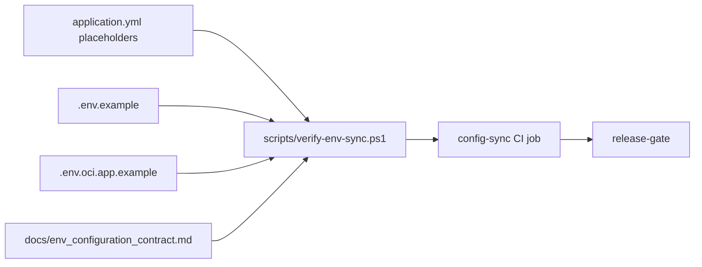

# Environment Configuration Contract

Updated: 2026-06-30

This contract keeps the checked environment examples aligned with `backend/src/main/resources/application.yml`. It exists because auth, remember-me, MinIO, Redis, OCR, LM Studio, n8n, migration, and backup settings are security-sensitive: a missing or stale variable can silently disable a control or expose an internal endpoint.

## Sync model

## Required groups

| Group | Variables |
| --- | --- |
| Database and migrations | `DB_URL`, `DB_DRIVER`, `DB_SERVER`, `DB_ID`, `DB_PASS`, `JPA_SHOW_SQL`, `JPA_FORMAT_SQL`, `H2_CONSOLE_ENABLED`, `DB_MIGRATION_ENABLED`, `DB_MIGRATION_BASELINE_ON_MIGRATE`, `DB_MIGRATION_BASELINE_VERSION`, `DB_MIGRATION_VALIDATE_ON_MIGRATE`, `APP_SCHEMA_LEGACY_UPDATERS_ENABLED` |
| Object storage and presigned URLs | `MINIO_API`, `MINIO_PUBLIC_API`, `MINIO_NAME`, `MINIO_SECRET`, `MINIO_CLOUD_BUCKET`, `MINIO_WORKSPACE_BUCKET`, `MINIO_PRESIGNED_URL_EXPIRY_SECONDS`, `MINIO_STORAGE_CAPACITY_BYTES` |
| Auth/session and seed | `JWT_KEY`, `JWT_EXPIRE`, `APP_SEED_ENABLED` |
| Travel integrations and media | `TRAVEL_EXCHANGE_RATE_BASE_URL`, `TRAVEL_EXCHANGE_RATE_CACHE_MINUTES`, `TRAVEL_REVERSE_GEOCODE_BASE_URL`, `TRAVEL_REVERSE_GEOCODE_USER_AGENT`, `TRAVEL_REVERSE_GEOCODE_REQUEST_MIN_INTERVAL_MS`, `TRAVEL_REVERSE_GEOCODE_CACHE_TTL_HOURS`, `TRAVEL_SUMMARY_CACHE_TTL_SECONDS`, `TRAVEL_MEDIA_DOWNLOAD_CACHE_TTL_SECONDS`, `TRAVEL_THUMBNAIL_BACKFILL_ENABLED`, `TRAVEL_THUMBNAIL_BACKFILL_FIXED_DELAY_MS`, `TRAVEL_THUMBNAIL_BACKFILL_INITIAL_DELAY_MS`, `TRAVEL_THUMBNAIL_BACKFILL_PAGE_SIZE`, `TRAVEL_THUMBNAIL_BACKFILL_MAX_ITEMS_PER_RUN`, `TRAVEL_MEDIA_STORAGE_PATH`, `TRAVEL_MEDIA_OBJECT_PREFIX`, `TRAVEL_PRESIGNED_UPLOAD_ENABLED` |
| Ledger OCR | `LEDGER_OCR_ENABLED`, `LEDGER_OCR_BASE_URL`, `LEDGER_OCR_WORKFLOW_URL`, `LEDGER_OCR_API_KEY`, `LEDGER_OCR_CONNECT_TIMEOUT`, `LEDGER_OCR_READ_TIMEOUT`, `LEDGER_OCR_MAX_FILE_SIZE` |
| Ledger AI provider | `APP_LEDGER_AI_ENABLED`, `APP_LEDGER_AI_PROVIDER`, `APP_LEDGER_AI_WORKFLOW_URL`, `APP_LEDGER_AI_API_KEY`, `APP_LEDGER_AI_API_KEY_HEADER`, `APP_LEDGER_AI_MODEL`, `APP_LEDGER_AI_LMSTUDIO_BASE_URL`, `APP_LEDGER_AI_LMSTUDIO_CHAT_PATH`, `APP_LEDGER_AI_LMSTUDIO_MODELS_PATH`, `APP_LEDGER_AI_LMSTUDIO_API_KEY`, `APP_LEDGER_AI_TEMPERATURE`, `APP_LEDGER_AI_MAX_TOKENS`, `APP_LEDGER_AI_CONNECT_TIMEOUT`, `APP_LEDGER_AI_READ_TIMEOUT`, `APP_LEDGER_AI_ENFORCE_PROVIDER_URL_ALLOWLIST`, `APP_LEDGER_AI_ALLOWED_PROVIDER_HOSTS`, `APP_LEDGER_AI_HISTORY_RETENTION_ENABLED`, `APP_LEDGER_AI_HISTORY_RETENTION_DAYS`, `APP_LEDGER_AI_HISTORY_RETENTION_CRON`, `APP_LEDGER_AI_HISTORY_RETENTION_ZONE` |
| Redis state and cache | `REDIS_CACHE_HOST`, `REDIS_CACHE_PORT`, `REDIS_CACHE_PASSWORD`, `REDIS_CACHE_DATABASE`, `REDIS_CACHE_SSL`, `REDIS_STATE_HOST`, `REDIS_STATE_PORT`, `REDIS_STATE_PASSWORD`, `REDIS_STATE_DATABASE`, `REDIS_STATE_SSL` |
| Family/support and data ops | `FAMILY_MEDIA_STORAGE_PATH`, `FAMILY_MEDIA_OBJECT_PREFIX`, `SUPPORT_ATTACHMENT_STORAGE_PATH`, `DATA_OPS_BACKUP_WORKDIR`, `DATA_OPS_BACKUP_REMOTE_NAME`, `DATA_OPS_BACKUP_REMOTE_DIR`, `DATA_OPS_MINIO_BACKUP_REMOTE_DIR`, `DATA_OPS_RCLONE_CONFIG_PATH`, `DATA_OPS_BACKUP_ZONE`, `DATA_OPS_DB_BACKUP_ENABLED`, `DATA_OPS_DB_BACKUP_CRON`, `DATA_OPS_MINIO_BACKUP_ENABLED`, `DATA_OPS_MINIO_BACKUP_CRON` |

## Safety rules enforced by CI

| Rule | Reason |
| --- | --- |
| Every uppercase Spring placeholder in `application.yml` must appear in `.env.example` and `.env.oci.app.example`. | Prevents deployment drift when a new backend setting is introduced. |
| Every required group variable must be referenced by `application.yml`, both env examples, and this document. | Keeps the operational contract explicit instead of relying on ad hoc comments. |
| Compose-only variables must match the allowlist in `scripts/verify-env-sync.ps1`. | Stops accidental committed variables that are not consumed by the app. |
| Boolean-like values must be literal `true` or `false`. | Prevents shell/YAML ambiguity and typo-driven disabled controls. |
| Secret-like example values must be blank or approved placeholders such as `change-me-*`. | Reduces the chance of committing real API keys or passwords. |
| LM Studio examples must keep `APP_LEDGER_AI_LMSTUDIO_BASE_URL=http://your-lm-studio-host:1234`, `APP_LEDGER_AI_LMSTUDIO_CHAT_PATH=/api/v1/chat`, `APP_LEDGER_AI_LMSTUDIO_MODELS_PATH=/api/v1/models`, and `APP_LEDGER_AI_MODEL=auto`. | Matches the local LM Studio API surface shown by the app and avoids pinning a model that may not be loaded. |
| `APP_LEDGER_AI_ALLOWED_PROVIDER_HOSTS` must include `your-lm-studio-host`. | Keeps the Windows/WSL LM Studio bridge usable when provider URL allowlist is enabled. |
| `.env.oci.app.example` must set `APP_LEDGER_AI_ENFORCE_PROVIDER_URL_ALLOWLIST=true`. | Production-like deployments should explicitly restrict LM Studio/n8n hosts. |
| `MINIO_PRESIGNED_URL_EXPIRY_SECONDS` must be an integer no larger than 604800 seconds. | Prevents accidental extremely long-lived presigned URLs in examples. |

## Change checklist

When adding or renaming a runtime setting:

1. Add the placeholder to `backend/src/main/resources/application.yml`.
2. Add safe example values to `.env.example` and `.env.oci.app.example`.
3. Add compose-only names to the verifier allowlist only when the backend does not consume them directly.
4. Add the variable to the relevant group in this document and `scripts/verify-env-sync.ps1`.
5. Keep real `.env` files, SSH keys, API keys, and production passwords out of git.
