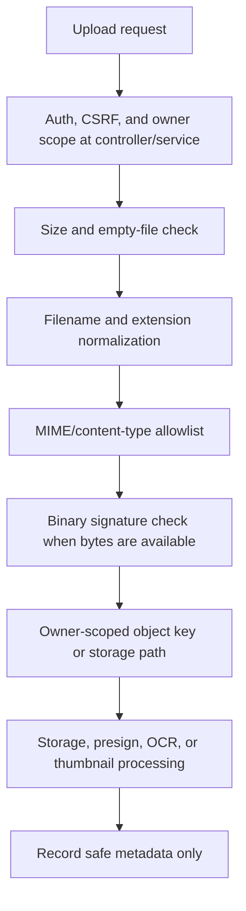

# File Upload Security Contract

Updated: 2026-06-30

This contract records the shared upload security baseline for TravelLedger. It complements `docs/media_processing_queue_contract.md`: that document owns expensive media processing and queue separation, while this document owns input validation before files reach remote OCR, object storage, durable media records, or user-visible thumbnails.

## Scope

| Upload family | Entry point | Current protection anchor |
| --- | --- | --- |
| OCR receipt upload | `LedgerOcrService.analyze` | Rejects empty, oversized, MIME/extension mismatch, and fake image-signature uploads before calling the remote OCR client. |
| CalenDrive upload | `DriveStorageService.initUpload` | Normalizes content type, validates known extension/content-type mismatches before presigned URL generation, and builds owner-prefixed object keys. |
| Travel media upload | `TravelMediaStorageService.store`, `preparePresignedUploads`, `completePresignedUpload` | Validates upload candidates, binary signatures for direct upload, prepared-thumbnail candidates, and owner/plan/record-scoped object keys before MinIO stat. |
| Travel GPX upload | `TravelMediaStorageService.storeRouteGpx` | Accepts only `.gpx`/XML route files and keeps route files out of image thumbnail generation. |
| Family album upload | `FamilyMediaStorageService.store` | Requires file name, MIME/extension match, binary signature validation, owner/category object key scoping, and fail-closed thumbnail preparation. |
| Support inquiry attachment | `SupportInquiryStorageService.store` | Limits attachments to 5MB, allows only image extensions/content types, verifies binary signatures, and stores under a normalized user directory. |
| Thumbnail serving | `TravelController`, `FamilyAlbumController`, `ImageThumbnailService` | Thumbnail failures return no thumbnail response instead of falling back to original private bytes. |

## Validation pipeline

## Required invariants

| Invariant | Required behavior |
| --- | --- |
| Validate before external calls | OCR upload validation must finish before `LedgerOcrRemoteClient.analyze`; invalid uploads must not notify users or call remote OCR. |
| Validate before presign | Drive and travel upload preparation must reject known extension/content-type mismatches before generating presigned upload URLs. |
| Validate before object stat | Travel presigned completion must validate owner/plan/record object-key scope and reject ambiguous path segments before MinIO `statObject`. |
| Validate direct upload bytes | OCR, support attachments, family album, and direct travel uploads must inspect binary signatures for supported image types when backend receives bytes. |
| Size limits stay explicit | OCR and support already have explicit limits; drive, travel, and family media must define per-feature limits before large-upload release. |
| Storage path confinement | Local storage paths must normalize under feature roots; object keys must include owner or owner-derived scope and avoid raw path traversal segments. |
| Image processing fails closed | Thumbnail decode/persist failures must not create a trusted thumbnail record, leak stack traces, or return original private bytes as a thumbnail fallback. |
| Metadata is safe | Queue payloads, logs, manifests, and notifications must not include raw presigned URLs, public tokens, API keys, secondary PINs, full filesystem paths, raw EXIF/GPS payloads, or OCR provider credentials. |
| User action remains explicit | Upload/OCR preview output can suggest ledger data, but must not mutate ledger entries until the user confirms the resulting transaction. |

## Implementation anchors

| Area | Evidence to preserve |
| --- | --- |
| OCR invalid upload guard | `LedgerOcrService.validateFile`, `normalizeContentType`, `resolveImageExtension`, `isAllowedImageContentType`, `hasAllowedImageSignature`, and `readImageHeader`. |
| OCR no remote call tests | `LedgerOcrServiceTest.analyzeRejectsEmptyFileBeforeRemoteCallOrNotification`, `analyzeRejectsOversizedFileBeforeRemoteCall`, `analyzeRejectsImageExtensionWithNonImageMimeBeforeRemoteCall`, `analyzeRejectsImageMimeWithNonImageExtensionBeforeRemoteCall`, `analyzeRejectsMismatchedImageMimeAndExtensionBeforeRemoteCall`, `analyzeRejectsFakeImageBytesBeforeRemoteCall`, and `analyzeRecordsInvalidFileMetricWhenUploadValidationFails`. |
| Drive presign guard | `DriveStorageService.prepareUploadRequest`, `normalizeContentType`, `validateContentTypeMatchesExtension`, `EXTENSION_CONTENT_TYPES`, and `GENERIC_CONTENT_TYPES`. |
| Drive tests | `DriveStorageServiceTest.initUploadRejectsKnownExtensionContentTypeMismatchBeforeStorageAccess`, `initUploadRejectsNullRequestBeforeStorageAccess`, and `initUploadAllowsGenericOctetStreamForKnownExtension`. |
| Travel presign completion guard | `TravelMediaStorageService.validateUploadCandidates`, `validateUploadCandidate`, `validateObjectKey`, `validatePreparedThumbnailCandidates`, `validateCompletedPreparedThumbnailCandidates`, and `verifyUploadedObject`. |
| Travel tests | `TravelMediaStorageServiceTest.completePresignedUploadRejectsObjectKeyOutsideOwnerRecordScopeBeforeMinioStat` and `completePresignedUploadRejectsAmbiguousObjectKeyBeforeMinioStat`. |
| Family upload guard | `FamilyMediaStorageService.validateFile`, `detectUpload`, `validateBinarySignature`, `matchesSignature`, `buildMinioObjectKey`, and `prepareDerivedThumbnailsQuietly`. |
| Support attachment guard | `SupportInquiryStorageService.MAX_ATTACHMENT_SIZE_BYTES`, `ALLOWED_CONTENT_TYPES_BY_EXTENSION`, `resolveAllowedContentType`, `validateBinarySignature`, and `matchesSignature`. |
| Fail-closed thumbnails | `FamilyAlbumControllerTest.shouldNotFallbackToOriginalImageWhenThumbnailIsUnavailable`, `TravelControllerTest`, and `ImageThumbnailServiceTest.shouldCreatePreparedThumbnailsForConfiguredWidths`. |

## Release gate

The `file-upload-security-contract` CI job must pass before promoting changes that affect OCR upload, Drive upload, travel media upload, family album upload, support inquiry attachments, presigned object keys, upload status UI, thumbnail serving, or large-upload queue work.

A release is not ready if any of these are true:

| Failure | Why it blocks release |
| --- | --- |
| Invalid OCR image reaches the remote OCR client. | Can leak user data to providers and waste external capacity. |
| Presigned upload URL is issued before extension/content-type validation. | Allows storage abuse and confusing file metadata. |
| Presigned completion stats an object key before owner/record scope validation. | Lets one user probe or complete another user's object. |
| Image signature spoofing is accepted by support, family, travel, or OCR flows. | Allows malicious or malformed bytes to be treated as trusted images. |
| Thumbnail failure falls back to original private bytes. | Breaks least-privilege preview behavior. |
| Upload logs or queue payloads store raw presigned URLs, public tokens, API keys, full filesystem paths, raw EXIF/GPS, or provider credentials. | Expands blast radius of operational logs and background queues. |

## CI contract

`scripts/verify-file-upload-security-contract.ps1` keeps this document synchronized with upload services, upload/security tests, `docs/security_baseline_checklist.md`, `docs/project_improvement_roadmap.md`, and the GitHub Actions `file-upload-security-contract` release-gate job.

## Next slices

| Slice | Notes |
| --- | --- |
| Per-feature max-size matrix | Define explicit max size for Drive, travel media, family album, GPX, support, OCR, and future video uploads. |
| Shared upload policy helper | Centralize extension/content-type/signature rules without weakening feature-specific allowances. |
| Travel/family malformed image tests | Add direct malformed-image upload tests that prove no trusted media row or thumbnail is created. |
| Upload status records | Persist upload intent, completion, failure reason, cleanup, and retry status before large-upload queue release. |
| Malware scanning hook | Add an optional async scan status before public sharing or data export includes uploaded binary files. |

## Test backlog

- Drive rejects known extension/content-type mismatches before MinIO presign.
- Drive completion cannot finalize object keys outside the current owner scope.
- Travel presigned completion rejects wrong-owner, wrong-plan, wrong-record, path traversal, and ambiguous object keys before MinIO stat.
- Travel direct upload rejects malformed image bytes before creating trusted media records.
- Family album rejects MIME/extension mismatch and fake image bytes before storage.
- Support inquiry rejects oversized, unsupported, MIME/extension mismatch, and fake image bytes.
- OCR rejects invalid uploads before remote OCR and records only bounded invalid-file metrics.
- Thumbnail endpoints never fall back to original private bytes when thumbnail generation/loading fails.