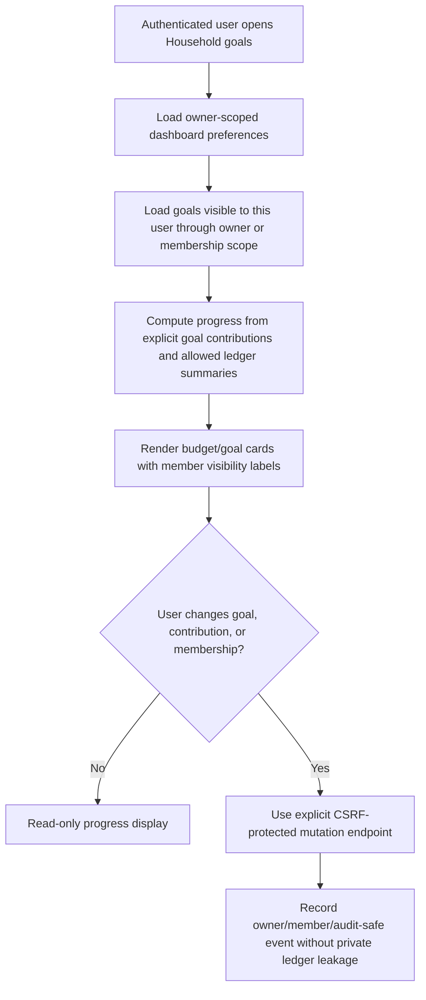

# Household Budget and Shared Goals Contract

Updated: 2026-06-30

This document defines the release contract for turning the Household area into family budgets and shared goals. The current product baseline has household aggregate widgets, household travel-ledger views, travel budget items, and owner-scoped personal household goals. The next feature slice should build on those owner-scoped foundations without accidentally exposing another user's ledger, payment methods, travel plans, or goal contributions.

## Current baseline

| Surface | Current anchor | Relevance to shared goals |
| --- | --- | --- |
| Household aggregate widgets | `HouseholdAggregatePreferenceService` and `HouseholdWorkspace.vue` | Lets a user choose dashboard aggregate cards for total/payment-method summaries. |
| Owner-scoped household goals | `HouseholdGoal`, `HouseholdGoalService`, `/api/account/preferences/household-goals`, and `V20260630_014__household_goals.sql` | Provides the first personal goal foundation before multi-member shared goals ship, with explicit Flyway schema coverage. |
| Household travel ledger | `HouseholdTravelLedgerWorkspace.vue` and travel-linked ledger entries | Gives a household-style view for trip spending and travel-plan linkage. |
| Travel budget items | `TravelBudgetItem` and `TravelBudgetItemRepository` | Existing budget category/title/amount/currency fields can inform future shared trip goals. |
| Ledger statistics | overview, payment breakdown, category breakdown, comparison, and calendar flows | Source data for future monthly family budget progress. |
| Privacy/data export controls | `docs/privacy_control_panel.md` and `docs/data_portability.md` | Shared-goal exports must not leak another member's private records or operational secrets. |

## Product boundary

| Concept | Definition | First safe slice |
| --- | --- | --- |
| Household budget | A user-visible spending cap for a period, category, payment method, travel plan, or household group. | Start with owner-scoped personal household budgets before multi-member sharing. |
| Shared goal | A target amount, due date, and progress source for savings, travel funds, emergency funds, or family projects. | Store goal metadata separately from ledger entries; compute progress from explicit contributions or selected owner-visible entries. |
| Member visibility | The rule deciding which member can see budget/goal metadata and contribution details. | Require explicit membership/grant rows before showing another user's goal or contribution. |
| Contribution | A user-entered amount or selected ledger entry that increases goal progress. | Never infer or publish another user's ledger entries without explicit opt-in. |
| Settlement/adjustment | Any action that changes ledger entries or money movement because of a shared goal. | Keep out of the first slice; later mutations require explicit confirmation and audit/event evidence. |

## Target data flow

## Non-negotiable safety rules

| Rule | Reason |
| --- | --- |
| Budget and goal records must be owner-scoped or membership-scoped. | A family feature cannot become a cross-user ledger browser. |
| Payment method, category, ledger entry, travel plan, and contribution references must be validated against the acting user's visibility. | Prevents attaching private financial records to another household's goal. |
| Shared goal progress is a derived summary, not authority to mutate ledger entries. | Users should review and confirm any ledger change separately. |
| Owner-scoped household goal APIs must use the authenticated user only. | The first slice must not accept body-provided owner IDs or leak another user goal. |
| Member invitations, removals, permission changes, and destructive goal changes require CSRF-protected explicit actions. | Household collaboration is account/security-sensitive. |
| Goal exports must exclude operational secrets and non-visible member data. | Data portability should preserve trust without leaking other users' records. |
| Dismissed/archived goals should remain auditable through safe metadata. | Avoids silent loss of financial collaboration context. |
| Notification producers must use bounded metadata only. | Budget/goal notifications should not include raw ledger titles, private notes, tokens, or account secrets. |
| Multi-member write conflicts need deterministic resolution or optimistic locking before shared editing ships. | Avoids overwriting family contribution decisions. |

## Current implementation anchors

| Anchor | Evidence |
| --- | --- |
| `HouseholdAggregatePreferenceService` | Stores up to 4 widgets on the current active user, normalizes kind/period/amount type, and validates payment methods by owner. |
| `HouseholdGoalService` / `HouseholdGoalServiceTest` | Lists, creates, updates, and archives owner-scoped personal goals; emits bounded `GOAL_PROGRESS` notifications when a goal reaches target; suppresses duplicate unread notifications by target URL. |
| `V20260630_014__household_goals.sql` / `HouseholdGoalSchemaUpdater` | Flyway now creates the `household_goals` table with owner/status and owner/due-date indexes; the runtime updater remains only as a documented transition fallback until staging Flyway evidence allows retirement. |
| `HouseholdAggregatePreferenceServiceTest` | Covers legacy/sparse widget normalization and owner-scoped active payment method validation. |
| `HouseholdWorkspace.vue` | Loads/saves household aggregate preferences and connects household travel-ledger UI to current user's travel plans and entries. |
| `TravelBudgetItemRepository` | Reads travel budget items through plan owner predicates and item owner predicates. |
| `TravelBudgetItem` | Persists category, title, amount, currency, KRW amount, memo, display order, and plan relation. |
| `docs/security_baseline_checklist.md` | Tracks security release requirements for shared/budget/goal surfaces. |

## Release gate

Before promoting a change that adds household budgets, shared goals, goal contributions, household member permissions, goal notifications, or goal export/import:

1. Confirm budget/goal list/detail APIs are owner-scoped or membership-scoped.
2. Confirm category, payment method, ledger entry, travel plan, and contribution references are validated against current-user visibility.
3. Confirm progress displays are read-only summaries unless the user performs an explicit CSRF-protected mutation.
4. Confirm member invitation/removal/permission changes have focused authorization tests.
5. Confirm data export and notification payloads exclude non-visible member details, raw ledger notes, storage paths, public tokens, presigned URLs, API keys, secondary PINs, and operational secrets.
6. Confirm shared editing has an optimistic-locking or deterministic conflict strategy before multi-member mutations ship.
7. Run `scripts/verify-household-budget-goals-contract.ps1` and focused household/travel budget tests.

## CI contract

The `household-budget-goals-contract` GitHub Actions job must run `scripts/verify-household-budget-goals-contract.ps1`. The release gate must include that job so future family-budget and shared-goal changes cannot bypass owner/member visibility, explicit mutation, export-safety, or notification-safety rules.

## Next slices

| Slice | Notes |
| --- | --- |
| Owner-scoped personal household budget | Add budget metadata for the current user only before introducing members. |
| Frontend personal household goal panel | Wire `GET/POST/PUT/DELETE /api/account/preferences/household-goals` into Household with accessible create/edit/archive controls. |
| Shared goal domain | Extend the current owner-scoped `HouseholdGoal` foundation with explicit membership/grant rows before multi-member sharing. |
| Contribution records | Store explicit contributions and optional visible ledger-entry references. |
| Membership/permission model | Define viewer/editor/admin permission levels and invitation/revocation flow. |
| Goal dashboard widgets | Add progress cards to Household using existing aggregate widget patterns. |
| Notifications | `GOAL_PROGRESS` now fires for owner-scoped goal completion with bounded goalId/status/progressBucket/visibility metadata; future shared notifications must keep the same boundary. |

## Test backlog

- User A cannot list, edit, contribute to, export, or receive notifications for User B's private budget/goal.
- Member-scoped users can see only the fields their permission allows.
- Goal progress does not include another user's ledger entries unless that user explicitly contributes or shares them.
- Contribution create/update/delete requires authentication and CSRF.
- Goal archive/delete is explicit and leaves safe metadata for audit/debug.
- Export excludes non-visible member data, public tokens, storage paths, presigned URLs, raw ledger notes, API keys, secondary PINs, and operational secrets.
- Notification payloads contain goal IDs/counts/status labels only, not raw private ledger details; current `GOAL_PROGRESS` metadata is limited to goalId/status/progressBucket/visibility.