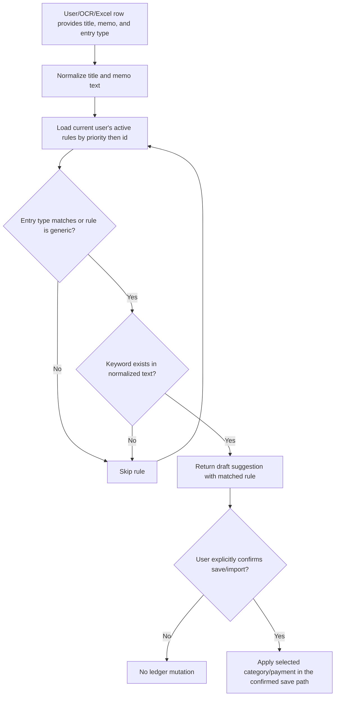

# Ledger Classification Rules

Updated: 2026-06-30

This document records the backend contract for user-defined ledger classification rules. The goal is to improve OCR and Excel import quality with explicit, explainable, owner-scoped rules before adding AI-recommended rule approval.

## Implemented API

| Endpoint | Method | Purpose |
| --- | --- | --- |
| `/api/ledger/classification-rules` | `GET` | List the current user's active rules, or all rules with `includeInactive=true`. |
| `/api/ledger/classification-rules` | `POST` | Create a keyword rule. |
| `/api/ledger/classification-rules/{ruleId}` | `PUT` | Replace a rule owned by the current user. |
| `/api/ledger/classification-rules/{ruleId}` | `DELETE` | Deactivate a rule instead of hard-deleting it. |
| /api/ledger/classification-rules/preview | POST | Preview the first matching rule for a title/memo/entryType input. |
| /api/ledger/classification-rules/recommendations/approve | POST | Approve an AI-recommended keyword/category/payment draft as an active owner-scoped rule. |

## Decision flow

## Matching Rule

| Step | Behavior |
| --- | --- |
| Text normalization | Title and memo are trimmed, lowercased, and repeated whitespace is collapsed. |
| Owner scope | Only rules owned by the authenticated user are listed, updated, deactivated, or previewed. |
| Active-only preview | Preview reads active rules only; inactive rules are retained for audit/debug but do not match. |
| Entry type filter | Rule entry type must match the preview entry type when both are present. |
| Keyword match | First active rule whose normalized keyword is contained in title+memo wins. |
| Priority | Lower priority number wins, then lower rule ID. |

## Cross-feature contract

| Flow | Rule behavior | Mutation boundary |
| --- | --- | --- |
| Manual preview | Returns a matched rule and suggested category/detail/payment. | Preview does not mutate ledger data. |
| OCR preview | OCR text can call the same preview contract and show a draft suggestion next to extracted rows. | OCR output must stay editable and unsaved until explicit user confirmation. |
| Excel import preview | Parsed spreadsheet rows can call the same preview contract before import. | Excel import must not create, update, delete, or reclassify entries until the user confirms selected rows. |
| AI-recommended rule approval | AI may propose a keyword/category/payment rule as a draft suggestion. The approval API reuses the same owner/category/detail/payment validation and stores the approved rule as active for future previews. | AI recommendations remain inactive/unapplied until the user approves the rule; approval creates only a rule, not ledger entries, and affected OCR/Excel rows still require a later save/import confirmation. |

## Non-negotiable safety rules

| Rule | Reason |
| --- | --- |
| Rules are scoped to `@AuthenticationPrincipal`. | Users cannot create, update, deactivate, list, or preview another user's rules. |
| Category group/detail/payment method IDs are owner-validated. | Prevents cross-user classification references. |
| Category detail must belong to the selected group. | Prevents inconsistent import suggestions. |
| Delete deactivates only. | Keeps audit/debug context for surprising import behavior. |
| Preview does not mutate ledger data. | User confirmation is still required before applying suggestions. |
| Rule output is a draft suggestion. | OCR, Excel, and AI-assisted classification remain reviewable instead of silently changing records. |
| The rule engine must not create, update, delete, or reclassify ledger entries by itself. | Save/import endpoints own mutations and must keep an explicit user confirmation boundary. |
| Debug/audit surfaces must not store raw OCR images, AI prompts, provider responses, API keys, or cross-user identifiers. | Classification diagnostics are useful, but they cannot become a data leakage path. |

## Current implementation anchors

| Anchor | Contract evidence |
| --- | --- |
| `LedgerClassificationRuleController` | Exposes owner-scoped CRUD, `/preview`, and `/recommendations/approve` endpoints under authenticated API routes. |
| `LedgerClassificationRuleService` | Uses owner-scoped repositories, active-only preview, priority ordering, normalized keyword matching, category/detail consistency checks, payment owner checks, and active rule creation for user-approved AI drafts. |
| `LedgerClassificationRuleRepository` | Provides owner-scoped list/find queries and active-only priority lookup. |
| `LedgerClassificationRule` | Persists owner, normalized keyword, entry type, category group/detail, payment method, priority, active state, and timestamps. |
| `LedgerClassificationRuleServiceTest` | Covers priority-order preview, entry-type mismatch, and category detail/group mismatch. |

## Test Evidence

| Evidence | Coverage |
| --- | --- |
| `LedgerClassificationRuleServiceTest.previewReturnsFirstActiveOwnerRuleInPriorityOrder` | Verifies preview reads the current user's active rules in priority order and returns the first matching keyword. |
| `LedgerClassificationRuleServiceTest.previewDoesNotMatchDifferentEntryTypeRule` | Verifies an income rule does not classify an expense preview even when the keyword text matches. |
| LedgerClassificationRuleServiceTest.createRuleRejectsCategoryDetailFromDifferentGroup | Verifies a rule cannot bind a category detail that belongs to a different category group. |
| LedgerClassificationRuleServiceTest.approveRecommendedRuleCreatesActiveOwnerRuleFromDraft | Verifies an AI draft approval creates an active normalized owner rule even when the draft payload was inactive. |
| `scripts/verify-ledger-classification-contract.ps1` | Verifies the documentation, implementation anchors, security checklist, and CI job stay connected. |

## Release gate

Before promoting a change that touches ledger OCR, Excel import, AI rule recommendations, category/payment assignment, or classification rule storage:

1. Confirm classification output is still a draft suggestion until explicit user confirmation.
2. Confirm preview paths do not create, update, delete, or reclassify ledger entries.
3. Confirm owner-scoped repository calls are still used for rules, categories, details, and payment methods.
4. Confirm inactive rules remain excluded from preview matching.
5. Run `scripts/verify-ledger-classification-contract.ps1` and the focused service tests listed above.

## CI contract

The `ledger-classification-contract` GitHub Actions job must run `scripts/verify-ledger-classification-contract.ps1`. The release gate must include that job so classification safety regressions block merges instead of becoming release-review memory work.

## Next Slices

| Slice | Notes |
| --- | --- |
| Apply rules in Excel/OCR preview | Show matched rule and suggested category/payment before save. |
| AI-recommended rule approval API | Backend endpoint accepts an AI draft only after user approval and turns it into an active owner-scoped rule without mutating ledger entries. |
| Rule conflict detection | Warn when a new keyword overlaps with a higher-priority rule. |
| Usage statistics | Track how often a rule matched and was accepted/rejected. |

## Test Backlog

- User A cannot create/update/deactivate/preview User B's category or payment IDs.
- Keep preview priority-order and active-only repository coverage current as matching modes expand.
- Inactive rules do not match preview.
- Keep detail/category consistency coverage current as rule creation gains conflict detection.
- Preview does not create or update ledger entries.
- OCR and Excel import previews display classification matches without saving entries before confirmation.
- AI-recommended rules stay inactive and unapplied until user approval; approval stores only a rule and never creates or reclassifies ledger entries by itself.