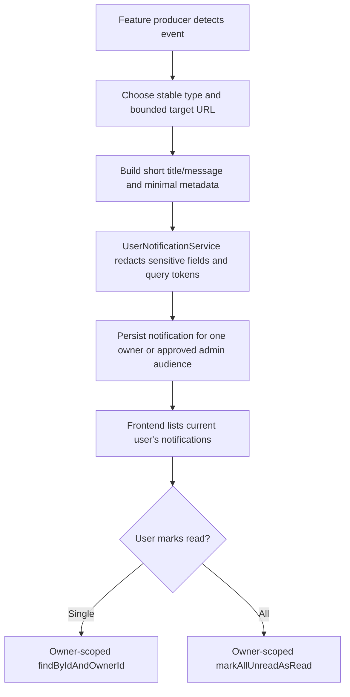

# Notification Center Contract

Updated: 2026-06-30

This document records the notification-center contract. Storage, listing, unread counts, read handling, AI analysis completed events, OCR failure events, scheduled backup failed events, privacy cleanup events, privacy export completion events, shared file received events, travel starts soon reminders, budget exceeded warnings, household goal progress events, frontend route rendering, and the topbar unread badge are now in place. The contract verifier now checks OCR and scheduled-backup producer implementation/test anchors directly, not only the generic notification API. Future multi-member household producers remain in the queue, and every new producer must keep notifications owner-scoped or membership-scoped, bounded, and free of operational secrets.

## Implemented API

| Endpoint | Method | Purpose |
| --- | --- | --- |
| `/api/notifications` | `GET` | List the current user's notifications with `page`, `size`, and optional `unreadOnly=true`. |
| `/api/notifications` | `POST` | Create a notification for the current user. This remains useful for manual/internal UI testing while producers are being wired. |
| `/api/notifications/{notificationId}/read` | `PATCH` | Mark one owned notification as read. |
| `/api/notifications/read-all` | `PATCH` | Mark all unread owned notifications as read. |

## Data model

| Field | Reason |
| --- | --- |
| `ownerId` | Keeps notifications user-scoped and avoids body-provided user targeting. |
| `type` | Stable event family such as `AI_ANALYSIS_DONE`, `BACKUP_FAILED`, or `SHARED_FILE_RECEIVED`. |
| `title` / `message` | User-facing summary text for header badge and notification list. |
| `targetUrl` | Optional deep link into the feature that produced the notification. Signed-token query values are redacted before persistence. |
| `metadataJson` | Optional structured payload for future UI rendering. Sensitive field values and signed-token query parameters are redacted before persistence. |
| `readAt` | Supports unread badge counts without deleting history. |

## Event flow

## Safety rules

| Rule | Reason |
| --- | --- |
| Current user ID always comes from `@AuthenticationPrincipal`. | Prevents cross-user notification access. |
| List and read APIs are owner-scoped. | A user cannot list or mark another user's notification as read. |
| Manual/internal creation uses the authenticated user as owner. | A request body cannot target another user. |
| API responses include `unreadCount`. | Header badge can render without a second count endpoint. |
| Notification metadata must not contain API keys, signed URLs, raw prompts, provider responses, backup credentials, secondary PINs, public tokens, or storage paths. | Notifications are designed for awareness, not sensitive data storage. |
| Notification creation redacts sensitive metadata fields, bearer tokens, and signed URL query parameters before persistence. | Producer mistakes should not turn the notification table into a secret store. |
| Scheduled backup failure notifications go only to active admins and store bounded `backupType`/`status` metadata. | Operators need actionability without leaking backup paths, remote names, or credentials. |
| Budget, travel, household, and privacy producers must store IDs/counts/status labels only. | These domains can include sensitive spending, family, route, photo, and location details. |
| Event producers should write short messages and link to the source page. | Keeps the center useful without duplicating feature data. |
| Notification center UX must group budget exceeded, AI analysis completed, backup failed, shared file received, travel starts soon, and OCR failed events as first-class inbox categories. | Users should not have to hunt through separate feature screens to know what needs attention. |
| Notification links must be relative application paths. | Avoids turning notifications into open redirects or signed URL storage. |

## Implemented producers

| Producer | Type | Target |
| --- | --- | --- |
| Ledger AI analysis completed | `AI_ANALYSIS_DONE` | AI analysis history deep link. |
| Ledger AI analysis failed | `AI_OR_OCR_FAILED` | AI analysis history/status deep link. |
| Ledger OCR failed | `AI_OR_OCR_FAILED` | Receipt OCR retry surface. |
| Scheduled database backup failed | `BACKUP_FAILED` | Admin data-management page. |
| Scheduled MinIO backup failed | `BACKUP_FAILED` | Admin data-management page. |
| CalenDrive file shared with user | `SHARED_FILE_RECEIVED` | CalenDrive shared-files view. |
| Privacy cleanup completed | `PRIVACY_ACTION_DONE` | Profile privacy panel. |
| Privacy export completed | `PRIVACY_EXPORT_DONE` | Profile privacy panel. |
| Travel starts tomorrow | `TRAVEL_REMINDER` | Travel money/planner page. |
| Travel budget threshold exceeded | `BUDGET_WARNING` | Travel money ledger page. |
| Household goal reached | `GOAL_PROGRESS` | Household goal dashboard. |

## Unified notification inbox

| Product group | Event examples | User action | Metadata boundary |
| --- | --- | --- | --- |
| Budget exceeded | Travel budget threshold exceeded, future family budget cap exceeded. | Open the budget or travel ledger review page and decide whether to adjust spending or the goal. | Store IDs, threshold label, period, and status only; never raw ledger notes, payment details, or member-private spending. |
| AI analysis completed | Ledger AI analysis done or failed. | Open the AI analysis history/status page and review advice. | Store analysis id/status only; never raw prompts, provider responses, API keys, or full transaction payloads. |
| Backup failed | Scheduled database or MinIO backup failed. | Open the admin data-management page and inspect operational runbooks/logs. | Notify active admins only with backupType/status; never backup paths, remote names, credentials, or raw exceptions. |
| Shared file received | CalenDrive file shared with the user. | Open shared files and review VIEW / DOWNLOAD / EDIT permission. | Store item/share ids and relative links only; never public tokens, presigned URLs, object keys, or storage paths. |
| Travel starts soon | Planned trip starts tomorrow or enters a future reminder window. | Open the travel planner/money page and prepare budget, route, and media. | Store plan id/date/status only; never trip private notes, raw GPS/EXIF, media tokens, or storage paths. |
| OCR failed | Receipt OCR could not complete after remote/configured OCR failure. | Open the OCR retry surface and upload again or enter manually. | Store bounded failure reason only; never raw receipt images, OCR text, AI output, or file paths. |
## Event producer queue
| Producer | Suggested type | Target | Required metadata boundary |
| --- | --- | --- | --- |

## Current implementation anchors

| Anchor | Evidence |
| --- | --- |
| `UserNotificationController` | Exposes authenticated list/create/read/read-all endpoints and passes only `currentUser.userId()` to the service. |
| `UserNotificationService` | Redacts sensitive metadata/query/bearer-token values, truncates fields, lists by owner, counts unread by owner, and marks read by owner. |
| `UserNotificationRepository` | Provides owner-scoped list, unread list, single lookup, unread count, and bulk read update queries. |
| UserNotificationServiceTest | Covers sensitive metadata/target redaction and owner-scoped single-notification read lookup. |
| LedgerOcrService / LedgerOcrServiceTest | Produces bounded AI_OR_OCR_FAILED notifications for remote/configured OCR failures while skipping invalid-file validation failures. |
| DataOpsBackupScheduler / DataOpsBackupSchedulerTest | Produces bounded BACKUP_FAILED notifications for active admins on scheduled database/MinIO backup failures without storing backup paths, credentials, or raw exception details. |
| PrivacyManagementService / PrivacyManagementServiceTest | Produces bounded PRIVACY_ACTION_DONE notifications after combined privacy cleanup without storing item names, tokens, archive contents, prompts, or location values. |
| DataPortabilityExportService / DataPortabilityExportServiceTest | Produces bounded PRIVACY_EXPORT_DONE notifications after protected archive creation without storing file names, archive contents, secondary PIN values, tokens, storage paths, prompts, provider responses, or raw GPS. |
| TravelReminderNotificationScheduler / TravelReminderNotificationSchedulerTest | Produces bounded TRAVEL_REMINDER notifications for PLANNED trips that start tomorrow without storing travel names, private notes, GPS/EXIF, media tokens, or storage paths. |
| TravelBudgetWarningNotificationScheduler / TravelBudgetWarningNotificationSchedulerTest | Produces bounded BUDGET_WARNING notifications for PLANNED/COMPLETED trips whose LEDGER spending exceeds planned budget and suppresses duplicate unread warnings for the same plan. |
| HouseholdGoalService / HouseholdGoalServiceTest | Produces bounded GOAL_PROGRESS notifications for owner-scoped goals that reach target and suppresses duplicate unread notifications by target URL. |
| `NotificationCenterWorkspace.vue` | Loads notifications, filters unread-only, marks one/all read, and only opens relative target URLs. |
| `App.vue` / `api.js` | Routes to the notification center and exposes frontend notification API calls. |

## Release gate

Before promoting a change that adds or modifies notification storage, notification UI, event producers, budget exceeded, AI analysis completed, backup failed, shared file received, travel starts soon, OCR failed, budget/travel/household/privacy notification payloads, backup/AI/OCR notification behavior, or read-state behavior:

1. Confirm every list/read/write path is scoped to the authenticated owner or an explicitly approved admin audience.
2. Confirm producers do not persist API keys, signed URLs, presigned URLs, public tokens, object storage paths, raw OCR images, raw AI prompts, provider responses, backup credentials, secondary PINs, raw GPS/EXIF, or private member ledger details.
3. Confirm target URLs are relative application paths and do not contain signed-token query values.
4. Confirm `metadataJson` remains bounded and redacted before persistence.
5. Confirm unread counts stay owner-scoped after read/read-all operations.
6. Confirm frontend notification cards expose enough status/action text without depending on color only.
7. Run `scripts/verify-notification-center-contract.ps1` and focused notification service/controller/UI tests.

## CI contract

The `notification-center-contract` GitHub Actions job must run `scripts/verify-notification-center-contract.ps1`. The release gate must include that job so future producers cannot bypass owner scope, redaction, target URL, unread-count, or frontend wiring rules.

## Test backlog

- Unauthenticated users cannot call `/api/notifications`.
- User A cannot list or mark User B's notification as read.
- `unreadCount` decreases after read/read-all operations.
- Event producers do not include raw prompts, backup credentials, route coordinates, storage paths, public tokens, signed URLs, or long raw payloads in `metadataJson`.
- Pagination clamps `size` to the backend maximum.
- Household goal, travel reminder, budget warning, and privacy export producers already use bounded goalId/status/progressBucket/visibility, planId/date/status, planId/threshold/period/status, or status/dateRange/archiveScope metadata only; future multi-member household producers must not include non-visible member details.
- Notification center E2E verifies unread/read-all UI and owner isolation.

## Frontend notification center

- `frontend/src/components/NotificationCenterWorkspace.vue` provides the in-app notification center for the signed-in user.
- The workspace loads `/api/notifications`, supports unread-only filtering, and can mark a single notification or all notifications as read.
- It is reachable from the main top navigation through the `notifications` route, and `App.vue` renders `NotificationCenterWorkspace` for that route.
- Notification cards expose category, severity, read state, creation time, and optional target links so budget exceeded, AI analysis completed, backup failed, shared file received, travel starts soon, OCR failed, privacy, and household events are actionable instead of hidden in separate feature logs.

