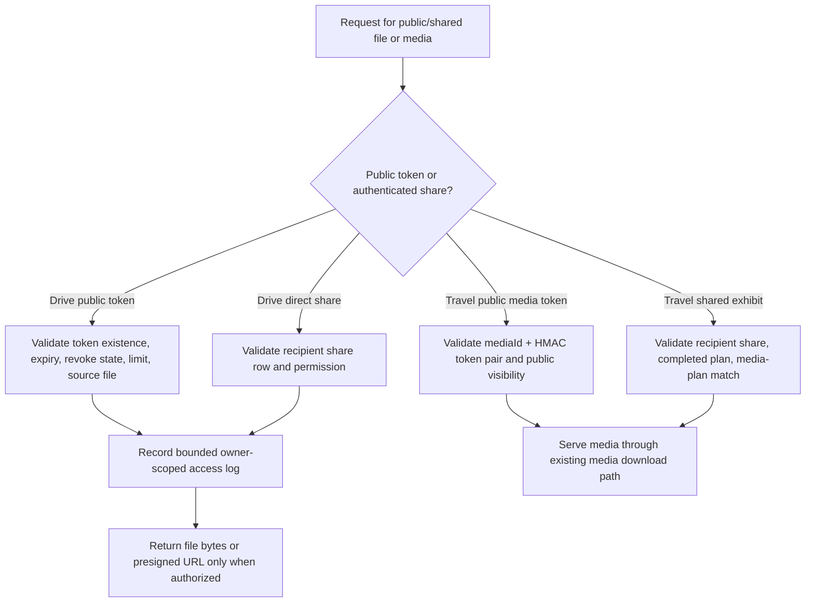

# Public Share Authorization Contract

Updated: 2026-06-30

This contract records the release boundary for public and shared file/media access in TravelLedger. It complements `docs/drive_share_permissions.md` by covering both CalenDrive direct shares, public download links, travel public media tokens, shared travel exhibits, and privacy revocation controls.

## Scope

| Surface | Entry point | Authorization boundary |
| --- | --- | --- |
| CalenDrive public download link | `/api/file/public-download/{token}` and public presigned download resolution | Link must exist, not be revoked, not be expired, under download limit, attached to a valid non-trashed file, and access must be logged without raw-token storage. |
| CalenDrive direct share | `/api/file/share/shared/{fileId}/download`, `/api/file/share/{fileId}/access-logs` | Recipient must have an explicit share row; `VIEW` cannot download or save; owner alone can read direct-share access logs. |
| CalenDrive share permission | `DriveSharePermission.VIEW`, `DOWNLOAD`, `EDIT` | Omitted permissions default to `DOWNLOAD`; unknown values fail fast; `EDIT` is reserved but still download-capable until collaborative edit semantics exist. |
| Travel public media token | `/api/travel/public/media/{mediaId}/content?token=...` | Token must match the requested media id using the configured public-media secret and the media must still be public/community-visible. |
| Travel shared exhibit media | `/api/travel/shared-exhibits/{shareId}/media/{mediaId}/content` | Authenticated recipient must own the share row, the source plan must be completed, and media must belong to that shared plan. |
| Privacy revocation | `/api/privacy/public-download-links`, `/api/privacy/travel-public-media-shares`, `/api/privacy/cleanup` | Authenticated user with CSRF can revoke only their own Drive public links and Travel public/community media share surfaces. |

## Authorization flow

## Required invariants

| Invariant | Required behavior |
| --- | --- |
| Public Drive tokens are bounded | Created links must have min/max expiry, max download limit, revocation state, and availability derived from expiry/revocation/download count. |
| Invalid public tokens fail closed | Blank, missing, revoked, expired, over-limit, invalid-item, and trashed-file tokens must not load file bytes or generate presigned URLs. |
| Access logs are safe | Public link and direct-share logs must store owner/item/status metadata and token fingerprints, not raw tokens. User-agent/client address fields stay bounded. |
| Direct share permissions are enforced | `VIEW` shares can list/preview only; download URL generation, object loading, and save-to-drive must require `DOWNLOAD` or `EDIT`. |
| Direct share failures are observable | `not_found`, `unavailable`, `permission_denied`, and `success` direct-share statuses remain bounded and owner-scoped. |
| Access log visibility is owner-only | File owners can inspect public/direct-share access logs; non-owners must be rejected before log reads. |
| Travel public media token is pair-bound | A token issued for one media id must not work for another media id, missing token, blank token, tampered token, or different secret. |
| Travel public media visibility is checked after token match | A valid token is not enough; media must be a public/community-visible photo or belong to a completed public plan. |
| Travel shared exhibit is recipient-bound | Authenticated shared exhibit media requires the recipient share row and the requested media must belong to the shared completed plan. |
| Revocation is current-user scoped | Privacy revocation must revoke only the current user's Drive public links and Travel public/community media surfaces. |

## Implementation anchors

| Area | Evidence to preserve |
| --- | --- |
| Public link creation/revocation | `DriveDownloadLinkService.createLink`, `revokeLink`, `resolveExpiresInMinutes`, `resolveMaxDownloads`, `DEFAULT_EXPIRES_IN_MINUTES`, `MIN_EXPIRES_IN_MINUTES`, `MAX_EXPIRES_IN_MINUTES`, and `DEFAULT_MAX_DOWNLOADS`. |
| Public link access | `DriveDownloadLinkService.downloadByToken`, `resolveDownloadUrlByToken`, `resolveAvailableDownloadLink`, `recordPublicDownloadLinkRequest`, and `recordPublicDownloadLinkAccess`. |
| Public link status coverage | `invalid`, `revoked`, `expired`, `limit_reached`, `invalid_item`, `trashed`, and `success`. |
| Public log safety | `DriveDownloadLinkAccessLogService.record`, `recordDirectShareAccess`, `listRecentLogs`, `listRecentDirectShareLogs`, and token-fingerprint tests. |
| Direct share permission | `DriveShareService.shareFiles`, `normalizePermission`, `effectivePermission`, `ensureDownloadAllowed`, `getSharedFileDownloadUrl`, `downloadSharedFile`, and `listSharedFileAccessLogs`. |
| Direct share tests | `DriveShareServiceTest.shareFilesStoresRequestedViewPermission`, `downloadSharedFileRejectsViewOnlyShareWithoutLoadingObject`, `sharedDownloadUrlRecordsSuccessfulAccess`, `sharedDownloadUrlRecordsViewOnlyDeniedAccess`, and trashed/unavailable source tests. |
| Travel public token | `TravelPublicMediaTokenService.issueToken`, `matches`, and `MessageDigest.isEqual`. |
| Travel public media | `TravelService.getSharedMediaDownload`, `TravelPlanUserScopeIntegrationTest` invalid-token coverage, public memory/community visibility, and completed public plan visibility. |
| Travel shared exhibit | `TravelService.getSharedExhibitMediaDownload`, `getRequiredShare`, completed-plan check, and media-plan match check. |
| Privacy revocation | `PrivacyManagementService.revokePublicDownloadLinks`, `revokeTravelPublicMediaSurfaces`, `PrivacyManagementServiceTest`, and `PrivacyControllerIntegrationTest` auth/CSRF coverage. |

## Release gate

The `public-share-authorization-contract` CI job must pass before promoting changes that affect Drive public links, direct Drive share permissions, public-link access logs, presigned download URL resolution, Travel public media URLs, Travel shared exhibits, privacy revocation, or notification/data-export surfaces that mention shared files or media.

A release is not ready if any of these are true:

| Failure | Why it blocks release |
| --- | --- |
| Public token failure path loads file bytes or creates a presigned download URL. | Allows probing or unauthorized file access. |
| Raw token is stored in access logs. | Converts logs into bearer-secret storage. |
| Non-owner can read a public/direct-share access log. | Leaks forensic history across users. |
| `VIEW` direct share can download, save, or generate a presigned URL. | Breaks the permission model promised to owners. |
| Travel media token works across media ids or secrets. | Makes public URLs transferable beyond the intended media object. |
| Valid Travel token bypasses public/community/completed-plan visibility. | Exposes private trip media. |
| Privacy revocation updates another user's public links or travel share surfaces. | Breaks account isolation. |

## CI contract

`scripts/verify-public-share-authorization-contract.ps1` keeps this document synchronized with Drive public link services, direct share services, Travel public media token checks, privacy revocation tests, `docs/drive_share_permissions.md`, `docs/security_baseline_checklist.md`, `docs/project_improvement_roadmap.md`, and the GitHub Actions `public-share-authorization-contract` release-gate job.

## Next slices

| Slice | Notes |
| --- | --- |
| Frontend access log view | Surface owner-only Drive public/direct-share access logs without raw tokens. |
| Public media expiry | Add optional expiration/revocation for Travel public media tokens or public plan media URLs. |
| Token rotation runbook | Document how changing `app.security.public-media-key` invalidates existing Travel media URLs. |
| Abuse controls | Add rate limiting and alerting for repeated invalid public tokens by bounded fingerprint/status. |
| Share notification hardening | Keep notification metadata relative-link-only and free of raw tokens/presigned URLs. |

## Test backlog

- Drive public token invalid/revoked/expired/limit/trashed/invalid-item paths never load object bytes.
- Drive public token presigned URL success logs access without reading bytes.
- Drive public access logs store fingerprints and bounded metadata only.
- Direct share `VIEW` cannot download, save, or generate presigned URLs.
- Direct share failures write owner-scoped bounded statuses.
- Only file owners can list public/direct-share access logs.
- Travel public media token rejects null, blank, tampered, wrong-media, and wrong-secret tokens.
- Travel shared exhibit media rejects non-recipient, non-completed plan, and wrong-plan media ids.
- Privacy revocation endpoints require auth/CSRF and remain current-user scoped.