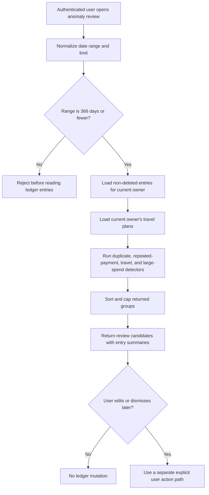

# Transaction Anomaly Detection

Updated: 2026-06-30

This document records the deterministic transaction anomaly detection contract. The backend API is read-only and does not use AI, so it can flag duplicate, repeated-payment, unusually large, and travel-out-of-range spending candidates without mutating ledger data.

## Implemented API

| Endpoint | Method | Purpose |
| --- | --- | --- |
| `/api/entries/anomalies` | `GET` | Lists duplicate, repeated-payment, unusually large, and travel-out-of-range expense candidates for the authenticated user. |

Optional query parameters:

| Parameter | Description |
| --- | --- |
| `from` | Start date, `yyyy-MM-dd`. |
| `to` | End date, `yyyy-MM-dd`. |
| `limit` | Maximum anomaly groups to return. Defaults to 50 and is capped at 200. |

## Decision flow

## Current Detectors

| Type | Rule | Severity |
| --- | --- | --- |
| `DUPLICATE_SAME_DAY_AMOUNT_TITLE` | Expense entries on the same date with the same amount and normalized title. | `medium` for 2 entries, `high` for 3 or more. |
| `REPEATED_SAME_AMOUNT_TITLE` | Expense entries with the same normalized title and amount across at least 3 different months. | `medium` for 3-5 entries/months, `high` for 6 or more entries/months. |
| `TRAVEL_OUT_OF_RANGE_EXPENSE` | Expense is linked to one of the user's travel plans but the entry date is before the plan start date or after the plan end date. | `medium` within 7 days outside the range, `high` beyond 7 days. |
| `UNUSUALLY_LARGE_EXPENSE` | Expense is at least 3x the selected-range median expense and at least KRW 50,000. Detector requires at least 5 expense entries in scope. | `high` when at least 5x median and KRW 50,000, otherwise `medium`. |

Normalization and thresholds:

- Title is trimmed, lowercased, and repeated whitespace is collapsed for duplicate and repeated-payment grouping.
- Amount uses a trailing-zero-insensitive decimal representation for anomaly keys.
- Repeated-payment detection requires distinct months so same-day duplicates do not become subscription candidates by themselves.
- Travel out-of-range detection only evaluates travel plans owned by the authenticated user.
- Large-spend detection ignores income entries and uses absolute expense amounts.
- Deleted entries and non-expense entries are ignored.
- User scope comes only from `@AuthenticationPrincipal`.

## User-facing anomaly cards

The backend already returns the four anomaly families that best fit this product. The frontend review panel should present them as review cards with cautious language, source entries, and a clear path to edit or dismiss later.

| User-facing card | Backend type | Copy direction | Primary action |
| --- | --- | --- | --- |
| Larger than usual spending | `UNUSUALLY_LARGE_EXPENSE` | "평소보다 큰 지출 후보" based on local median, not a confirmed mistake. | Review entry, compare category, then optionally edit through the normal ledger form. |
| Possible duplicate payment | `DUPLICATE_SAME_DAY_AMOUNT_TITLE` | "중복 결제 의심" when same-day amount/title match. | Compare entries side by side before deleting or merging elsewhere. |
| Repeated same-amount payment | `REPEATED_SAME_AMOUNT_TITLE` | "같은 금액 반복 결제" for subscription/fixed-cost candidates across distinct months. | Review as recurring spend; optionally create a classification or budget rule later. |
| Travel spending outside trip dates | `TRAVEL_OUT_OF_RANGE_EXPENSE` | "여행 기간 외 여행 지출 후보" when a linked travel expense falls outside the owned travel plan date range. | Review the travel link/date and fix through explicit edit if needed. |

All cards must say "review candidate" or equivalent wording. They must not say fraud, error, duplicate confirmed, or automatically fixed.
## Safety Rules

| Rule | Reason |
| --- | --- |
| Detector is read-only. | It must not mutate or delete ledger data automatically. |
| Results are candidates, not facts. | User confirmation is required before editing, deleting, merging, dismissing, or reclassifying entries. |
| Date range is capped at 366 days. | Prevents expensive full-history scans from accidental wide queries. |
| Result limit is capped at 200 groups. | Prevents unbounded UI/API responses while preserving the full `totalGroups` count. |
| Repeated-payment detector requires distinct months. | Avoids confusing one-off duplicate imports with recurring spend. |
| Travel detector uses owner-scoped travel plans. | Prevents another user's trip dates from influencing anomaly results. |
| Large-spend detector requires a small baseline. | Avoids flagging the first few expenses before there is enough local context. |
| API returns entry summaries, not hidden deleted records. | Keeps output aligned with normal ledger visibility. |
| Future dismiss workflows must be separate from source entries. | Reviewing a candidate should not silently hide, delete, or rewrite ledger records. |

## Current implementation anchors

| Anchor | Contract evidence |
| --- | --- |
| `LedgerTransactionAnomalyController` | Exposes authenticated `GET /api/entries/anomalies` and passes only `currentUser.userId()` to the service. |
| `LedgerTransactionAnomalyService` | Is `@Transactional(readOnly = true)`, caps range/limit, loads owner-scoped non-deleted entries, loads owner-scoped travel plans, and emits candidate groups. |
| `LedgerEntryRepository` | Supplies owner-scoped, non-deleted entry queries for all-entry and date-range anomaly scans. |
| `TravelPlanRepository` | Supplies owner-scoped travel plans for travel out-of-range checks. |
| `LedgerTransactionAnomalyServiceTest` | Covers duplicate grouping, repeated payments, travel date range, unusual spending, result cap, and pre-read range rejection. |

## Release gate

Before promoting a change that touches anomaly detection, Excel/OCR import duplicate review, AI risk spending, transaction edit/delete/merge flows, or anomaly dismiss UI:

1. Confirm anomaly output is still a review candidate, not a confirmed fraud/error statement.
2. Confirm the anomaly API remains read-only and does not create, update, delete, merge, dismiss, or reclassify ledger entries.
3. Confirm all entry and travel-plan reads remain scoped to the authenticated user.
4. Confirm deleted entries, income entries, wide date ranges, and excessive limits stay bounded as documented.
5. Run `scripts/verify-ledger-anomaly-contract.ps1` and the focused service tests listed below.

## CI contract

The `ledger-anomaly-contract` GitHub Actions job must run `scripts/verify-ledger-anomaly-contract.ps1`. The release gate must include that job so anomaly review safety regressions block merges before frontend, AI, or import flows depend on the API.

## Next Detectors

| Candidate | Notes |
| --- | --- |
| Category/payment historical baseline | Use longer history by category or payment method instead of only the selected-range median. |
| Imported duplicate candidates | Compare newly imported Excel/OCR rows against existing entries before save. |
| Dismiss workflow | Let users hide reviewed anomaly candidates without mutating source entries. |
| Frontend anomaly panel | Surface anomaly candidates with clear "review, not fact" language. |

## Test Evidence

| Evidence | Coverage |
| --- | --- |
| `LedgerTransactionAnomalyServiceTest.findAnomaliesGroupsSameDaySameAmountNormalizedTitleExpensesOnly` | Verifies same-day same-amount normalized-title expense duplicates are grouped, while income entries and different dates do not join the group. |
| `LedgerTransactionAnomalyServiceTest.findAnomaliesFlagsRepeatedSameAmountTitleAcrossMonths` | Verifies repeated same-title/same-amount expenses across distinct months are grouped while income entries are ignored. |
| `LedgerTransactionAnomalyServiceTest.findAnomaliesFlagsTravelLinkedExpenseOutsideOwnedPlanDateRange` | Verifies user-owned travel-plan date ranges flag linked expenses outside the trip period while ignoring in-range, unknown-plan, and income entries. |
| `LedgerTransactionAnomalyServiceTest.findAnomaliesFlagsUnusuallyLargeExpenseAgainstMedianExpense` | Verifies a large single expense is flagged against the selected-range median without including income entries. |
| `LedgerTransactionAnomalyServiceTest.findAnomaliesCapsReturnedGroupsWithoutChangingTotalGroups` | Verifies `limit` is capped at 200 and does not change the full `totalGroups` count. |
| `LedgerTransactionAnomalyServiceTest.findAnomaliesRejectsRangeLongerThan366DaysBeforeReadingEntries` | Verifies wide date ranges fail before reading ledger entries. |
| `scripts/verify-ledger-anomaly-contract.ps1` | Verifies the documentation, implementation anchors, security checklist, roadmap, and CI job stay connected. |

## Test Backlog

- Keep same-day same-amount normalized-title duplicate grouping coverage current as detectors expand.
- Different users never see each other's anomaly candidates.
- Keep repository owner/deleted scope and expense-only grouping coverage current.
- Keep range validation coverage current before adding broader historical detectors.
- Keep limit cap coverage current so UI pagination cannot hide total candidate count.
- Add frontend panel and dismiss workflow coverage once the anomaly candidates are shown in the UI.
- Add Excel/OCR imported-row duplicate preview coverage before import commit uses anomaly hints.