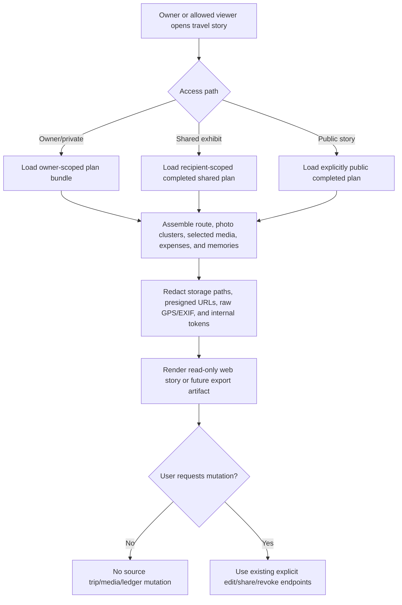

# Travel Story Export Contract

Updated: 2026-06-30

This document defines the release contract for turning a travel plan into a shareable timeline/story export. The product goal is to combine route segments, map/photo context, expenses, and memories into a readable web story or future PDF without weakening the existing owner, share, public-trip, and media-token boundaries.

## Current baseline

| Surface | Current anchor | Story/export relevance |
| --- | --- | --- |
| Private trip detail | `GET /api/travel/plans/{planId}` | Owner-scoped source for plan dates, route, budget, expenses, memories, and media summaries. |
| My map | `GET /api/travel/my-map` and marker/photo-cluster detail APIs | Owner-scoped map/photo context that can become timeline sections. |
| Shared exhibits | `GET /api/travel/shared-exhibits` and `GET /api/travel/shared-exhibits/{shareId}` | Authenticated recipient view for completed shared trips. |
| Public trips | `GET /api/travel/public-trips` and public photo-cluster detail APIs | Authenticated public/community overview for explicitly public completed trips. |
| Public media token | `TravelPublicMediaTokenService` | Stateless media access guard; tokens must match the exact media id and current visibility checks. |
| Privacy cleanup | `PrivacyManagementService` travel share revocation | Revoking public travel media sharing must invalidate future story/media surfaces through visibility checks. |

## Story assembly flow

## Data contract

| Story section | Allowed content | Not allowed |
| --- | --- | --- |
| Header | Plan name, destination, date range, status, public/shared badge. | Owner email/login id unless already visible in the current surface. |
| Timeline | Route segment order, memory dates, photo timestamps, expense dates. | Hidden draft/private records from another user. |
| Map | Route summary, marker labels, cluster summaries, approximate display coordinates already visible in the selected travel surface. | Raw EXIF payloads, internal geocoder responses, or background location history. |
| Photos/media | Prepared thumbnails and media URLs issued through existing visibility/token checks. | Object storage keys, full filesystem paths, presigned upload URLs, raw public-media secret, or unbounded original downloads. |
| Expenses | User-facing expense summaries already visible in the travel plan/shared exhibit. | Ledger entries outside the travel plan, deleted records, or another user's category/payment metadata. |
| Memories | Travel memory titles/body already visible to the same viewer. | AI prompts, private notes from unrelated plans, or hidden operational metadata. |
| Export metadata | Export timestamp, story version, included section counts, and visibility mode. | API keys, public tokens, signed URLs, secondary PINs, provider URLs, or raw archive credentials. |

## Export product modes

| Mode | Output | First release shape | Guardrail |
| --- | --- | --- | --- |
| Web story | Shareable responsive page that combines route timeline, photo map, spending summary, and memories. | Reuse private, shared, and public visibility paths and render read-only sections from existing travel DTOs. | No source mutation, no hidden records, no raw storage paths, tokens, GPS, or EXIF leakage. |
| Web exhibition | Curated gallery and timeline for completed shared or public trips. | Build on shared exhibits and public trips; show visibility badge, section counts, and media coverage. | Completed-plan-only and recipient/public visibility checks remain authoritative. |
| PDF/static export | Downloadable artifact for one trip. | Future async bounded job with size caps, cleanup retention, and optional encryption/private-link policy. | Do not block request threads; artifact excludes secrets and uses expiring access. |

## Story composition checklist

| Section | Required source | User value | Release check |
| --- | --- | --- | --- |
| Route timeline | Plan dates, itinerary days, route segments, and map coordinates already visible to the viewer. | Turns the trip into a chronological narrative. | Omits private stops or hidden locations outside the current viewer scope. |
| Photo map | Approved media, clusters, generated thumbnails, and safe public media tokens. | Shows where memories happened without exposing storage internals. | Uses tokenized media access and never emits raw object keys or presigned URLs. |
| Spending summary | Travel expense totals, category summaries, and optional daily spend buckets. | Connects travel memories to actual cost. | Shows aggregate/read-only values first; itemized spend requires the same owner/shared visibility rule as the source trip. |
| Memories | User notes, highlights, captions, and curated moments. | Preserves the personal story around photos and routes. | Excludes deleted/private notes and supports redaction before sharing. |
| Share/export metadata | Visibility, generatedAt, section counts, export mode, and source plan id. | Makes the artifact auditable and easy to review before publishing. | Metadata contains no secrets, API keys, raw GPS/EXIF, storage paths, or internal tokens. |
## Non-negotiable safety rules
| Rule | Reason |
| --- | --- |
| Story/export is read-only. | Rendering a story must not mutate travel plans, media, expenses, ledger entries, shares, or memories. |
| Private stories are owner-scoped. | Users cannot export another user's trip unless a share/public path already grants visibility. |
| Shared stories are recipient-scoped and completed-plan only. | Draft/in-progress trips should not leak through a shared exhibit. |
| Public stories require explicit public sharing and completed status. | Public/community visibility must stay an intentional owner action. |
| Media access must reuse prepared-thumbnail/media-token visibility checks. | Story pages must not bypass object storage, presigned URL, or token validation. |
| Revoking public travel sharing must disable future story/media access. | Privacy cleanup should invalidate derived public story surfaces. |
| Generated artifacts must exclude operational secrets. | Story export files/logs can live longer than requests, so they must not contain storage paths, tokens, keys, presigned URLs, raw GPS/EXIF, prompts, or provider responses. |
| Future PDF/static exports need bounded async jobs. | Large photo exports should reuse the media/export queue contract instead of blocking request threads. |

## Current implementation anchors

| Anchor | Evidence |
| --- | --- |
| `TravelController` | Uses `@AuthenticationPrincipal` for private, shared, public-trip, route, memory, media, and share endpoints. |
| `TravelService` | Contains owner/public/shared trip methods that existing story assembly must reuse rather than bypass. |
| `TravelServiceShareVisibilityTest` | Covers public-share enable rules, shared exhibit completed-plan filtering, and stale shared exhibit denial. |
| `TravelPublicMediaTokenServiceTest` | Covers exact media-id token matching and invalid/tampered/wrong-secret rejection. |
| `PrivacyControllerIntegrationTest` / `PrivacyManagementService` | Cover public travel media share revocation as a privacy control. |
| `docs/media_processing_queue_contract.md` | Defines async queue boundaries for future large binary media/export artifacts. |
| `docs/privacy_control_panel.md` | Defines travel public media share revocation and safe cleanup behavior. |

## Release gate

Before promoting a change that adds travel story pages, web exhibition exports, PDF/static exports, share links, or media-heavy archive generation:

1. Confirm private story generation is owner-scoped.
2. Confirm shared story generation is recipient-scoped and completed-plan only.
3. Confirm public story generation requires explicit public share and completed status.
4. Confirm generated output excludes object storage paths, presigned URLs, public-media tokens/secrets, API keys, secondary PINs, raw GPS/EXIF, AI prompts, and provider responses.
5. Confirm story rendering is read-only; edits, share changes, revocation, and media deletion still use explicit existing endpoints.
6. Confirm large PDF/static/photo exports use an async bounded job plan before binary export is enabled.
7. Run `scripts/verify-travel-story-export-contract.ps1` and the focused travel share/media token tests listed above.

## CI contract

The `travel-story-export-contract` GitHub Actions job must run `scripts/verify-travel-story-export-contract.ps1`. The release gate must include that job so story/export privacy boundaries block merges before new public or downloadable travel surfaces are shipped.

## Next slices

| Slice | Notes |
| --- | --- |
| Owner read-only story DTO | Compose plan, route, memories, expense summaries, and prepared media for the authenticated owner. |
| Shared exhibit story view | Reuse recipient-scoped completed-plan checks from shared exhibits. |
| Public story view | Reuse explicit public-share and completed-plan checks from public trips. |
| PDF/static export job | Add async job progress, size caps, encryption/private-link policy, and cleanup retention. |
| Frontend story route | Render route/photo/memory/expense sections with clear visibility badges and no hidden source metadata. |

## Test backlog

- Owner can render only their own story bundle.
- Recipient can render only completed trips shared to them.
- Public story rejects incomplete or non-public trips.
- Public media token for one media id cannot access another media id.
- Revoking travel public media share disables public story media access.
- Story export artifact excludes object keys, presigned URLs, public tokens, raw GPS/EXIF, API keys, provider URLs, prompts, and secondary PINs.
- Future PDF/static export job is bounded, retryable, encrypted when private data is included, and has cleanup retention evidence.
